#  			[Java学习笔记（一）——关于java中的String类](https://www.cnblogs.com/xt0810/p/3530840.html) 		


**【前面的话】**

​      毕业将近6个月了，试用期也快要过去了，期待接下来的日子。在金融类性质的机构，最痛苦的是也许就是大部分系统外包，所以比较少写代码，在这六个月中只写了1个月左右的代码，然后每天都在做一些比较杂的事情，希望有机会可以写一写代码，提高技术。

​      前段时间做了一下开发，最近马上也要过年了，时间相对就比较多了，所以又回过头来看看书，巩固一下基础知识，做一些笔记，看看自己的思维，主要目的是为了自己积累，所以都是**很基础、很基础的知识，请自行选择。**如果看到这里要走了，祝新年快乐，也不枉进来一趟。

**【知识汇总】**

-  **String****类的定义：**String在java中是一个比较特殊的类，因为其自己可以做一种数据类型直接定义变量，如下：

1. String str = "hello";
2. String str = new String ("hello");

- **String****两种不同定义地理解：**

1. String str = "hello"; //可以把str理解为一个char*，str指向数据段中的字符串"hello"。
2. String str = new String ("hello");//是new了一个对象，堆空间分配了一块内存，把对象放在里面，str 指向这个对象

- **上面两者的区别：**

1. String str 1= "hello";
2. String str 2= "hello";

​      //当定义str2的时候，系统会先检测数据段里是否已经有了“hello”，如果有了那么str2直接指向这个“hello”，这是系统的优化。也就是说不会单独再在数据段中存储“hello”，str1和str2指向的是同一个数据段，也就是str1和str2代表的数据段地址也是一样的。

​     //改正哈，下面1楼指出了这里有误哈：可以参见1楼。

1. String str 3= new String ("hello");
2. String str 4= new String ("hello");

​     //str4是重新new的一个对象，是在堆空间又单独存储的，也就是说str3和str4的地址是不一样的，但是存储内容是一样的。读者可以运行一下下面的代码：

​        代码：

[](javascript:void(0);)

```
String s1="hello";
String s2="hello";
System.out.println(s1==s2);
String s3=new String("hello");
String s4=new String("hello");
System.out.println(s3==s4);
System.out.println(s3.equals(s4));
```

[](javascript:void(0);)

​      运行结果：

```
true
false
true
```

- **对于****String****类对象是不可变字符的理解：**

1. String str1="hello";
2. str1=str1.substring(0, 3)+” p!”;

​      //首先substring(0, 3)表示提取字符串第一个到第三个的字母。

​       //对于不可变的理解就是说，存储“hello”的地方永远存储的是“hello”，除非系统自动收回，是永远不会变的。对于str1提取子串，只是让str1再次指向“hello”的引用，对于这个引用再进行改变，而原来存储“hello”的地方是不变的。读者可以运行一下下面的代码：

​    代码：

```
String str1="hello";
String str2=str1;
str1=str1.substring(0, 3)+"p!";
System.out.println(str1);
System.out.println(str2);
```

​    运行结果：

```
help!
hello
```

   //因为第2行代码是让str1和str2指向了同一个地址段，后面改变了str1的指向，而str2指向的东西是没有改变的。

**【****java****代码】**

[](javascript:void(0);)

```
public class Text {
    public static void main(String[] args){        
//说明了s1和s2指向的同一个地址段，s3和s4指向的是不同的地址段，而存储内容是一样的
        String s1="hello";
        String s2="hello";
        System.out.println(s1==s2);
        String s3=new String("hello");
        String s4=new String("hello");
        System.out.println(s3==s4);
        System.out.println(s3.equals(s4));
//说明了str1和str2指向同一个地址段，而后面改变的str1只是对"hello"的一个引用的改变
        String str1="hello";
        String str2=str1;
        str1=str1.substring(0, 3)+"p!";
        System.out.println(str1);
        System.out.println(str2);
    }
}
```

[](javascript:void(0);)

**【运行结果】**

```
true
false
true
help!
hello
```

**【后面的话】**

​     将看到的、学到的东西写出来的感觉还是非常好的，一方面可以锻炼自己的思维能力，另一方面可以更加好的理解所学。

​     这几天看到了几句话分享一下：

1. 你养兰花不是今天用来生气的。
2. 昨日黄土陇头送白骨，今宵红灯帐底卧鸳鸯。
3. 我认为这些真理是不言自明了，人人生来平等，造物主赋予他们一定的不可让与的权利，这些权利有生活的权利、自由的权利和追求幸福的权利。为了取得这些权利，人类创建了政府，政府则从被治理的同意中得到权利。任何政府形式一但有背这些目的，人民就有权改变或废除它，组织新的政府······                                                                                                         

——《独立宣言》

 

​                                                                                                                                 ——TT

 

#  			[Java学习笔记（二）——Java操作properties文件](https://www.cnblogs.com/xt0810/p/3534169.html) 		


**【前面的话】**

​      前段时间在学习和玩java  web相关的东西，对于这些技术，一边学习，一边做东西，一边总结，希望可以一边成长和有所收获。有时总是思考太多反而成为了前进的阻力，所以对于生活还是简单一些，不以最坏的恶意去揣摩别人，但是对于技术还是要认真对待，一点都马虎不得。

​      前段时间做了一下开发，最近马上也要过年了，时间相对就比较多了，所以又回过头来看看书，巩固一下基础知识，做一些笔记，看看自己的思维，主要目的是为了自己积累，所以都是**很基础、很基础的知识，请自行选择。**如果看到这里要走了，祝新年快乐，也不枉进来一趟。

**【问题背景】**

​      在做完项目的第一期以后，发现由于项目中的一些变量需要经常修改，而修改.java文件就需要对于整个项目进行重新编译，而这个项目里面有很多图片，每次用eclipse进行编译都非常慢，所以就想到把所有需要经常改变的变量全部定义到.properties文件中，每次改变变量的值得时候，只需要去改变.properties文件中的变量值就可以，从而不需要重新编译代码，就可以直接运行，这样就比较方便了。

**【术语定义】**

- **.properties****文件注释：**注释以**#**开始；
- **.properties****文件格式：**文件格式为文本文件，可以使用记事本打开；
- **.propertise****文件内容：**文件内容的格式是：“键=值”；
-  **JDK****对于操作的支持：**JDK 内置java.util.Properties 类可以使得我们操作.properties 文件；
- **.properties****示例：**

```
1 #定义了max和min
2 max=1000
3 min=2
```

**【代码描述】**

- 项目中的代码不方便贴出，刚好在网上看到了一份代码，稍加改造，写出了一个demo，供读者参阅。
-  代码参考了**【参考资料】**中的部分代码（**如涉及版权，请及时联系，好方便删除**）。
- 代码写了三个文件如下：

1. PropertiesText.java
2. ActionText.java
3. Maintext.java

- 另外还有.properties文件：

1. text.properties
2. ps：应该还有一个.properties文件，名字为：save.properties文件。这个文件在最开始是不需要自己动手建立，可以生成。

- 代码：

1. PropertiesText.java

[](javascript:void(0);)

```
  1 package configuration;
  2 import java.io.FileInputStream;
  3 import java.io.FileNotFoundException;
  4 import java.io.FileOutputStream;
  5 import java.io.IOException;
  6 import java.util.Properties;
  7 
  8 /**
  9  * 读取properties文件
 10  * @author Qutr
 11  *
 12  */
 13 public class PropertiesText
 14 {
 15     private Properties propertie;
 16     private FileInputStream inputFile;
 17     private FileOutputStream outputFile;
 18       /**
 19      * 初始化ProtertiesText类
 20      */
 21     public PropertiesText()
 22    {
 23         propertie = new Properties();
 24     }    
 25     /**
 26      * 初始化Configuration类
 27      * @param filePath 要读取的配置文件的路径+名称
 28      */
 29     public PropertiesText(String filePath)
 30     {
 31         propertie = new Properties();
 32         try{
 33             inputFile = new FileInputStream(filePath);
 34             propertie.load(inputFile);
 35             inputFile.close();
 36         } catch (FileNotFoundException ex){
 37             System.out.println("读取属性文件--->失败！- 原因：文件路径错误或者文件不存在");
 38             ex.printStackTrace();
 39         } catch (IOException ex) {
 40             System.out.println("装载文件--->失败!");
 41             ex.printStackTrace();
 42         }
 43     }//end ReadConfigInfo(...)    
 44     /**
 45      * 重载函数，得到key的值
 46      * @param key 取得其值的键
 47      * @return key的值
 48      */
 49     public String getValue(String key)
 50     {
 51         if(propertie.containsKey(key)){
 52             String value = propertie.getProperty(key);//得到某一属性的值
 53             return value;
 54         }
 55         else 
 56             return "";
 57     }//end getValue(...)    
 58     /**
 59      * 重载函数，得到key的值
 60      * @param fileName properties文件的路径+文件名
 61      * @param key 取得其值的键
 62      * @return key的值
 63      */
 64     public String getValue(String fileName, String key)
 65     {
 66         try{
 67             String value = "";
 68             inputFile = new FileInputStream(fileName);
 69             propertie.load(inputFile);
 70             inputFile.close();
 71             if(propertie.containsKey(key)){
 72                 value = propertie.getProperty(key);
 73                 return value;
 74             }else
 75                 return value;
 76         } catch (FileNotFoundException e) {
 77             e.printStackTrace();
 78             return "";
 79         } catch (IOException e) {
 80             e.printStackTrace();
 81             return "";
 82         } catch (Exception ex){
 83             ex.printStackTrace();
 84             return "";
 85         }
 86     }//end getValue(...)    
 87     /**
 88      * 清除properties文件中所有的key和其值
 89      */
 90     public void clear()
 91     {
 92         propertie.clear();
 93     }//end clear();    
 94     /**
 95      * 改变或添加一个key的值，当key存在于properties文件中时该key的值被value所代替，
 96      * 当key不存在时，该key的值是value
 97      * @param key 要存入的键
 98      * @param value 要存入的值
 99      */
100     public void setValue(String key, String value)
101     {
102         propertie.setProperty(key, value);
103     }//end setValue(...)    
104     /**
105      * 将更改后的文件数据存入指定的文件中，该文件可以事先不存在。
106      * @param fileName 文件路径+文件名称
107      * @param description 对该文件的描述
108      */
109     public void saveFile(String fileName, String description)
110     {
111         try{
112             outputFile = new FileOutputStream(fileName);
113             propertie.store(outputFile, description);
114             outputFile.close();
115         } catch (FileNotFoundException e){
116             e.printStackTrace();
117         } catch (IOException ioe){
118             ioe.printStackTrace();
119         }
120     }//end saveFile(...)    
121 }//end class ProtertiesText
```

[](javascript:void(0);)

​     2.Maintext.java

[](javascript:void(0);)

```
1 package configuration;
2 public class Maintext {
3     public static void main(String[] args){
4         ActionText actiontext=new ActionText();
5         actiontext.action();     
6     }//end main()  
7 }
```

[](javascript:void(0);)

​      3.text.properties

```
1 aaaa=999999
2 b=10
3 max=10
4 d=0
```

​    4.ActionText.java版本1(有两个版本，说明不同的问题)

[](javascript:void(0);)

```
 1 package configuration;
 2 public class ActionText {
 3       public void action(){
 4             String path=this.getClass().getResource("").getPath();
 5             System.out.println(path);
 6     PropertiesText rc = new PropertiesText(path+"../../text.properties");//相对路径
 7             String b = rc.getValue("aaaa");//以下读取properties文件的值
 8             System.out.println("aaaa = " + b);
 9             PropertiesText cf = new PropertiesText();
10             String c = cf.getValue(path+"../../text.properties", "aaaa");
11             System.out.println("c = " + c);
12             cf.setValue("b", "99");
13             cf.setValue("max", "1000");
14             cf.saveFile(path+"../../save.properties","test");  
15       }
16 }
```

[](javascript:void(0);)

​      4.ActionText.java版本2(有两个版本，说明不同的问题)

[](javascript:void(0);)

```
 1 package configuration;
 2 
 3 public class ActionText {
 4       public void action(){ 
 5         String path=ActionText.class.getClassLoader().getResource("").getPath();
 6             System.out.println(path);
 7             PropertiesText rc = new PropertiesText(path+"../text.properties");//相对路径
 8             String b = rc.getValue("a");//以下读取properties文件的值
 9             System.out.println("a = " + b);
10             PropertiesText cf = new PropertiesText();
11             String c = cf.getValue(path+"../text.properties", "a");
12             System.out.println("c = " + c);
13             cf.setValue("b", "99");
14             cf.setValue("max", "1000");
15             cf.saveFile(path+"../save.properties","test"); 
16       }
17 }
```

[](javascript:void(0);)

**【运行结果】**

​    1.版本1运行结果：

- 打印到控制台的结果:

```
1 /D:/workspace8/PropertiesText/bin/configuration/
2 aaaa = 999999
3 c = 999999
```

- 存储到save中的数据：

[](javascript:void(0);)

```
1 #test
2 #Sun Jan 26 09:47:10 CST 2014
3 max=1000
4 b=99
5 aaaa=999999
6 d=0
```

[](javascript:void(0);)

​    2.版本2运行结果：

- 打印到控制台的结果:

```
1 /D:/workspace8/PropertiesText/bin/
2 aaaa = 999999
3 c = 999999
```

- 存储到save中的数据：

[](javascript:void(0);)

```
1 #test
2 #Sun Jan 26 15:38:01 CST 2014
3 max=1000
4 b=99
5 aaaa=999999
6 d=0
```

[](javascript:void(0);)

**【结果分析】**

上面写两个版本的ActionText.java是为了区分下面两行代码：

String path=**this**.getClass().getResource("").getPath();（1）

String path=ActionText.**class**.getClassLoader().getResource("").getPath();（2）

1，  运行的结果可以看到这两者的区别

2，  代码（1）只能运行在非静态方法中

​       代码（2）可以运行在非静态方法和静态方法中。

**【遇到问题】**

​      其实上面的代码还是比较好操作，但是还是会有一些问题可能会遇到：

1，路径问题：在做的过程中，会遇到路径找不到，这里不具体分析相对路径和绝对路径的详细介绍，有时间单独写。

​      相对路径：就是你的主页上的文件或目录在硬盘上真正的路径，(URL和物理路径)。

​      绝对路径：相对与某个基准目录的路径。

2，错误：Invalid escape sequence (valid ones are  \b  \t  \n  \f  \r  \"  \'  \\ )

​     原因：这是一个正则表达式的错误，我理解的是，"\"在java中当作特殊字符处理的，所以这里就会把\t当作转义字符处理。

​     解决：所以提示有正则表达式的错误，改为\\就行。

3，当我在本地已经作好了以后，部署到服务器发现一直提醒找不到路径，打印出路径发现，把路径中的空格全变成了%20

​    解决办法：path=path.replaceAll("%20", " ");

​    ps:我没有找到更好的办法，使用了上面的办法。

4，静态方法中不能用this。

​    原因：this代表的是调用这个函数的对象的引用,而静态方法是属于类的,不属于对象,静态方法成功加载后,对象还不一定存在。

**【参考资料】**

Java Properties 类读取配置文件信息<http://wenku.baidu.com/view/47dfcd2c2af90242a895e5d6.html>

**【后面的话】**

​       自己以前就很喜欢写东西，但是比较少的写技术类的学习笔记，最近开始写，感觉很好，读到别人写的技术文章也很受教，有时看到别人写的条理性很清晰，并且很有见地的文章都很激动，希望自己可以写的越来越好，并且多一些自己的见解而不仅仅是对知识的照搬，可以多一些自己独到的东西在里面。

​      最近看到的一些话，分享一下：

1. 人一辈子都在高潮低潮中浮沉，惟有庸碌的人，生活才如死水一般；或者要有极高的修养，方能廓然无累，真正的解脱。只要高潮不过分使你紧张，低潮不过分使你颓废，就好了。——《傅雷家书》
2. 我相信你逐渐会学会这一套，越来越坚强的。我以前在信中和你提过感情的ruin［创伤，覆灭］，就是要你把这些事当做心灵的灰烬看，看的时候当然不免感触万端，但不要刻骨铭心地伤害自己，而要像对着古战场一般的存着凭吊的心怀。——《傅雷家书》
3. 寒塘渡鹤影，冷月葬花魂。——《红楼梦》
4. 门前节选：

- 草在结它的种子
- 风在摇它的叶子
- 我们站着，不说话——《门前》

——TT


#  			[Java学习笔记（三）——静态导入，package-info，Fall-through](https://www.cnblogs.com/xt0810/p/3542995.html) 		


**【前面的话】**

​      算是真正的放松了好几天时间，没有看任何书，没有任何任务，今天是过完年后的第一天上班时间，我又开始了我的学习之路，感觉还没有老，怎么心态越来越平静了，进入工作状态，就好好努力工作，新的一年，我会不努力？哈哈。

​      这篇文章是自己在学习的过程中总会发现一些小的知识点，然后我就记录在这了，**基础文章，选择阅读**。

**【知识汇总】**

**一、****静态导入**

1. 代码

​      静态导入之**前**的代码：

```
public class HelloWorld{
  public static void main(String[] args){
     System.out.println("Hello World!");
}
}
```

​      静态导入之**后**的代码：

 

[](javascript:void(0);)

```
import static java.lang.System.out;//导入java.lang包下的System类，通过System类直接使用out对象。因为out是一个static PrintStream 对象，可以直接使用。

 public class HelloWorld{
     public static void main(String[] args){ 
         out.println("Hello World!");//既是在这里不用再写成System.out.println("Hello World!")了，因为已经导入了out。
      }
 }
```

[](javascript:void(0);)

​       2.import xxxx 和 import static xxxx的**区别：**

​        import xxxx一般导入的是类文件如import java.util.Scanner;

​        import static xxxx一般是导入静态的对象引用、常量（记住，它们是static 或final）和static方法如：import static java.lang.System.out是对静态对象的引用，进行的静态导入。

​     3.使用静态导入的几条**原则****：**

​        1).你必须说import static，不能说static import。

​         2).提防含糊不清的命名static成员。例如，如果你对Integer类和Long类执行了静态导入，引用MAX_VALUE将导致一个编译器错误，因为Integer和Long都有一个MAX_VALUE常量，并且Java不会知道你在引用哪个MAX_VALUE。

​       3).你可以在static对象引用、常量（记住，它们是static 或final）和static方法上进行静态导入。

========================我是2014年2月7日的分割线========================

**二、****学习****package-info.java**

1. 参考资料

​     **另类的****package-info.java****文件探讨**<http://strong-life-126-com.iteye.com/blog/806246>

​      2.特点：

​      1) 它不能随便被创建，因为有一个“-”中横线，是不允许在命名规则中的，所以一般创建可以直接使用记事本创建然后刷新，或者拷贝一个别的项目已经使用过的。

​      2) 服务的对象很特殊，**描述和记录本包信息**

​      3) 类不能带有public、private访问权限。package-info.java中只能声明默认访问权限的类，也就是友好类。

​      4) 其实还有几个特殊的地方，比如不可以继承，没有接口，没有类间关系（关联、组合、聚合等等）等。

​      3.作用：

​      1) 为标注在包上Annotation提供便利；

​      2) 声明友好类和包常量；

​      3) 提供包的整体注释说明。

**PS:这里只是简单的标记笔记，如果想要详细知道package-info.java。请阅读上面的参考资料。**

========================我是2014年2月10日的分割线=======================

**三、****switch****语句中的****Fall-through**

​      今天看到switch语句中可能发现Fall-through现象，一时不明白是什么意思，就学习了一下，下面代码中的第二个switch就发现了Fall-through现象。

​      代码：

[](javascript:void(0);)

```
public class FallTest {
    public static void main(String[] args){
        int i=2;
        switch(i){
          case 1:
            System.out.println("woshishuaige1");
            break;
          case 2:
            System.out.println("woshishuaige2");
            break;
          case 3:
            System.out.println("woshishuaige3");
            break;
          default:
            System.out.println("xiaosile");  
        }
        switch(i){
          case 1:
            System.out.println("我是帅哥1");
          case 2:
            System.out.println("我是帅哥2");
          case 3:
            System.out.println("我是帅哥3");
          default:
            System.out.println("笑死了");  
        }
        
    }
}
```

[](javascript:void(0);)

输出结果：

```
woshishuaige2
我是帅哥2
我是帅哥3
笑死了
```

========================我是2014年2月10日的分割线=======================

**【后面的话】**

​     这篇文章先到这里，这样长度的文章自己比较喜欢，后面文章继续学习。

​     分享几句话：

1. 任何人都是可以代替的
2. 试着理解不一样的人

——TT

 

# Java学习笔记（四）——google java编程风格指南（上） 		


**【前面的话】**

​    年后开始正式上班，计划着想做很多事情，但是总会有这样那样的打扰，不知道是自己要求太高还是自我的奋斗意识不够？接下来好好加油。好好学学技术，好好学习英语，好好学习做点自己喜欢的事情，趁着自己还是一个人。

​    如果你想要学习关于编码风格方面的知识，**建议直接阅读参考资料中的文章**，比看我这里写的好多了，这是真心话，我只是写自己的笔记。便于自己在以后的编码中注意。

**【问题背景】**

​     在做开发工作的时候，总是被说编码风格不好，现在自己找了Google Java编程风格指南进行学习，希望可以写出清晰的代码。

**【学习资料】**

​     **1.** **Google Java****编程风格指南，作者：****Hawstein**

​     [**http://hawstein.com/posts/google-java-style.html**](http://hawstein.com/posts/google-java-style.html)

**【知识汇总】**

**一、****源文件编码格式为：****UTF-8**

**二、****一个源文件按照下面顺序出现：**

1. 许可证或版权信息--如果需要
2. package语句--出现在一行之内，不能换行
3. import语句

​          1)出现在一行之内，不能换行；

​         2)不要出现通配符；

​         3)顺序和间距：

​            a)所有的静态导入独立成组，import static java.lang.System.out;

​            b)com.google  import(仅当这个源文件是在com.google包下)

​            c)第三方的包。每个顶级包为一组，字典序。例如：android，com，junit，org，sun。

​            d)java imports

​            e)javax imports

​            组内不空行，按字典序排列

​      \4. 一个顶级类

​         1)有且只有一个

​         2)类成员的顺序——每个类应该以某种逻辑去排序它的成员，维护者应该要能解释这种排序逻辑，也就是不能习惯性的将新添加的方法总是放在最后面。重载不能够分开，当一个类有多个构造函数，或是多个同名方法，这些函数/方法应该按顺序出现在一起，中间不要放进其它函数方法。

**以上四个部分之间用一个空行隔开**

**三、****大括号**

1. 大括号与`if, else, for, do, while`语句一起使用，即使只有一条语句(或是空)，也应该把大括号写上。
2. 对于非空块遵循K & R 风格

​       1)左大括号前不换行

​       2)左大括号后换行

​       3)右大括号前换行

​       4)如果右大括号是一个语句、函数体或类的终止，则右大括号后换行; 否则不换行。例如，如果右大括号后面是else或逗号，则不换行。

​    \3. 空块：可以用简洁版本

​        一个空的块状结构里什么也不包含，大括号可以简洁地写成{}，不需要换行。例外：如果它是一个多块语句的一部分(if/else 或 try/catch/finally) ，即使大括号内没内容，右大括号也要换行。

**四、****每当开始一个新的块，缩进增加****2****个空格**

**五、****一行一个语句**

**六、****列限制：****80****或****100**

**例外：**

1. 不可能满足列限制的行(例如，Javadoc中的一个长URL，或是一个长的JSNI方法参考)。
2. package和import语句
3. 注释中那些可能被剪切并粘贴到shell中的命令行

**七、****自动换行**

1. 一般情况下，一行长代码为了避免超出列限制(80或100个字符)而被分为多行，我们称之为自动换行(line-wrapping)。
2. 从哪里断开——自动换行的基本准则是：更倾向于在更高的语法级别处断开

​        1)如果在非赋值运算符处断开，那么在该符号前断开(比如+，它将位于下一行)。注意：这一点与Google其它语言的编程风格不同(如C++和JavaScript)。这条规则也适用于以下“类运算符”符号：点分隔符(.)，类型界限中的&（<T  extends Foo & Bar>)，catch块中的管道符号(catch (FooException |  BarException e)

​       2)如果在赋值运算符处断开，通常的做法是在该符号后断开(比如=，它与前面的内容留在同一行)。这条规则也适用于foreach语句中的分号。

​       3)方法名或构造函数名与左括号留在同一行。

​       4)逗号(,)与其前面的内容留在同一行。

   3.自动换行时缩进至少+4个空格

**八、****空白**

   \1. 垂直空白——一个空行

​       1)类内连续的成员之间：字段，构造函数，方法，嵌套类，静态初始化块，实例初始化块。例外：两个连续字段之间的空行是可选的，用于字段的空行主要用来对字段进行逻辑分组。

​      2)在函数体内，语句的逻辑分组间使用空行。

​      3)类内的第一个成员前或最后一个成员后的空行是可选的(既不鼓励也不反对这样做，视个人喜好而定)。

​      4)要满足本文档中其他节的空行要求(比如import语句)

​    2.水平空白——除了语言需求和其它规则，并且除了文字，注释和Javadoc用到单个空格，单个ASCII空格也出现在以下几个地方：

​       1)分隔任何保留字与紧随其后的左括号(()(如if, for catch等)。

​      2)分隔任何保留字与其前面的右大括号(})(如else, catch)。

​      3)在任何左大括号前({)，两个例外：

​         a)@SomeAnnotation({a, b})(不使用空格)。

​         b)String[][] x = foo;(大括号间没有空格，见下面的Note)。

​      4)在任何二元或三元运算符的两侧。这也适用于以下“类运算符”符号：

​         a)类型界限中的&(<T extends Foo & Bar>)。

​         b)catch块中的管道符号(catch (FooException | BarException e)。

​         c)foreach语句中的分号。

​      5)在, : ;及右括号())后

​     6)如果在一条语句后做注释，则双斜杠(//)两边都要空格。这里可以允许多个空格，但没有必要。

​     7)类型和变量之间：List list。

​     8)数组初始化中，大括号内的空格是可选的，即new int[] {5, 6}和new int[] { 5, 6 }都是可以的。

​    3.水平对齐：不做要求

​      未对齐的代码：主要是看x

```
private int x; // this is fine
private Color color; // this too
```

​      对齐的代码：主要是看x  

```
private int   x;      // permitted, but future edits
private Color color;  // may leave it unaligned
```

**九、****在运算等涉及到优先级的地方，要用****()****的地方一定要用，这样便于理解。**

 

**未完待续，见下一篇文章。。。。。。**

 

 **【后面的话】**

​       要好好爱惜身体，今天有点不舒服。

——TT


#  			[Java学习笔记（五）——google java编程风格指南（中）](https://www.cnblogs.com/xt0810/p/3544078.html) 		


**【前面的话】**

​    年后开始正式上班，计划着想做很多事情，但是总会有这样那样的打扰，不知道是自己要求太高还是自我的奋斗意识不够？接下来好好加油。好好学学技术，好好学习英语，好好学习做点自己喜欢的事情，趁着自己还是一个人。

​    如果你想要学习关于编码风格方面的知识，**建议直接阅读参考资料中的文章**，比看我这里写的好多了，这是真心话，我只是写自己的笔记。便于自己在以后的编码中注意。

**【问题背景】**

​     在做开发工作的时候，总是被说编码风格不好，现在自己找了Google Java编程风格指南进行学习，希望可以写出清晰的代码。

**【学习资料】**

​     **Google Java****编程风格指南，作者：****Hawstein**

​    [**http://hawstein.com/posts/google-java-style.html**](http://hawstein.com/posts/google-java-style.html)

**【知识汇总】**

**十、****几个具体结构：**

   \1. 枚举类

- 枚举常量间用逗号隔开，换行可选。
- 没有方法和文档的枚举类可写成数组初始化的格式：

```
private enum Suit { CLUBS, HEARTS, SPADES, DIAMONDS }
```

- 由于枚举类也是一个类，因此所有适用于其它类的格式规则也适用于枚举类

   \2. 变量声明

- 每次只声明一个变量
- 需要时才声明，并尽快进行初始化

   \3. 数组

- 数组初始化：可写成块状结构——下面的都可以。

[](javascript:void(0);)

```
new int[] {
  0, 1, 2, 3 
} 

new int[] {
  0,
  1,
  2,
  3
}

new int[] {
  0, 1,
  2, 3
}

new int[]
    {0, 1, 2, 3}
```

[](javascript:void(0);)

- 非C风格的数组声明——中括号是类型的一部分：`String[] args`， 而非`String args[]`。

   \4. switch语句——switch块的大括号内是一个或多个语句组。每个语句组包含一个或多个switch标签(`case FOO:`或`default:`)，后面跟着一条或多条语句。

- 缩进：

​      与其它块状结构一致，switch块中的内容缩进为2个空格。每个switch标签后新起一行，再缩进2个空格，写下一条或多条语句。

- Fall-through：注释

​      在一个switch块内，每个语句组要么通过`break, continue, return`或抛出异常来终止，要么通过一条注释来说明程序将继续执行到下一个语句组，任何能表达这个意思的注释都是OK的(典型的是用`// fall through`)。这个特殊的注释并不需要在最后一个语句组(一般是`default`)中出现。   

- 示例：

[](javascript:void(0);)

```
switch (input) {
  case 1:
  case 2:
    prepareOneOrTwo();
    // fall through
  case 3:
    handleOneTwoOrThree();
    break;
  default:
    handleLargeNumber(input);
}
```

[](javascript:void(0);)

- default的情况要写出来——每个switch语句都包含一个default语句组，即使它什么代码也不包含。

   \5. 注解(Annotations)

- 注解紧跟在文档块后面，应用于类、方法和构造函数，一个注解独占一行

```
@Override
@Nullable
public String getNameIfPresent() { ... }
```

- **例外**：单个的注解可以和签名的第一行出现在同一行。例如：      

```
 @Override public int hashCode() { ... }
```

- 应用于字段的注解紧随文档块出现，应用于字段的多个注解允许与字段出现在同一行。例如：        

```
@Partial @Mock DataLoader loader;
```

​      参数和局部变量注解没有特定规则。

   \6. 注释

-  块注释风格

```
     块注释与其周围的代码在同一缩进级别。它们可以是/* ... */风格，也可以是// ...风格。对于多行的/* ... */注释，后续行必须从*开始，并且与前一行的*对齐。以下示例注释都是OK的。
/*
 * This is          // And so           /* Or you can
 * okay.            // is this.          * even do this. */
 */
```

   \7. Modifiers

​      类和成员的modifiers如果存在，则按Java语言规范中推荐的顺序出现。

```
public protected private abstract static final transient volatile synchronized native strictfp
```

**十一、****命名规则**

   \1. 对所有标识符都通用的规则

- 标识符只能使用ASCII字母和数字，因此每个有效的标识符名称都能匹配正则表达式\w+。
- 在Google其它编程语言风格中使用的特殊前缀或后缀，如name_, mName, s_name和kName，在Java编程风格中都不再使用。

   \2. 标识符类型的规则

- 包名——包名全部小写，连续的单词只是简单地连接起来，不使用下划线
- 类名

1. 类名都以UpperCamelCase**（第一个词的首字母，以及后面每个词的首字母都大写，叫做“大骆驼拼写法”）**风格编写。
2. 类名通常是名词或名词短语，接口名称有时可能是形容词或形容词短语。现在还没有特定的规则或行之有效的约定来命名注解类型。
3. 测试类的命名以它要测试的类的名称开始，以Test结束。例如，HashTest或HashIntegrationTest。

- 方法名

1. 方法名都以lowerCamelCase**（第一个词的首字母小写，后面每个词的首字母大写，叫做“小骆驼拼写法”）**风格编写。
2. 方法名通常是动词或动词短语。
3. 下划线可能出现在JUnit测试方法名称中用以分隔名称的逻辑组件。一个典型的模式是：test<MethodUnderTest>_<state>，例如testPop_emptyStack。并不存在唯一正确的方式来命名测试方法。

- 常量名

1. 常量名命名模式为CONSTANT_CASE，全部字母大写，用下划线分隔单词。那，到底什么算是一个常量？
2. 每个常量都是一个静态final字段，但不是所有静态final字段都是常量。在决定一个字段是否是一个常量时，考虑它是否真的感觉像是一个常量。例如，如果任何一个该实例的观测状态是可变的，则它几乎肯定不会是一个常量。只是永远不打算改变对象一般是不够的，它要真的一直不变才能将它示为常量。

[](javascript:void(0);)

```
// Constants
static final int NUMBER = 5;
static final ImmutableList<String> NAMES = ImmutableList.of("Ed", "Ann");
static final Joiner COMMA_JOINER = Joiner.on(',');  // because Joiner is immutable
static final SomeMutableType[] EMPTY_ARRAY = {};
enum SomeEnum { ENUM_CONSTANT } 

// Not constants
static String nonFinal = "non-final";
final String nonStatic = "non-static";
static final Set<String> mutableCollection = new HashSet<String>();
static final ImmutableSet<SomeMutableType> mutableElements = ImmutableSet.of(mutable);
static final Logger logger = Logger.getLogger(MyClass.getName());
static final String[] nonEmptyArray = {"these", "can", "change"};
```

[](javascript:void(0);)

- 非常量字段名——非常量字段名以`lowerCamelCase`风格编写。
- 参数名——参数名以lowerCamelCase风格编写。参数应该避免用单个字符命名。
- 局部变量名

1. 局部变量名以lowerCamelCase风格编写，比起其它类型的名称，局部变量名可以有更为宽松的缩写。
2. 虽然缩写更宽松，但还是要避免用单字符进行命名，除了临时变量和循环变量。
3. 即使局部变量是final和不可改变的，也不应该把它示为常量，自然也不能用常量的规则去命名它。

- 类型变量名

1. 单个的大写字母，后面可以跟一个数字(如：E, T, X, T2)。
2. 以类命名方式,后面加个大写的T(如：RequestT, FooBarT)。

   \3. 驼峰式命名法——驼峰式命名法分大驼峰式命名法(`UpperCamelCase`)和小驼峰式命名法(`lowerCamelCase`)。有时，我们有不只一种合理的方式将一个英语词组转换成驼峰形式，如缩略语或不寻常的结构(例如"IPv6"或"iOS")。Google指定了以下的转换方案。

- 把短语转换为纯ASCII码，并且移除任何单引号。例如："Müller’s algorithm"将变成"Muellers algorithm"。
- 把这个结果切分成单词，在空格或其它标点符号(通常是连字符)处分割开。
- 现在将所有字母都小写(包括缩写)，然后将单词的第一个字母大写：

1. 每个单词的第一个字母都大写，来得到大驼峰式命名。‘
2. 除了第一个单词，每个单词的第一个字母都大写，来得到小驼峰式命名。

- 最后将所有的单词连接起来得到一个标识符。

举例：

[](javascript:void(0);)

```
Prose form                Correct               Incorrect
------------------------------------------------------------------
"XML HTTP request"        XmlHttpRequest        XMLHTTPRequest
"new customer ID"         newCustomerId         newCustomerID
"inner stopwatch"         innerStopwatch        innerStopWatch
"supports IPv6 on iOS?"   supportsIpv6OnIos     supportsIPv6OnIOS
"YouTube importer"        YouTubeImporter
```

[](javascript:void(0);)

 

**未完待续，见下一篇文章。。。。。。**

 

**【后面的话】**

做舅舅了，哈哈哈哈。。。。。。。。。。。

——TT


#  			[Java学习笔记（六）——google java编程风格指南（下）](https://www.cnblogs.com/xt0810/p/3544356.html) 		


**【前面的话】**

​    年后开始正式上班，计划着想做很多事情，但是总会有这样那样的打扰，不知道是自己要求太高还是自我的奋斗意识不够？接下来好好加油。好好学学技术，好好学习英语，好好学习做点自己喜欢的事情，趁着自己还是一个人。

​    如果你想要学习关于编码风格方面的知识，**建议直接阅读参考资料中的文章**，比看我这里写的好多了，这是真心话，我只是写自己的笔记。便于自己在以后的编码中注意。

**【问题背景】**

​     在做开发工作的时候，总是被说编码风格不好，现在自己找了Google Java编程风格指南进行学习，希望可以写出清晰的代码。

**【学习资料】**

​     **1.** **Google Java****编程风格指南，作者：****Hawstein**

​     [**http://hawstein.com/posts/google-java-style.html**](http://hawstein.com/posts/google-java-style.html)

**【知识汇总】**

**十二、编程实践**

1．@Override：能用则用

   只要是合法的，就把`@Override`注解给用上。

2．捕获的异常：不能忽视

   对于捕获的异常，大多数都要做响应。

例外：一个捕获的异常被命名为`expected`，则它可以被不加注释地忽略

```
try {
  emptyStack.pop();
  fail();
} catch (NoSuchElementException expected) {
}
```

如果它确实是不需要在catch块中做任何响应，需要做注释加以说明(如下面的例子)。

[](javascript:void(0);)

```
try {
  int i = Integer.parseInt(response);
  return handleNumericResponse(i);
} catch (NumberFormatException ok) {
  // it's not numeric; that's fine, just continue
}
return handleTextResponse(response);
```

[](javascript:void(0);)

3．静态成员：使用类进行调用

使用类名调用静态的类成员，而不是具体某个对象或表达式。

```
Foo aFoo = ...;
Foo.aStaticMethod(); // good
aFoo.aStaticMethod(); // bad
somethingThatYieldsAFoo().aStaticMethod(); // very bad
```

4．Finalizers: 禁用

**十三、Javadoc**

1．格式

- 一般形式：

   这样：

```
/**
 * Multiple lines of Javadoc text are written here,
 * wrapped normally...
 */
public int method(String p1) { ... }
```

   或这样：

```
/** An especially short bit of Javadoc. */
```

-  段落

​      空行(即，只包含最左侧星号的行)会出现在段落之间和Javadoc标记(@XXX)之前(如果有的话)。除了第一个段落，每个段落第一个单词前都有标签`<p>`，并且它和第一个单词间没有空格。

- Javadoc标记

​      标准的Javadoc标记按以下顺序出现：`@param`, `@return`, `@throws`, `@deprecated`, 前面这4种标记如果出现，描述都不能为空。当描述无法在一行中容纳，连续行需要至少再缩进4个空格。

2．摘要片段

-  每个类或成员的Javadoc以一个简短的摘要片段开始。这个片段是非常重要的，在某些情况下，它是唯一出现的文本，比如在类和方法索引中。
-  这只是一个小片段，可以是一个名词短语或动词短语，但不是一个完整的句子。它不会以A  {@code Foo} is a...或This method returns...开头, 它也不会是一个完整的祈使句，如Save the  record...。然而，由于开头大写及被加了标点，它看起来就像是个完整的句子。
- Tip：一个常见的错误是把简单的Javadoc写成`/** @return the customer ID */`，这是不正确的。它应该写成`/** Returns the customer ID. */`。

3．  哪里需要使用Javadoc

   至少在每个public类及它的每个public和protected成员处使用Javadoc。

**例外：**

- 不言自明的方法

​      对于简单明显的方法如getFoo，Javadoc是可选的(即，是可以不写的)。这种情况下除了    写“Returns the foo”，确实也没有什么值得写了。

​      单元测试类中的测试方法可能是不言自明的最常见例子了，我们通常可以从这些方法的描述性命名中知道它是干什么的，因此不需要额外的文档说明。

- 重载

​      如果一个方法重载了超类中的方法，那么Javadoc并非必需的。

- 可选的Javadoc

​      对于包外不可见的类和方法，如有需要，也是要使用Javadoc的。如果一个注释是用来定义一个类，方法，字段的整体目的或行为，那么这个注释应该写成Javadoc，这样更统一更友好。

 

**编程风格完。。。。。。**

 

**【后面的话】**

 简单的生活，简单的过，努力奋斗。我生活的舒适日子要到头了，明天开始自主开发项目，加油吧，少年。

 

——TT

 

#  			[Java学习笔记（七）——获取类中方法的信息,java的LinkedList](https://www.cnblogs.com/xt0810/p/3545686.html) 		


**【前面的话】**

​      在实际项目中学习知识总是最快和最有效的，既能够较好的掌握知识，又能够做出点东西，还是简单的知识总结，最近一直在总结笔记，写的东西还是比较水，希望慢慢可以写出一些干货。

​      学习过程中的小知识点总结，**基础文章，选择阅读**。

**【知识汇总】**

**一、** **获取一个类中方法的详细信息**

​     \1. getDeclaredMethods()方法和getMethods()的区别

​        1)getDeclaredMethod*()获取的是类自身声明的所有方法，包含public、protected和private方法。

​        2)getMethod*()获取的是类的所有共有方法，这就包括自身的所有public方法，和从基类继承的、从接口实现的所有public方法。

​     \2. 如何得到一个类的方法的详细信息，下面的代码就是获得一个类的：

​        1)方法的名字

​        2)参数的类型

​        3)方法的返回值的类型

​        4)方法的修饰符有

​        5)方法的异常类型

​     \3. 代码介绍：

​        1)ModifiersText.java实现获取Text类方法的信息

​        2)Test.java测试类

​    \4. 代码：

​        1)ModifiersText.java


[](javascript:void(0);)

```
 1 import java.lang.reflect.Method;
 2 import java.lang.reflect.Modifier;
 3 
 4 public class ModifiersText {
 5  public static void main(String[] args) throws Exception {
 6    Class c=Class.forName("Test");
 7    //-------------------获取方法的详细信息
 8    //-------------------测试函数getDeclaredMethods()
 9    Method m[]=c.getDeclaredMethods();
10  
11    for(int i=0;i<m.length;i++)
12    {
13      //--------------------获得方法的名字
14      System.out.println("getDeclaredMethods()获得的方法的名字是:"+m[i].getName());
15      
16      //--------------------获得方法参数的类型和有几个参数
17      Class b[]=m[i].getParameterTypes();//获得所有的参数并且存放到数组B中
18      for(int j=0;j<b.length;j++){
19        System.out.println("getDeclaredMethods()获得的参数的类型是"+b[j]);
20      }
21      
22      //--------------------获得方法返回值的类型
23      System.out.println("getDeclaredMethods()获得的方法的返回值的类型"+m[i].getReturnType());//获得方法的返回值类型
24      
25      //--------------------获得方法的修饰符
26      int mod=m[i].getModifiers();
27      System.out.println("getDeclaredMethods()获得的方法的修饰符有"+Modifier.toString(mod));
28      
29      //--------------------获得方法的异常类型
30      Class e[]=m[i].getExceptionTypes();//获得所有的异常类型存放到数组e中
31      for(int k=0;k<e.length;k++){
32         System.out.println("getDeclaredMethods()获得的方法的异常类型是："+e[k]);
33      }
34      
35    System.out.println("-------------------------------------------------------------------");
36   }
37    
38    //-------------------获取方法的详细信息
39    //-------------------测试函数getMethods()
40    Method n[]=c.getMethods();
41   
42    for(int i=0;i<n.length;i++)
43    {
44      //--------------------获得方法的名字
45      System.out.println("getMethods()获得的方法的名字是:"+n[i].getName());
46      
47      //--------------------获得方法参数的类型和有几个参数
48      Class b1[]=n[i].getParameterTypes();//获得所有的参数并且存放到数组B中
49      for(int j=0;j<b1.length;j++){
50        System.out.println("getMethods()获得的参数的类型是"+b1[j]);
51      }
52      
53      //--------------------获得方法返回值的类型
54      System.out.println("getMethods()获得的方法的返回值的类型"+n[i].getReturnType());//获得方法的返回值类型
55      
56      //--------------------获得方法的修饰符
57      int mod1=n[i].getModifiers();
58      System.out.println("getMethods()获得的方法的修饰符有"+Modifier.toString(mod1));
59      
60      //--------------------获得方法的异常类型
61      Class e1[]=n[i].getExceptionTypes();//获得所有的异常类型存放到数组e中
62      for(int k=0;k<e1.length;k++){
63         System.out.println("getMethods()获得的方法的异常类型是："+e1[k]);
64      }
65      
66    System.out.println("-------------------------------------------------------------------");
67   }
68  }
69 }
```

[](javascript:void(0);)

​       2)Test.java


[](javascript:void(0);)

```
 1 public class Test {
 2   public void test1(String[] args) throws ClassNotFoundException {
 3   }
 4   
 5   protected int test2(String[] args) throws ClassNotFoundException {
 6         return 0;
 7   }
 8   private double test3(String[] args) throws ClassNotFoundException {
 9         return 0;
10   }
11 }
```

[](javascript:void(0);)

​    \5. 执行结果


[](javascript:void(0);)

```
 1 getDeclaredMethods()获得的方法的名字是:test1
 2 getDeclaredMethods()获得的参数的类型是class [Ljava.lang.String;
 3 getDeclaredMethods()获得的方法的返回值的类型void
 4 getDeclaredMethods()获得的方法的修饰符有public
 5 getDeclaredMethods()获得的方法的异常类型是：class java.lang.ClassNotFoundException
 6 -------------------------------------------------------------------
 7 getDeclaredMethods()获得的方法的名字是:test2
 8 getDeclaredMethods()获得的参数的类型是class [Ljava.lang.String;
 9 getDeclaredMethods()获得的方法的返回值的类型int
10 getDeclaredMethods()获得的方法的修饰符有protected
11 getDeclaredMethods()获得的方法的异常类型是：class java.lang.ClassNotFoundException
12 -------------------------------------------------------------------
13 getDeclaredMethods()获得的方法的名字是:test3
14 getDeclaredMethods()获得的参数的类型是class [Ljava.lang.String;
15 getDeclaredMethods()获得的方法的返回值的类型double
16 getDeclaredMethods()获得的方法的修饰符有private
17 getDeclaredMethods()获得的方法的异常类型是：class java.lang.ClassNotFoundException
18 -------------------------------------------------------------------
19 getMethods()获得的方法的名字是:test1
20 getMethods()获得的参数的类型是class [Ljava.lang.String;
21 getMethods()获得的方法的返回值的类型void
22 getMethods()获得的方法的修饰符有public
23 getMethods()获得的方法的异常类型是：class java.lang.ClassNotFoundException
24 -------------------------------------------------------------------
25 getMethods()获得的方法的名字是:wait
26 getMethods()获得的方法的返回值的类型void
27 getMethods()获得的方法的修饰符有public final
28 getMethods()获得的方法的异常类型是：class java.lang.InterruptedException
29 -------------------------------------------------------------------
30 getMethods()获得的方法的名字是:wait
31 getMethods()获得的参数的类型是long
32 getMethods()获得的参数的类型是int
33 getMethods()获得的方法的返回值的类型void
34 getMethods()获得的方法的修饰符有public final
35 getMethods()获得的方法的异常类型是：class java.lang.InterruptedException
36 -------------------------------------------------------------------
37 getMethods()获得的方法的名字是:wait
38 getMethods()获得的参数的类型是long
39 getMethods()获得的方法的返回值的类型void
40 getMethods()获得的方法的修饰符有public final native
41 getMethods()获得的方法的异常类型是：class java.lang.InterruptedException
42 -------------------------------------------------------------------
43 getMethods()获得的方法的名字是:hashCode
44 getMethods()获得的方法的返回值的类型int
45 getMethods()获得的方法的修饰符有public native
46 -------------------------------------------------------------------
47 getMethods()获得的方法的名字是:getClass
48 getMethods()获得的方法的返回值的类型class java.lang.Class
49 getMethods()获得的方法的修饰符有public final native
50 -------------------------------------------------------------------
51 getMethods()获得的方法的名字是:equals
52 getMethods()获得的参数的类型是class java.lang.Object
53 getMethods()获得的方法的返回值的类型boolean
54 getMethods()获得的方法的修饰符有public
55 -------------------------------------------------------------------
56 getMethods()获得的方法的名字是:toString
57 getMethods()获得的方法的返回值的类型class java.lang.String
58 getMethods()获得的方法的修饰符有public
59 -------------------------------------------------------------------
60 getMethods()获得的方法的名字是:notify
61 getMethods()获得的方法的返回值的类型void
62 getMethods()获得的方法的修饰符有public final native
63 -------------------------------------------------------------------
64 getMethods()获得的方法的名字是:notifyAll
65 getMethods()获得的方法的返回值的类型void
66 getMethods()获得的方法的修饰符有public final native
67 -------------------------------------------------------------------
```

[](javascript:void(0);)

========================我是2014年2月11日的分割线========================

**二、****java****的****LinkedList**

​      项目中要使用到LinkedList，其实对于java来说这些结构都已经是写好了的，只需要去调用就可以了，开发就简单了好多。

​     1.代码结构：主要写了下面几个java文件，将对LinkedList的操作分开。

- LinkList.java实现对LinkedList类中方法的重写定义，这样就可以方便的使用自己定义的方法名对LinkedList进行操作，逻辑结构也就更加清晰一些了。
-  LinkListInfo.java数据封转
- StorageTest,.java实现存储数据
- MainTest.java测试代码，取数

​     2.代码

- LinkList.java


[](javascript:void(0);)

```
 1 package linkedlisttest;
 2 
 3 import java.util.LinkedList;
 4 import java.util.List;
 5 
 6 /**
 7  * @author XT
 8  * 定义List
 9  *
10  */
11 
12 public class LinkList 
13 {  
14     private static LinkedList <LinkListInfo> linklist = new LinkedList<LinkListInfo>();
15     
16     public static void addToList(LinkListInfo displayinfo){
17         linklist.add(displayinfo);
18     }
19     
20     public static void addFistToList(LinkListInfo displayinfo){
21         linklist.addFirst(displayinfo);
22     }
23     
24     public static void addLastToList(LinkListInfo displayinfo){
25         linklist.addLast(displayinfo);
26     }
27     
28     public static void removeFistToList(){
29         linklist.removeFirst();
30     }
31     
32     public static void removeLastToList(){
33         linklist.removeLast();
34     }
35     
36     public static List getList(){
37         return linklist;
38     }
39 }
```

[](javascript:void(0);)

- LinkListInfo.java


[](javascript:void(0);)

```
 1 package linkedlisttest;
 2 
 3 public class LinkListInfo {
 4     
 5     private String IdName;
 6     private int IdNum;
 7     
 8     public String getIdName() {
 9         return IdName;
10     }
11     
12     public void setIdName(String idName) {
13         IdName = idName;
14     }
15     
16     public int getIdNum() {
17         return IdNum;
18     }
19     
20     public void setIdNum(int idNum) {
21         IdNum = idNum;
22     }
23 }
```

[](javascript:void(0);)

- StorageTest,.java


[](javascript:void(0);)

```
 1 package linkedlisttest;
 2 
 3 public class StorageTest 
 4 {
 5     public void storageTest (){     
 6          for(int i=0;i<10;i++){
 7              LinkListInfo linklistinfo = new LinkListInfo();
 8              linklistinfo.setIdName("帅哥"+i);
 9              linklistinfo.setIdNum(i);
10              LinkList.addToList(linklistinfo);//静态方法类可以直接使用
11          }
12     }
13     
14 }
```

[](javascript:void(0);)

-  MainTest.java


[](javascript:void(0);)

```
 1 package linkedlisttest;
 2 
 3 import java.util.List;
 4 
 5 public class MainTest {
 6   public static void main(String[] args){ 
 7     StorageTest storagetest = new StorageTest();
 8     storagetest.storageTest();
 9     List<LinkListInfo>  linklistinfo = LinkList.getList();
10     for(int i=0;i<linklistinfo.size();i++){
11       System.out.println(linklistinfo.get(i).getIdName());
12       System.out.println(linklistinfo.get(i).getIdNum());
13       System.out.println("..........");
14     } 
15   }
16 }
```

[](javascript:void(0);)

   3.结果


[](javascript:void(0);)

```
 1 帅哥0
 2 0
 3 ..........
 4 帅哥1
 5 1
 6 ..........
 7 帅哥2
 8 2
 9 ..........
10 帅哥3
11 3
12 ..........
13 帅哥4
14 4
15 ..........
16 帅哥5
17 5
18 ..........
19 帅哥6
20 6
21 ..........
22 帅哥7
23 7
24 ..........
25 帅哥8
26 8
27 ..........
28 帅哥9
29 9
30 ..........
```

[](javascript:void(0);)

========================我是2014年2月12日的分割线========================

**【后面的话】**

​      节后的生活有归于平静了，必须在接下来的日子学习到更多，不要着急，一点一点来。

​      **分享:**

​      社交网络≠阅读

​      阅读≠学习

​      学习≠生产

​      生产≠影响力

 

**——TT**


分类: [[02\]Java笔记](https://www.cnblogs.com/xt0810/category/549237.html)


#  			[Java学习笔记（八）——java多线程](https://www.cnblogs.com/xt0810/p/3558000.html) 		


**【前面的话】**

​      实际项目在用spring框架结合dubbo框架做一个系统，虽然也负责了一块内容，但是自己的能力还是不足，所以还需要好好学习一下基础知识，然后做一些笔记。希望做完了这个项目可以写一些dubbo框架和spring框架方面的总结。

​      学习过程中的小知识点总结，**基础知识，选择阅读**。

**【线程定义】**

​      在学习操作系统的时候，学习过什么是进程，什么是线程，下面这只维基百科里面关于线程的定义，大家可以看一下：

​      [定义](http://zh.wikipedia.org/wiki/%E7%BA%BF%E7%A8%8B)：线程（英语：thread）是操作系统能够进行运算调度的最小单位。它被包含在进程之中，是进程中的实际运作单位。一条线程指的是进程中一个单一顺序的控制流，一个进程中可以并发多个线程，每条线程并行执行不同的任务。在Unix  System V及SunOS中也被称为轻量进程（lightweight processes），但轻量进程更多指内核线程(kernel  thread)，而把用户线程(user thread)称为线程。

**【实现方法】**

   \1. 第一种继承：Thread类

[](javascript:void(0);)

```
1 class 类名extends Thread{
2   方法1；
3   方法2；
4   ……
5   public void run(){
6     实现代码
7    }
8 }
```

[](javascript:void(0);)

   \2. 第二种：实现Runnable接口

[](javascript:void(0);)

```
1 class 类名 implements Runnable{
2    方法1；
3    方法2；
4    ……
5    public void run(){
6      实现代码
7    }
8 }
```

[](javascript:void(0);)

**【三段代码】**

​      第一段代码，就是一个很简单，就是和多线程没有关系的一段测试代码。

​      第二段代码，使用继承Thread的方法实现多线程。

​      第三段代码，使用实现Runnable接口的方法实现多线程。

**第一段代码：**


[](javascript:void(0);)

```
 1 public class NoThreadTest {
 2     private String noThread1;
 3     public NoThreadTest(){
 4     }
 5     public NoThreadTest(String noThread1){
 6         this.noThread1=noThread1;
 7     }
 8     public void run(){
 9         for(int i=0;i<3;i++){
10             System.out.println(noThread1+"非多线程运行结果                             "+i);
11         }
12     }
13     public static void main(String[] args){
14         NoThreadTest maintest1=new NoThreadTest("我是A");
15         NoThreadTest maintest2=new NoThreadTest("我是B");
16         maintest1.run();
17         maintest2.run();
18     }
```

[](javascript:void(0);)

**执行结果：**


[](javascript:void(0);)

```
1 我是A非多线程运行结果                                 0
2 我是A非多线程运行结果                                 1
3 我是A非多线程运行结果                                 2
4 我是B非多线程运行结果                                 0
5 我是B非多线程运行结果                                 1
6 我是B非多线程运行结果                                 2
```

[](javascript:void(0);)

**第二段代码：** 


[](javascript:void(0);)

```
 1 public class ThreadTest extends Thread {
 2     private String Thread1;
 3     public ThreadTest(){
 4     }
 5     public ThreadTest(String Thread1){
 6         this.Thread1=Thread1;
 7     }
 8     public void run(){
 9         for(int i=0;i<3;i++){//可以参看评论5进行修改，效果会好一些。
10             System.out.println(Thread1+"多线程运行结果                                 "+i);
11         }
12     }
13     public static void main(String[] args){
14         ThreadTest maintest1=new ThreadTest("我是A");
15         ThreadTest maintest2=new ThreadTest("我是B");
16         maintest1.run();
17         maintest2.run();
18         System.out.println("..............我是分割线........................");
19         maintest1.start();
20         maintest2.start();
21     }
22 }
```

[](javascript:void(0);)

**执行结果：(每一次执行的结果都是不一样的，这只是其中的某一种)**


[](javascript:void(0);)

```
 1 我是A多线程运行结果                                 0
 2 我是A多线程运行结果                                 1
 3 我是A多线程运行结果                                 2
 4 我是B多线程运行结果                                 0
 5 我是B多线程运行结果                                 1
 6 我是B多线程运行结果                                 2
 7 ..............我是分割线........................
 8 我是A多线程运行结果                                 0
 9 我是B多线程运行结果                                 0
10 我是B多线程运行结果                                 1
11 我是B多线程运行结果                                 2
12 我是A多线程运行结果                                 1
13 我是A多线程运行结果                                 2
```

[](javascript:void(0);)

**第三段代码:**


[](javascript:void(0);)

```
 1 public class ThreadTest2 implements Runnable {
 2     private String Thread1;
 3     public ThreadTest2(){
 4     }
 5     public ThreadTest2(String Thread1){
 6         this.Thread1=Thread1;
 7     }
 8     public void run(){
 9         for(int i=0;i<3;i++){//可以参看评论5，效果会好一些
10             System.out.println(Thread1+"多线程运行结果                                 "+i);
11         }
12     }
13     public static void main(String[] args){
14         ThreadTest2 maintest1=new ThreadTest2("我是A");
15         ThreadTest2 maintest2=new ThreadTest2("我是B");
16         Thread maintest4=new Thread(maintest1);
17         Thread maintest5=new Thread(maintest2);
18         maintest1.run();
19         maintest2.run();
20         System.out.println("..............我是分割线1........................");
21         maintest4.run();
22         maintest5.run();
23         System.out.println("..............我是分割线2........................");
24         maintest4.start();
25         maintest5.start();
26     }
27 }
```

[](javascript:void(0);)

**执行结果：(每一次执行的结果都是不一样的，这只是其中的某一种)**


[](javascript:void(0);)

```
 1 我是A多线程运行结果                                 0
 2 我是A多线程运行结果                                 1
 3 我是A多线程运行结果                                 2
 4 我是B多线程运行结果                                 0
 5 我是B多线程运行结果                                 1
 6 我是B多线程运行结果                                 2
 7 ..............我是分割线1........................
 8 我是A多线程运行结果                                 0
 9 我是A多线程运行结果                                 1
10 我是A多线程运行结果                                 2
11 我是B多线程运行结果                                 0
12 我是B多线程运行结果                                 1
13 我是B多线程运行结果                                 2
14 ..............我是分割线2........................
15 我是B多线程运行结果                                 0
16 我是B多线程运行结果                                 1
17 我是B多线程运行结果                                 2
18 我是A多线程运行结果                                 0
19 我是A多线程运行结果                                 1
20 我是A多线程运行结果                                 2
```

[](javascript:void(0);)

**【代码分析】**

​    \1. run方法和start方法的区别：

​       java核心技术中有这样一段话：不要调用Thread类或Runnable对象的run方法。直接调用run方法，只会执行同一个线程中的任务，而不会启动新线程。应该调用Thread.start方法。这个方法将创建一个执行run方法的新线程。

   \2. 在上面第三段代码中，ThreadTest2类，Thread类和Runnerable接口都实现了run方法。

​     1)Runnerable接口实现run方法


[](javascript:void(0);)

```
 1 public
 2 interface Runnable {
 3     /**
 4      * When an object implementing interface <code>Runnable</code> is used 
 5      * to create a thread, starting the thread causes the object's 
 6      * <code>run</code> method to be called in that separately executing 
 7      * thread. 
 8      * <p>
 9      * The general contract of the method <code>run</code> is that it may 
10      * take any action whatsoever.
11      *
12      * @see     java.lang.Thread#run()
13      */
14     public abstract void run();
15 }
```

[](javascript:void(0);)

​     2)Thread类实现run方法。


```
1 public void run() {
2     if (target != null) {
3         target.run();
4     }
5     }
```

​    3)为什么要说这个？因为这个实现是使用了代理模式。

​     代理:一个角色代表另一个角色来完成某些特定的功能。

​     举个例子：大家都买过衣服，所以在买衣服的时候，一般有下面的角色：

​     **购物者**：我们一般是从代理商那里买衣服，我们并不和制造商进行交涉，我们不关心衣服是如何生产出来的。

​     **代理商**：代理商是从制造商那里拿衣服，并且代理商可以提供一些简单的服务，比如裁剪裤子等。

​     **制造商**：制造衣服，并且批发衣服给代理商。

​     我们从上面的行为中可以抽象出，一个行为就是卖衣服这个行为在代理商和制造商都有，如果购物者要买衣服，也需要以代理商和制造商卖衣服为前提。

​     从上面我们可以抽象出三个角色，并不是和上面对应的哈。

​     **抽象主题角色：**这个使我们可以抽象出来的角色。就是卖衣服这个行为。

​     **代理主题角色：**中间商。

​     **实际被代理角色：**制造商。

​    代码：

- SellClothes.java(需要和接口名一样)


```
1 //抽象主题角色：买衣服
2 public interface SellClothes {
3   void sellClothes();
4 }
```

- Middleman.java


[](javascript:void(0);)

```
 1 //代理主题角色：中间商
 2 public class Middleman implements SellClothes{
 3   private SellClothes t;
 4   public Middleman(SellClothes t) {
 5    super();
 6    this.t = t;
 7   }
 8   public void sellClothes() {
 9       t.sellClothes();
10       System.out.println("我是中间商，我买的是制造商的衣服");
11       System.out.println("我是中间商，我还提供对裤子不合适的进行裁剪服务");
12 }
13 }
```

[](javascript:void(0);)

- SellClothes.java


[](javascript:void(0);)

```
1 //实际被代理角色
2 public class Manufacturer implements SellClothes{
3   public void sellClothes() {
4    System.out.println("我是制造商，我提供批发衣服服务");
5   }
6 }
```

[](javascript:void(0);)

- Test.java


[](javascript:void(0);)

```
1 public class Test {
2   public static void main(String[] args) {
3    Manufacturer t = new Manufacturer();
4    Middleman sellclothes = new Middleman(t);
5    sellclothes.sellClothes();
6   }
7 } 
```

[](javascript:void(0);)

​     运行结果：


```
1 我是制造商，我提供批发衣服服务
2 我是中间商，我买的是制造商的衣服
3 我是中间商，我还提供对裤子不合适的进行裁剪服务
```

​    **得出结论：**

​    抽象主题角色：Runnable，提供run方法

​    代理主题角色：Thread类，提供run方法

​    实际被代理角色：ThreadTest2，也实现了run 方法

​    这就是代理主题模式，我希望我讲清楚了，哈哈

​    \3. native关键字

​     在看到start()实现方法的时候，看到了如下一段代码：


[](javascript:void(0);)

```
 1   public synchronized void start() {
 2         /**
 3      * This method is not invoked for the main method thread or "system"
 4      * group threads created/set up by the VM. Any new functionality added 
 5      * to this method in the future may have to also be added to the VM.
 6      *
 7      * A zero status value corresponds to state "NEW".
 8          */
 9         if (threadStatus != 0)
10             throw new IllegalThreadStateException();
11         group.add(this);
12         start0();
13         if (stopBeforeStart) {
14         stop0(throwableFromStop);
15     }
16     }
17 private native void start0();
```

[](javascript:void(0);)

​    然后我好奇，native是什么关键字：

​    一个Native Method就是一个java调用非java代码的接口。一个Native Method是这样一个java的方法：该方法的实现由非java语言实现

**【实现区别】**

​    \1. 三段代码

​     1)第一段：


[](javascript:void(0);)

```
 1 public class ThreadTest6 extends Thread {
 2     private int num=3;//定义飞机票的张数
 3     public void run(){
 4         for(int i=0;i<10;i++){
 5             if(num>0){
 6                 System.out.println(Thread.currentThread().getName()+"飞机票还剩余num= "+num--);
 7             }
 8         }        
 9     }
10     public static void main(String[] args){
11         ThreadTest6 threadtest1=new ThreadTest6();
12         ThreadTest6 threadtest2=new ThreadTest6();
13         ThreadTest6 threadtest3=new ThreadTest6();
14         threadtest1.start();
15         threadtest2.start();
16         threadtest3.start();
17 
18     }
19 }
```

[](javascript:void(0);)

​      结果：


[](javascript:void(0);)

```
1 Thread-1飞机票还剩余num= 3
2 Thread-2飞机票还剩余num= 3
3 Thread-2飞机票还剩余num= 2
4 Thread-2飞机票还剩余num= 1
5 Thread-0飞机票还剩余num= 3
6 Thread-0飞机票还剩余num= 2
7 Thread-0飞机票还剩余num= 1
8 Thread-1飞机票还剩余num= 2
9 Thread-1飞机票还剩余num= 1
```

[](javascript:void(0);)

​    2)第二段：


[](javascript:void(0);)

```
 1 public class ThreadTest5 implements Runnable {
 2     private int num=3;//定义飞机票的张数
 3     public void run(){
 4         for(int i=0;i<10;i++){
 5             if(num>0){
 6                 System.out.println(Thread.currentThread().getName()+"飞机票还剩余num= "+num--);
 7             }
 8         }        
 9     }
10     public static void main(String[] args){
11         ThreadTest5 threadtest1=new ThreadTest5();
12         ThreadTest5 threadtest2=new ThreadTest5();
13         ThreadTest5 threadtest3=new ThreadTest5();
14         Thread thread1=new Thread(threadtest1,"窗口1");
15         Thread thread2=new Thread(threadtest2,"窗口2");
16         Thread thread3=new Thread(threadtest3,"窗口3");
17         thread1.start();
18         thread2.start();
19         thread3.start();
20     }
21 }
```

[](javascript:void(0);)

​      结果：


[](javascript:void(0);)

```
1 窗口2飞机票还剩余num= 3
2 窗口2飞机票还剩余num= 2
3 窗口2飞机票还剩余num= 1
4 窗口1飞机票还剩余num= 3
5 窗口1飞机票还剩余num= 2
6 窗口1飞机票还剩余num= 1
7 窗口3飞机票还剩余num= 3
8 窗口3飞机票还剩余num= 2
9 窗口3飞机票还剩余num= 1
```

[](javascript:void(0);)

​     3)第三段：


[](javascript:void(0);)

```
 1 public class ThreadTest7 implements Runnable {
 2     private int num=3;//定义飞机票的张数
 3     public void run(){
 4         for(int i=0;i<10;i++){
 5             if(num>0){
 6                 System.out.println(Thread.currentThread().getName()+"飞机票还剩余num= "+num--);
 7             }
 8         }        
 9     }
10     public static void main(String[] args){
11         ThreadTest7 threadtest1=new ThreadTest7();
12         Thread thread1=new Thread(threadtest1,"窗口1");
13         Thread thread2=new Thread(threadtest1,"窗口2");
14         Thread thread3=new Thread(threadtest1,"窗口3");
15         thread1.start();
16         thread2.start();
17         thread3.start();
18     }
19 }
```

[](javascript:void(0);)

​      结果：


```
1 窗口1飞机票还剩余num= 3
2 窗口1飞机票还剩余num= 2
3 窗口1飞机票还剩余num= 1
```

​    \2. 分析：

​      第一和第二段代码不管是使用Runnerable实现还是使用Thread实现，从结果可以看出三个线程每个线程均有num这个资源，如果把num看做是飞机票的话，那么每个线程都有三张飞机票。这不是我们实际中要得到的情况。

​      **要实现这个飞机售票程序，我们只能创建一个资源对象，但要创建多个线程去处理同一个资源对象，并且每个线程上所运行的是相同的程序代码。**

​        **这就是第三段代码实现的结果，ThreadTest7只创建了一个资源对象——threadtest1。创建了三个线程，每个线程调用的是同一个threadtest1对象中的run()方法，访问的是同一个对象中的变量（num）的实例，这个程序满足了我们的需求。**

​     \3. 结论：

​      可见，实现Runnable接口相对于继承Thread类来说，有如下显著的好处： 
​      (1)适合多个相同程序代码的线程去处理同一资源的情况，把虚拟CPU（线程）同程序的代码，数据有效的分离，较好地体现了面向对象的设计思想。 
​      (2)可以避免由于Java的单继承特性带来的局限。我们经常碰到这样一种情况，即当我们要将已经继承了某一个类的子类放入多线程中，由于一个类不能同时有两个父类，所以不能用继承Thread类的方式，那么，这个类就只能采用实现Runnable接口的方式了。 
​        (3)有利于程序的健壮性，代码能够被多个线程共享，代码与数据是独立的。当多个线程的执行代码来自同一个类的实例时，即称它们共享相同的代码。多个线程操作相同的数据，与它们的代码无关。当共享访问相同的对象是，即它们共享相同的数据。当线程被构造时，需要的代码和数据通过一个对象作为构造函数实参传递进去，这个对象就是一个实现了Runnable接口的类的实例。 

**【后面的话】**

​     写一篇文章的过程是充满了乐趣的一次奇妙的旅程，有时“柳暗“，有时”花明“。但是当写完的时候如同一次旅行的结束，总会是有收获的。

分享：

1. 10层以下，走楼梯
2. 左手刷牙
3. 公交车读书
4. 持续早起早睡
5. 出门的时候记得，“伸手要纸钱“——身份证，手机，钥匙，纸巾，钱包。

 

——T


#  			[Java学习笔记（九）——javabean](https://www.cnblogs.com/xt0810/p/3560289.html) 		


**【前面的话】**

​      实际项目在用spring框架结合dubbo框架做一个系统，虽然也负责了一块内容，但是自己的能力还是不足，所以还需要好好学习一下基础知识，然后做一些笔记。自己的自学能力还是显得不够好，每次静下心的时间持续的不够多，要好好锻炼自己的自学能力。

​      学习过程中的小知识点总结，**基础知识，选择阅读**。

**【****javabean****定义】**

**定义：**JavaBeans是Java语言中可以重复使用的软件组件，实质上是一种特殊的Java类。特点是可序列化，提供无参构造器，提供getter方法和setter方法访问对象的属性。

**优点：**

1. Bean可以控制它的属性、事件和方法是否暴露给其他程序。
2. Bean可以接收来自其他对象的事件，也可以产生事件给其他对象。
3. 有软件可用来配置Bean。
4. Bean的属性可以被序列化，以供日后重用。

**规范：**要成为JavaBean类，则必须遵循关于命名、构造器、方法的特定规范。有了这些规范，才能有可以使用、复用、替代和连接JavaBeans的工具。

1. 有一个公有的无参构造器。**（java核心技术上面说：大多数开发工具要求每一个bean都具备一个默认的构造器，这样他们才能在没有构造参数的情况下初始化bean）**
2. 属性可以通过get、set、is（可以替代get，用在布尔型属性上）方法或遵循特定命名规范的其他方法访问。
3. 可序列化。

**【两段代码】**

  Javabean有两种使用方式：（当作普通的类来使用或者在 jsp 中页面处理时有特殊的标记符处理方式）

- 嵌入 java 代码方式
- 使用 jsp 标记符方式

   \1. 嵌入 java 代码方式**（java核心技术上面说：最简单的bean与一个java类没什么任何区别，只不过其方法采用了某种严格的命名惯例罢了）**

   下面就是这样一个简单的使用：

- BeanTest.java


[](javascript:void(0);)

```
 1 public class BeanTest {
 2  
 3     public int getId() {
 4         return id;
 5      }
 6      public void setId(int id) {
 7          this.id = id;
 8      }
 9      public String getName() {
10          return name;
11      }
12      public void setName(String name) {
13           this.name = name;
14      }
15      public String getPassword() {
16           return password;
17      }
18      public void setPassword(String password) {
19           this.password = password;
20      }
21      private int id;
22      private String name;
23      private String password;
24  
25 }
```

[](javascript:void(0);)

- Maintest.java


[](javascript:void(0);)

```
 1 public class Maintest {
 2     public static void main(String[] args){
 3         BeanTest beantest1=new BeanTest();
 4         beantest1.setId(1234567);
 5         beantest1.setName("帅哥");
 6         beantest1.setPassword("123456");
 7         System.out.println(beantest1.getId());
 8         System.out.println(beantest1.getName());
 9         System.out.println(beantest1.getPassword());
10     }
11 }
```

[](javascript:void(0);)

- 运行结果：


```
1 1234567
2 帅哥
3 123456
```

   \2.  使用 jsp 标记符方式

- 基础知识

​     1)在jsp中构建一个新bean——jsp:useBean

​      **<jsp:useBean**　　**id="beanName"**　　**class="package.Class"  />**

​      例如：

​     <jsp:useBean　　id="book1"　　class="coreservlets.Book" />

​     等价于下列jsp语句（**在****jsp****文件中，使用****<% %>****里面包含的就是****java****语句**）

​     <% coreservlets.Book   book1 = new   coreservlets.Book(); %>

​    2）读取或者输出bean属性的值——jsp:getProperty

​    **<jsp:getProperty**　　**name="beanName"**　　**property="propertyName"  />**

​    例如：

​    <jsp:getProperty　　name="book1"　　property="title" />

​    等价于---

​    <%= book1.getTitle() %>

​    3）修改bean的属性——jsp:setProperty

​    **<jsp:setProperty  name="beanName" property="propertyName" value="propertyValue" />**

   例如：

​    <jsp:setProperty　　name="book1"　　property="title"　　value="Core Servlets and JavaServer Pages" />

​    等价于----

​    <% book1.setTitle("Core Servlets and JavaServer Pages"); %>

- 代码：

​    1)JavaBeanTest .java

​     这段代码就是一个简单的网页，显示怎么在jsp网页上面使用javabean。在eclipse中创建一个Dynamic Web Project.当然你要使用服务器。


[](javascript:void(0);)

```
 1 package com;
 2 public class JavaBeanTest {
 3    public String getName() {
 4        return name;
 5     }
 6  
 7     public void setName(String name) {
 8         this.name = name;
 9     }   
10      public String getAge() {
11         return age;
12     }
13  
14     public void setAge(String age) {
15         this.age = age;
16     }
17  
18     public String getAddress() {
19         return address;
20     }
21  
22     public void setAddress(String address) {
23         this.address = address;
24     }
25  
26     private String name;
27     private String age;
28     private String address;
29 }
```

[](javascript:void(0);)

   2)JavaBean.jsp


[](javascript:void(0);)

```
 1 <%@ page language="java" contentType="text/html; charset=ISO-8859-1"
 2     pageEncoding="ISO-8859-1"%>
 3 <!DOCTYPE html PUBLIC "-//W3C//DTD HTML 401 Transitional//EN" "http://www.w3.org/TR/html4/loose.dtd">
 4 <html>
 5 <head>
 6 <meta http-equiv="Content-Type" content="text/html; charset=ISO-8859-1">
 7 <title>javabeantest</title>
 8 </head>
 9 <body>
10   <jsp:useBean id="javabeanTest" class="com.JavaBeanTest"></jsp:useBean>
11   <jsp:setProperty property="name" name="javabeanTest" value="TT"/>
12   <jsp:setProperty property="age" name="javabeanTest" value="20"/>
13   <jsp:setProperty property="address" name="javabeanTest" value="beijing"/>
14   
15   <jsp:getProperty property="name" name="javabeanTest"/><br>
16   <jsp:getProperty property="age" name="javabeanTest"/><br>
17   <jsp:getProperty property="address" name="javabeanTest"/><br>
18 </body>
19 </html>
```

[](javascript:void(0);)

-  运行结果：

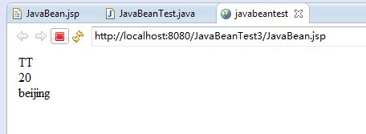

​    其实在jsp中使用还有一些更为复杂的东西，但是这里是入门技术，就以上。

**【****javabean****持久化】**

   JavaBean的持久化可以考虑三种方式：数据库、XML文件、二进制流

   第一种方式可以使用O/R Mapping技术将一个JavaBean映射到关系数据库中的表；

   第二种方式可以使用JAVA1.4 的java.beans.XMLDecoder/java.beans.XMLEncoder将Bean映射到一个XML文件中；

   第三种方式要求Bean实现Java的Serializable接口；这里测试了一下用第二种方式的持久化。

   **具体涉及到的知识点后面在学习，这篇文章就到这里。**

**【参考资料】**

1. **http://www.cnblogs.com/kkgreen/archive/2011/04/19/2021621.html**

**【后面的话】**

​     还是总结以下这篇文章，学习了什么是javabean，javabean的两种简单使用方式。简单说明了javabean的持久化。以后有时间了在学习学习EJB，使用javabean的持久化写一些demo。


**分享：**

​      \1.  这世上有这么一类人，念书的时候按部就班，初中高中啥都不想，默默考了大学，可能考的也还不错，选专业要么听父母，要么是从众，这也无所谓，但是对于未来一无所知，也没想过，接着大学依然按部就班，上课听讲下课作业，平时轻松考前恶补，没想过拿奖，没热爱过专业，没做过实习，没主动去试着尝试点项目，哪怕连最普通的自学都没做过，就这么稀里糊涂的混了三四年，快毕业觉得社会恐惧工作难找，于是又认为这是学历还不够高的问题，于是又去考了研

​     **反思****:**这说的是我吗?说的是我吗?说的是我吗?

​     \2. 不成熟的男人不理性地认为理性可以解决一切问题，成熟的男人理性地看待人类理性与感性的共存。


——TT

 

#  			[Java学习笔记（十）——xml](https://www.cnblogs.com/xt0810/p/3565367.html) 		


****

**【前面的话】**

学习过程中还是效率不够高，老是容易注意力不集中，着急啊。不能在这样了，要好好学习，好好努力。

学习过程中的小知识点总结，**基础知识，选择阅读**。

**【****xml****定义】**

[**定义**：](http://zh.wikipedia.org/zh-cn/XML)可扩展标记语言（英语：eXtensible  Markup Language，简称:  XML），是一种标记语言。标记指计算机所能理解的信息符号，通过此种标记，计算机之间可以处理包含各种信息的文章等。如何定义这些标记，既可以选择国际通用的标记语言，比如HTML，也可以使用像XML这样由相关人士自由决定的标记语言，这就是语言的可扩展性。XML是从标准通用标记语言（SGML）中简化修改出来的。它主要用到的有可扩展标记语言、可扩展样式语言（XSL）、XBRL和XPath等。

**用途：**XML设计用来传送及携带数据信息，不用来表现或展示数据，HTML语言则用来表现数据，所以XML用途的焦点是它说明数据是什么，以及携带数据信息。

\1. 丰富文件（Rich Documents）- 自定文件描述并使其更丰富

- 属于文件为主的XML技术应用
- 标记是用来定义一份资料应该如何呈现  

\2. 元数据（Metadata）- 描述其它文件或网络资讯

- 属于资料为主的XML技术应用
- 标记是用来说明一份资料的意义

\3. 配置文档（Configuration Files）- 描述软件设置的参数

**xml****和html区别：****（在java核心技术中有如下的说明：）**

- 与html不同，xml是大小写敏感的
- 在html中，如果上下文可以分清哪里是段落或列表的结尾，那么结束标签就可以省略，但是在xml中结束标签式绝对不能省略的。
- 在xml中，只有一个标签而没有相对应的结束标签的元素必须以/结尾，比如。这样，解析器就知道不需要查找</img>标签了。
- 在xml中，属性值必须用引号括起来，在html中，引号可有可无。如<applet  code =”MyApplet.class”width=300  height=300>对于html是合法的，但是对于xml是不合法的。在xml中必须使用width=”300”。
- 在html中属性名可以没有值，例如<input  type=”radio” name=”language” value=”Java”  checked>。但是在xml中，所有属性必须都有属性值。比如checked=”true”或者checked=”checked”

**举例：（这个想起了在初中的时候，上课总是和同学传字条，下面就是用xml和同学一起传纸条的内容）**

[](javascript:void(0);)

```
<?xml version="1.0" encoding=”UTF-8”?>
<小纸条>
<收件人>大头</收件人>
<发件人>强哥</发件人>
<主题>吃饭</主题>
<具体內容>下课等我，我们一起去吃饭？ </具体內容>
</小纸条>
```

[](javascript:void(0);)

这XML文档仅是纯粹的信息标签，这些标签意义的展开依赖于应用它的程序。

**【四种操作】**

**下面定义****xml** **文档，然后通过四种方法对于****xml****文档进行操作。**

**四种操作都是对于**xmltest.xml文档的操作，所以xmltest.xml文档时共用的。

- xmltest.xml


[](javascript:void(0);)

```
 1 <?xml version="1.0" encoding="UTF-8"?>
 2 <RESULT>
 3   <VALUE>
 4      <NO>陕A1234</NO>
 5      <ADDR>西安</ADDR>
 6   </VALUE>
 7    <VALUE>
 8      <NO>陕C1234</NO>
 9      <ADDR>宝鸡</ADDR>
10   </VALUE>
11 </RESULT>
```

[](javascript:void(0);)

\1. DOM

- XmlTest.java


[](javascript:void(0);)

```
 1 import java.io.*; 
 2 import java.util.*; 
 3 import org.w3c.dom.*; 
 4 import javax.xml.parsers.*; 
 5 
 6 public class XmlTest{ 
 7     public static void main(String arge[]){
 8         long lasting =System.currentTimeMillis();
 9         try{
10             File f=new File("xmltest.xml"); 
11             DocumentBuilderFactory factory=DocumentBuilderFactory.newInstance(); 
12             DocumentBuilder builder=factory.newDocumentBuilder(); 
13             Document doc = builder.parse(f); 
14             NodeList nl = doc.getElementsByTagName("VALUE"); 
15             for (int i=0;i<nl.getLength();i++){ 
16                 System.out.print("车牌号码:" + doc.getElementsByTagName("NO").item(i).getFirstChild().getNodeValue()); 
17                 System.out.println("车主地址:" + doc.getElementsByTagName("ADDR").item(i).getFirstChild().getNodeValue()); 
18             }
19             
20         }catch(Exception e){ 
21             e.printStackTrace(); 
22         }
23     }
24 }
```

[](javascript:void(0);)

- 运行结果


```
1 车牌号码:陕A1234车主地址:西安
2 车牌号码:陕C1234车主地址:宝鸡
```

\2. JDOM（**需要导入jdom.jar包**）

- XmlTest.java


[](javascript:void(0);)

```
 1 import java.io.*; 
 2 import java.util.*; 
 3 import org.jdom.*; 
 4 import org.jdom.input.*; 
 5 
 6 public class XmlTest { 
 7     public static void main(String arge[]) { 
 8         long lasting = System.currentTimeMillis(); 
 9         try { 
10             SAXBuilder builder = new SAXBuilder(); 
11             Document doc = builder.build(new File("xmltest.xml")); 
12             Element foo = doc.getRootElement(); 
13             List allChildren = foo.getChildren(); 
14             for(int i=0;i<allChildren.size();i++) { 
15                 System.out.println("车牌号码:" + ((Element)allChildren.get(i)).getChild("NO").getText());
16                 System.out.println("车主地址:" + ((Element)allChildren.get(i)).getChild("ADDR").getText()); 
17                 }
18             }catch (Exception e) { 
19                 e.printStackTrace(); 
20             }
21     }
22 }
```

[](javascript:void(0);)

- 运行结果：


```
1 车牌号码:陕A1234
2 车主地址:西安
3 车牌号码:陕C1234
4 车主地址:宝鸡
```

\3. DOM4J（**需要导入dom4j.jar包**）

- XmlTest.java


[](javascript:void(0);)

```
 1 import java.io.*; 
 2 import java.util.*; 
 3 import org.dom4j.*; 
 4 import org.dom4j.io.*; 
 5 
 6 public class XmlTest { 
 7     public static void main(String arge[]) { 
 8         long lasting = System.currentTimeMillis(); 
 9         try { 
10             File f = new File("xmltest.xml"); 
11             SAXReader reader = new SAXReader(); 
12             Document doc = reader.read(f); 
13             Element root = doc.getRootElement(); 
14             Element foo; 
15             for (Iterator i = root.elementIterator("VALUE");i.hasNext();){ 
16                 foo = (Element)i.next(); 
17                 System.out.println("车牌号码:" + foo.elementText("NO")); 
18                 System.out.println("车主地址:" + foo.elementText("ADDR")); 
19                 } 
20             } catch (Exception e) { 
21                 e.printStackTrace(); 
22             }
23         }
24 }
```

[](javascript:void(0);)

- 运行结果：


```
1 车牌号码:陕A1234
2 车主地址:西安
3 车牌号码:陕C1234
4 车主地址:宝鸡
```

\4. SAX（**还没有完全理解清楚，存在问题，在输出的时候，会把xml文档中</NO>后面的内容页输出**)

- XmlTest.java

 


[](javascript:void(0);)

```
 1 import org.xml.sax.*; 
 2 import org.xml.sax.helpers.*; 
 3 import javax.xml.parsers.*;
 4 import java.util.Stack;
 5 
 6 public class XmlTest extends DefaultHandler { 
 7     Stack tags = new Stack(); 
 8     public XmlTest() { 
 9         super(); 
10         } 
11     public void characters(char ch[], int start, int length) throws SAXException { 
12         String tag = (String) tags.peek(); //查看栈顶对象而不删除它
13         if (tag.equals("NO")) { //如果栈顶多想是"NO"输出
14             System.out.println("车牌号码：" +new String(ch, start, length));
15             } 
16         if (tag.equals("ADDR")) {//如果栈顶多想是"ADDR"输出
17             System.out.println("地址:" + new String(ch, start, length)); 
18             }
19         } 
20     public void startElement(String url,String localName,String qName,Attributes attrs) { 
21         tags.push(qName);
22         } 
23     public static void main(String args[]) { 
24         long lasting = System.currentTimeMillis(); 
25         try { 
26             SAXParserFactory sf = SAXParserFactory.newInstance(); 
27             SAXParser sp = sf.newSAXParser(); 
28             XmlTest reader = new XmlTest(); 
29             sp.parse(new InputSource("xmltest.xml"), reader);     
30             } catch (Exception e) { 
31                 e.printStackTrace(); 
32                 } 
33         System.out.println("运行时间：" + (System.currentTimeMillis() - lasting) + "毫秒");
34         } 
35 }
```

[](javascript:void(0);)

 

- 运行结果：


[](javascript:void(0);)

```
 1 车牌号码：陕A1234
 2 车牌号码：
 3      
 4 地址:西安
 5 地址:
 6   
 7 地址:
 8    
 9 车牌号码：陕C1234
10 车牌号码：
11      
12 地址:宝鸡
13 地址:
14      
15 地址:123
16 地址:
17   
18 地址:
19 
20 运行时间：51毫秒
```

[](javascript:void(0);)

**【参考资料】**

1. <http://download.csdn.net/detail/shizhending/4067649#comment>

**【后面的话】**

学习总会有学不下去的时候，没事，好好休息休息，再接着来。加油吧，少年。

分享：《许三观卖血记》——记忆深刻。

1. 一乐吃不到1元7角的一碗面，一个人在哭泣的时候。
2. 许三观为了给一乐治疗肝炎连续卖血。
3. 当许三观自己的血卖不出。生活的状况也不需要他再去卖血，他哭泣的说：以前的生活灾难，都是靠我卖血度过的，那么现在我的血卖不出了，以后生活的灾难我们怎么度过。

——TT


#  			[Java学习笔记（十一）——通过JDBC操作mysql数据库](https://www.cnblogs.com/xt0810/p/3566586.html) 		


**【前面的话】**

​      时间总是好快，每次都感觉还没有怎么好好去过，对于好多事情，希望自己可以做的更多一点。心情能够好一点，平淡一点就行了。

​      学习过程中的知识点总结，**基础知识，选择阅读**。

**【****JDBC****定义】**

[**定义：**](http://zh.wikipedia.org/wiki/Java%E6%95%B0%E6%8D%AE%E5%BA%93%E8%BF%9E%E6%8E%A5)Java  数据库连接，（Java Database  Connectivity，简称JDBC）是Java语言中用来规范客户端程序如何来访问数据库的应用程序接口，提供了诸如查询和更新数据库中数据的方法。JDBC也是Sun  Microsystems的商标。它JDBC是面向关系型数据库的。

[**OBDC****定义：**](http://zh.wikipedia.org/zh-cn/ODBC)

**ODBC**（Open Database  Connectivity，开放数据库互连）提供了一种标准的API（应用程序编程接口）方法来访问数据库管理系统（DBMS）。这些API利用SQL来完成其大部分任务。ODBC本身也提供了对SQL语言的支持，用户可以直接将SQL语句送给ODBC。ODBC的设计者们努力使它具有最大的独立性和开放性：与具体的编程语言无关，与具体的数据库系统无关，与具体的操作系统无关。

**JDBC****的类型**

1. 通过使用jdbc/obdc桥，然后让odbc驱动程序和数据库进行通信。也就是jdbc——jdbc/obdc桥——odbc。
2. 驱动程序是由部分java程序和部分本地代码组成，用于与数据库的客户端API进行通信。
3. 驱动程序是纯java客户端类库，它使用一种与具体数据库无关的协议将数据库请求发送给服务器构件，然后该构件再将数据库请求翻译成特定数据库协议。
4. 驱动程序是纯java类库，他将jdbc请求直接翻译成特定数据库协议。

**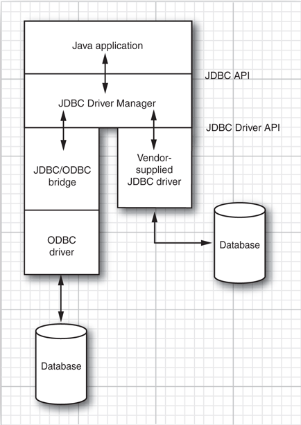**

**【代码】**

​      下面的代码对于Mysql数据库进行操作。

​      创建数据库代码：

[](javascript:void(0);)

```
1 CREATE DATABASE jdbctest；
2 use jdbctest；
3 create table user(
4 userid int(8) unsigned not null auto_increment,
5 username varchar(20) not null default'',
6 password varchar(40) not null default'',
7 email varchar(40) not null default'',
8 primary key(userid)
9 )；
```

[](javascript:void(0);)

如下图：

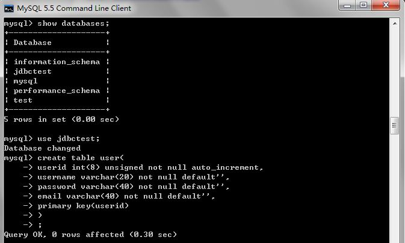

[ **点击可以下载：  代码要加入mysql-connector-java-5.1.25-bin.jar包。**](http://download.csdn.net/detail/xtbda/6961449)

   \1. JdbcTest.java


[](javascript:void(0);)

```
  1 package database;
  2 import java.sql.*;
  3 import java.util.logging.Level;
  4 import java.util.logging.Logger;
  5 
  6 public class JdbcTest {
  7     String drivename="com.mysql.jdbc.Driver";
  8     String url="jdbc:mysql://localhost/jdbctest";
  9     String user="root";
 10     String password="891004";
 11     String insql;
 12     String upsql;
 13     String delsql;
 14     String sql="select * from user";
 15     String name;
 16     Connection conn;
 17     ResultSet rs=null;
 18  
 19     public Connection ConnectMysql(){
 20         try{
 21             Class.forName(drivename);
 22             conn = (Connection) DriverManager.getConnection(url, user, password);
 23             if (!conn.isClosed()) {
 24                 System.out.println("Succeeded connecting to the Database!");
 25             } else {
 26                 System.out.println("Falled connecting to the Database!");
 27             }
 28         }catch(Exception ex){
 29             ex.printStackTrace();
 30         }
 31          return conn;
 32     }
 33     public void CutConnection(Connection conn) throws SQLException{
 34         try{
 35             if(rs!=null);
 36             if(conn!=null);
 37             }catch(Exception e){
 38                 e.printStackTrace();
 39                 }finally{
 40                     rs.close();
 41                     conn.close();
 42                     }
 43         }
 44          //插入、删除、更新的方法是一样的，不一样的是数据库参数
 45     public boolean InsertSql(User user){
 46         try{
 47             insql="insert into user(userid,username,password,email) values(?,?,?,?)";
 48             //上面的方法比下面的方法有优势
 49             //insql="insert into user(userid,username,password,email) values(user.getId,user.getName,user.getPassword,user.getEmail)";
 50             PreparedStatement ps=conn.prepareStatement(insql);
 51             //.preparedStatement(insql);
 52             //PreparedStatement  ps=(PreparedStatement) conn.prepareStatement(insql);
 53             ps.setInt(1, user.getId());
 54             ps.setString(2, user.getName());
 55             ps.setString(3, user.getPassword());
 56             ps.setString(4, user.getEmail());
 57             int result=ps.executeUpdate();
 58             //ps.executeUpdate();无法判断是否已经插入
 59             if(result>0)
 60             return true;
 61             }catch(Exception e){
 62                 e.printStackTrace();
 63                 }
 64         return false;
 65         }
 66     //与其他操作相比较，查询语句在查询后需要一个查询结果集（ResultSet）来保存查询结果
 67     public void SelectSql(String sql){
 68         try{
 69             Statement statement=conn.createStatement();
 70             rs=statement.executeQuery(sql);
 71             while(rs.next()){
 72             name=rs.getString("username");
 73             System.out.println("UserID:"+rs.getString("userid")+"    Name:"+name+"    email:"+rs.getString("email"));
 74             }
 75             }catch(Exception e){
 76                 e.printStackTrace();
 77                 }
 78         }
 79     public boolean UpdateSql(String upsql){
 80         try {
 81             PreparedStatement ps = conn.prepareStatement(upsql);
 82             int result=ps.executeUpdate();//返回行数或者0
 83             if(result>0)
 84                 return true;
 85         } catch (SQLException ex) {
 86             Logger.getLogger(JdbcTest.class.getName()).log(Level.SEVERE, null, ex);
 87         }
 88         return false;
 89         }
 90     public boolean DeletSql(String delsql){
 91         try {
 92             PreparedStatement ps = conn.prepareStatement(upsql);
 93             int result=ps.executeUpdate(delsql);
 94             if(result>0)
 95                 return true;
 96             } catch (SQLException ex) {
 97             Logger.getLogger(JdbcTest.class.getName()).log(Level.SEVERE, null, ex);
 98             }
 99         return false;
100         }
101     }
```

[](javascript:void(0);)

​    \2. User.java


[](javascript:void(0);)

```
 1 package database;
 2 
 3 class User{//内部类，其字段对应用来存放、提取数据库中的数据
 4 int userid;
 5 String username="";
 6 String password="";
 7 String email="";
 8 //通过set方法，往类的实例里“存放”数据
 9 //通过get方法，从类的实例里“获得”数据，然后再通过插入数据库
10 public void setId(int userid){
11     this.userid=userid;
12     }
13 public void setName(String username){
14     this.username=username;
15     }
16 public void setPassword(String password){
17     this.password=password;
18     }
19 public void setEmail(String email){
20     this.email=email;
21     }
22 public Integer getId(){
23     return userid;
24     }
25 public String getName(){
26     return username;
27     }
28 public String getPassword(){
29     return password;
30     }
31 public String getEmail(){
32     return email;
33     }
34 }
```

[](javascript:void(0);)

   \3. MainTest.java


[](javascript:void(0);)

```
 1 package database;
 2 
 3 import java.sql.SQLException;
 4 import database.User;
 5 
 6 public class MainTest {
 7     public static void main(String args[]) throws SQLException{
 8         JdbcTest cd=new JdbcTest();
 9         User user=new User();
10         cd.ConnectMysql();
11         user.setId(12);//每次测试运行都要改变该数字,因为主键要保持唯一。
12         user.setName("zhangsan");
13         user.setPassword("we23");
14         user.setEmail("udjdj@125.com");
15         cd.upsql="update user set username='we' where userid=5";
16         cd.delsql="delete from user where userid=1";
17         cd.InsertSql(user);
18         cd.DeletSql(cd.delsql);
19         cd.UpdateSql(cd.upsql);
20         cd.SelectSql(cd.sql);
21         cd.CutConnection(cd.conn);
22         }
23     }
```

[](javascript:void(0);)

   \4. 运行结果：（**运行结果大家都不一样，主要看你数据库中有什么样的数据，另外切记每次输入数据库的ID要不一样，因为ID是主键。**）


[](javascript:void(0);)

```
1 Succeeded connecting to the Database!
2 UserID:2    Name:zhangsan    email:udjdj@125.com
3 UserID:3    Name:zhangsan    email:udjdj@125.com
4 UserID:4    Name:zhangsan    email:udjdj@125.com
5 UserID:5    Name:we    email:udjdj@125.com
6 UserID:12    Name:zhangsan    email:udjdj@125.com
7 UserID:14    Name:zhangsan    email:udjdj@125.com
```

[](javascript:void(0);)

   \5. 下图显示数据库存储状况：

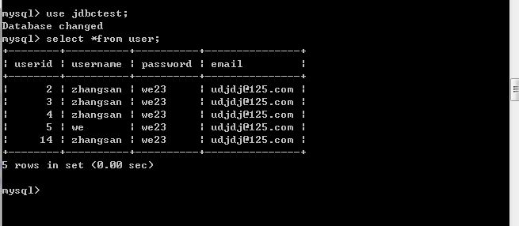

**【参考资料】**

1. <http://blog.sina.com.cn/s/blog_4bea2fb10100f147.html>

**【后面的话】**

​     每天学习一点点，希望这样可以让我进步一点点，加油啦。

分享：（来自知乎日报）

​    凡是在不恰当的场合或者不恰当的对象前盲目展现自己，不懂克制自己的优越感与资源优势的，都很难称之为有品位。

​    分寸，就是对问题恰如其分的回应，多一分，腻；少一分，冷。

​    克制，是在明白生命无常之后对自我的控制，与对生命不同形态的宽容。

​    雄鹰自有雄鹰的疆场，何必飞入麻雀的山林故展雄姿。

​    优秀的人已经得到别人内心的认同，无需再求他人无言的自卑。

 

——TT


#  			[Java学习笔记（十二）——eclipse和SVN配置，导入SVN服务器项目](https://www.cnblogs.com/xt0810/p/3570713.html) 		


**【前面的话】**

​      北京的天气外加自己的不小心终于病了，在病的过程中，感觉身体好着真好，可以学习，可以吃好吃的，可以去运动，这一病了，干什么都感觉没有力气，身体好着真好。

​      这个文章的背景是：领导把项目最开始的demo部署到了SVN服务器上，需要把SVN服务器上面的代码导入本地的eclipse中，我探索了怎么配置SVN插件和eclipse，并且把SVN服务器上面代码导入到了eclipse中。**基础文章，选择性阅读。**

**【定义】**

​    [ **Apache Subversion**](http://zh.wikipedia.org/wiki/Subversion)（简称**SVN**，svn），一个开放源代码的版本控制系统，相较于RCS、CVS，它采用了分支管理系统，它的设计目标就是取代CVS。互联网上很多版本控制服务已从CVS转移到Subversion。

**【解决方法】**

​     eclipse安装svn有两种方式：

​     **一种是：使用****eclipse****安装向导****（这里不介绍了，我没有使用，网上资料非常多，大家可以去学习。没有做的原因是我们本地是连不上网的。）**

​     **一种是：手动安装**

**步骤：**

​        \1. 关闭eclipse

​      \2. 下载插件：最新版本是1.10.3，下载eclipse版本对应的svn。 下面的网址只有eclipse2和eclipse3对应的插件。但是经过试验eclipse4也可以使用插件1.10.3版本的插件。

​       下载地址：<http://subclipse.tigris.org/servlets/ProjectDocumentList?folderID=2240&expandFolder=2240&folderID=1730>

​      \3. 将插件包中的内容复制到你安装eclipse的目录中。如图：

​       1）插件包中的内容：

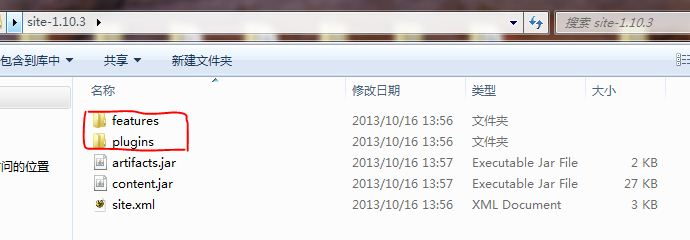

​       2）eclipse安装目录中的东西：

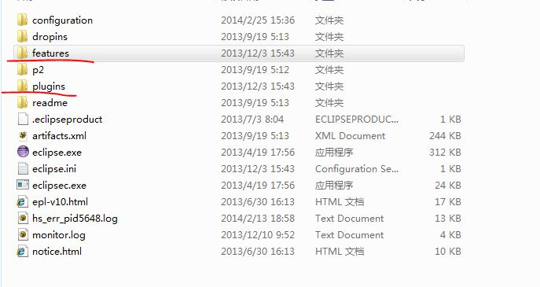

​      将1) fearutes中的内容拷贝到2)中的fearutes中。

​      将1) plugins中的内容拷贝到2)中的plugins中。

​      \4. 重启eclipse，svn插件就安装成功了。

​      \5. 然后在eclipse中，file——new——project

​      \6. svn——从SVN检出项目，点击next

**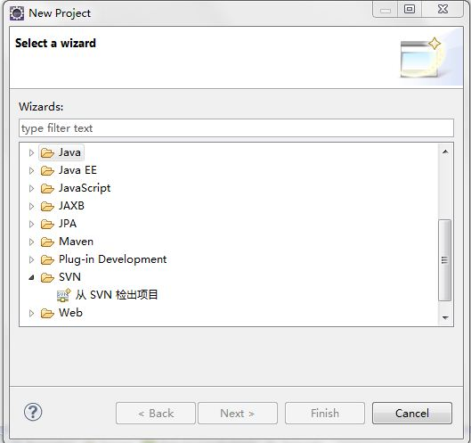**

​     \7. 点击next

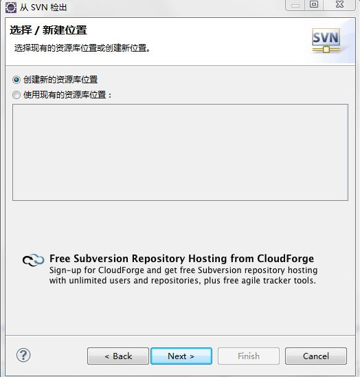

​    \8. 输入URL <http://195.203.6.84:8080/svn/dddsample/trunk/>点击next

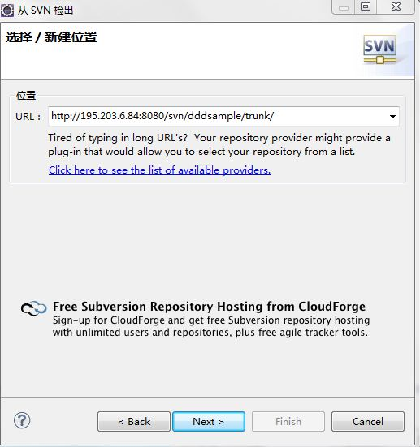

​    \9. 选中项目点击next


​    \10. 输入密码（如果的的SVN服务器有密码的话）

​         大家在这里输入自己的用户名和密码，点击OK。

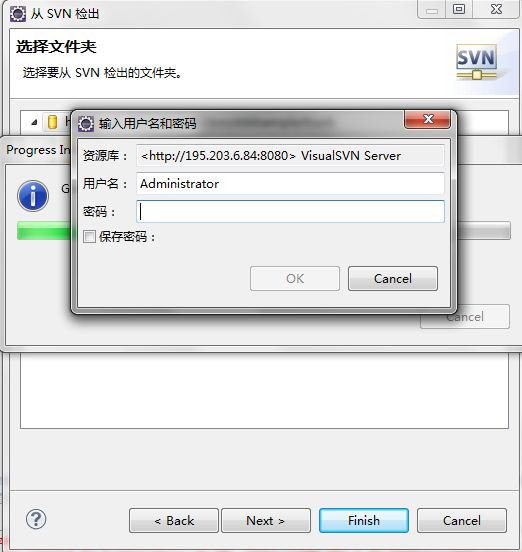

​    \11. 点击finish：

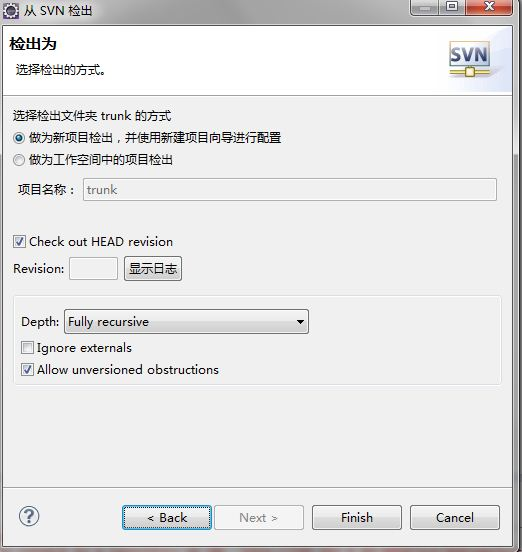

​    \12. 选择java project，点击next

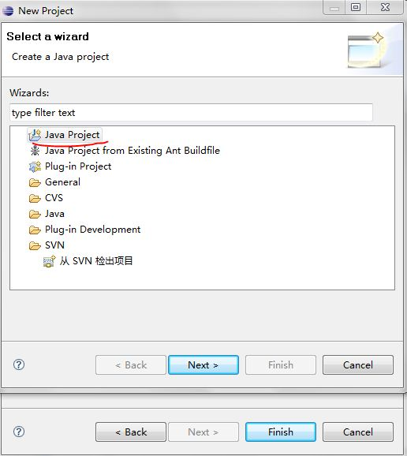

​    \13. 输入project name,点击finish，点击OK

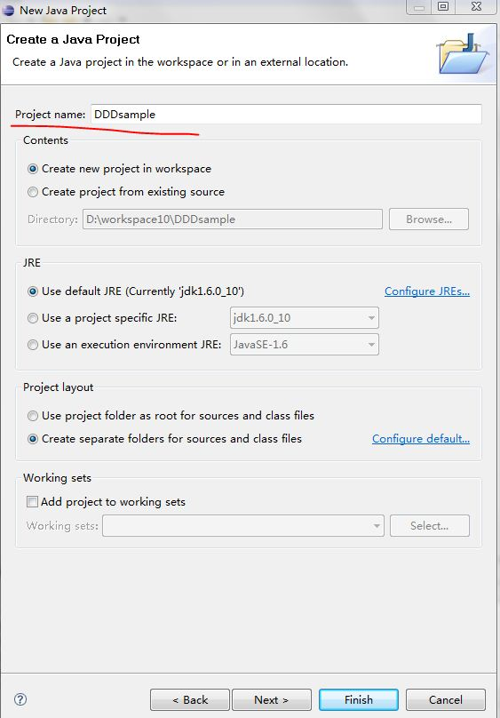

​    \14. 现在导入的项目错误，点击file——properties——java Build Path，选择Libraries

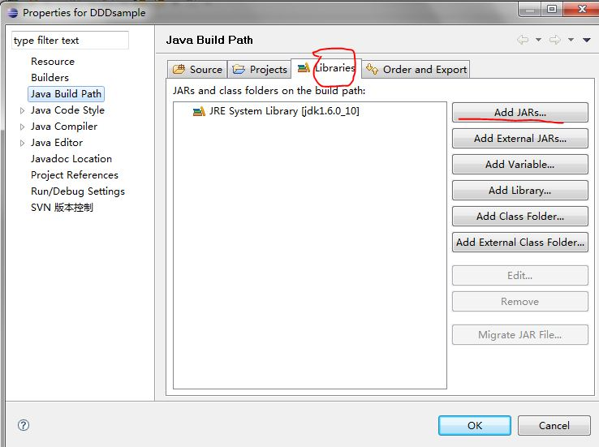

​    \15. 点击Add JARs，选择如下图的JAR包。点击OK。就算完成了。

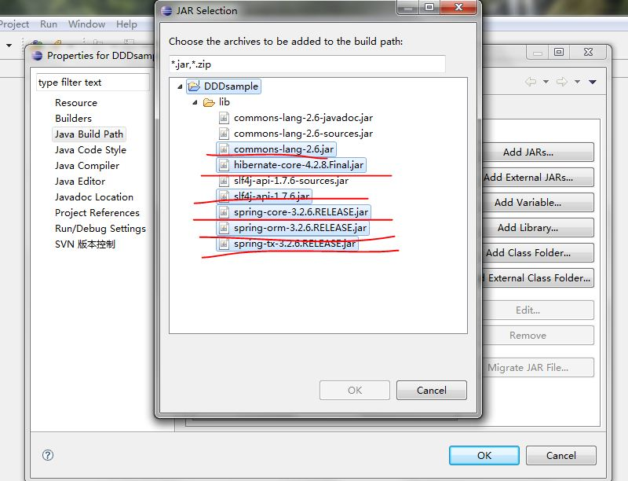

 

​     以上全部。

**【后面的话】**

​     今天的身体才慢慢好了一些，可以继续做事，可以好好学习，领导今天过来说，早点回去吧，你身体不好，感觉真好，不以最坏的恶意去揣摩别人。

——TT

 

#  			[Java学习笔记（十三）——通过Netbeans开发环境生成oracle数据库中表的对应hibernate映射文件](https://www.cnblogs.com/xt0810/p/3571389.html) 		


**【前面的话】**

​      身体慢慢已经快好了，感觉真好，哈哈。

​      这篇文章要通过Hibernate对数据库进行操作，而Netbeans可以直接通过数据库逆向生成对应的映射文件。**基础文章，选择性阅读。**

**【步骤】**

\1. 在netbeans中选择服务，点击数据库，选择建立连接

**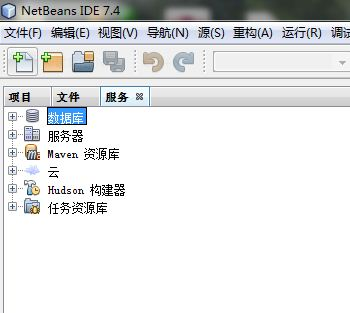**

\2. 我要使用的是oracle，所以我选择Oracle Thin。需要加入连接的jar包，点击添加，然后加入就行了。点击下一步。

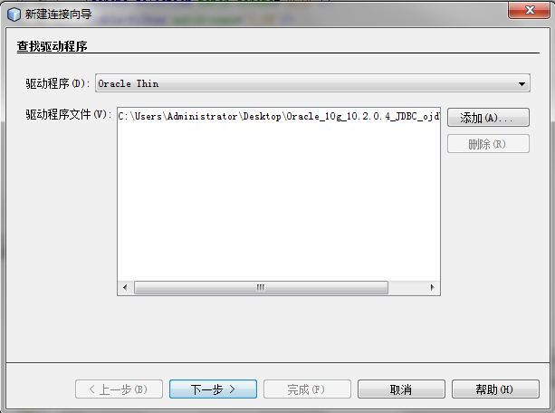

\3. 输入主机名，端口号，服务ID，用户名，口令。

我使用的是远端的数据库所以我输入的主机就是：195.xx.xx.xx

端口号，服务ID，用户名，口令等依次输入就可以了。

输入好以后点击下一步：

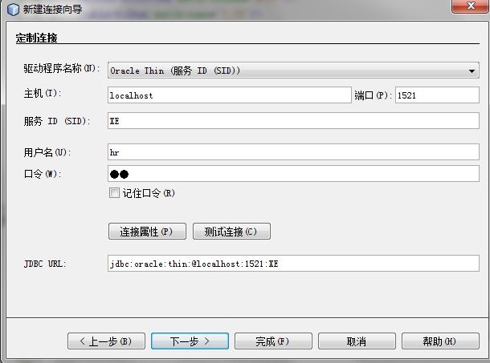

\4. 选择方案，一般就是默认方案。点击finish

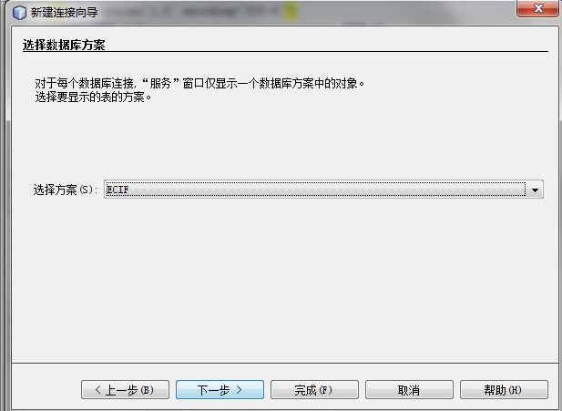

\5. 可以在数据库下面看到自己建立的这个链接。

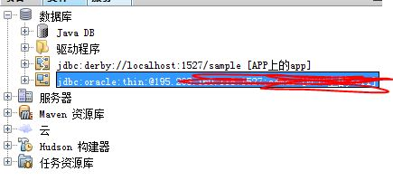

\6. 建立一个java project。

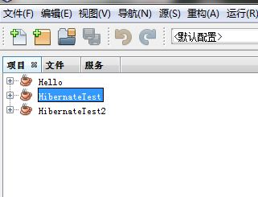

\7. 在新建的项目上面，点击右键，选择其他，点击hibernate

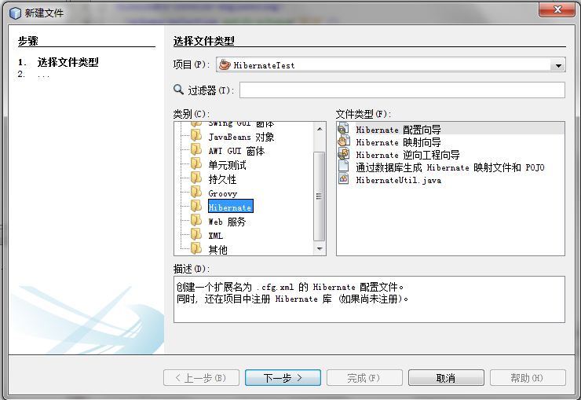

\8. 选择文件类型中的Hibernate 配置向导。点击下一步。选择你刚刚建立的那条链接，点击完成。

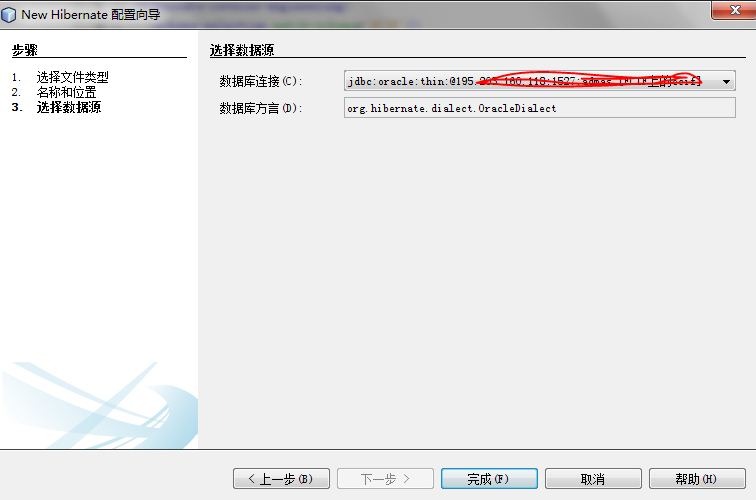

\9. 你就会发现你建立的java project就有一个新的文件了。

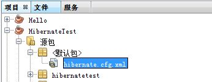

\10. 和上面一样，在新建的项目上面，点击右键，选择其他，点击hibernate，选择Hibernate 逆向工程向导。点击下一步，再点一次下一步。


\11. 选择你要进行转换的数据库表。进行添加。点击完成。

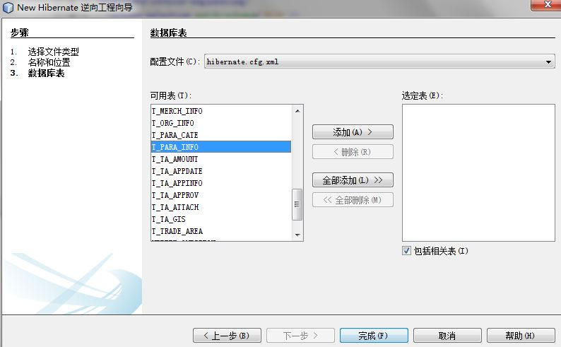

\12. 现在你应该有两个文件如下图，如果没有的话，到你建立项目的文件夹下面，把这两个文件拷贝到scr文件夹下面。

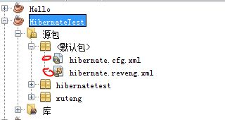

\13. 和上面一样，在新建的项目上面，点击右键，选择其他，点击hibernate，选择通过数据库生成Hibernate映射文件和POJO。点击下一步


\14. 输入包名，建议和你实际项目中的包名一样。点击完成.

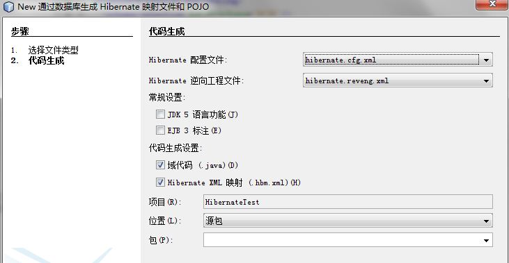

\15. 就会发现已经生成Hibernate映射文件和POJO.

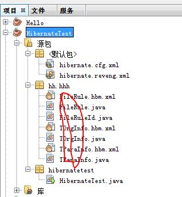

 **【后面的话】**

**时间好快。**

**——TT**


#  			[Java学习笔记（十三一）——Xml 常用知识总结](https://www.cnblogs.com/xt0810/p/3621073.html) 		


**【前面的话】**

​      在学习spring框架，发现很多地方都用到了Xml的知识，所以会过头来再学习学习Xml。

​      本章学习的是Xml的基础，所以**基础性文章，选择性阅读**。

**【****Xml****】**

**一、****Xml****初步了解**

​      XML 指可扩展标记语言

​      XML 被设计用来传输和存储数据。

**二、****什么是****Xml?**

1. XML 指可扩展标记语言（EXtensible Markup Language）
2. XML 是一种标记语言，很类似 HTML
3. XML 的设计宗旨是传输数据，而非显示数据
4. XML 标签没有被预定义。您需要自行定义标签。
5. XML 被设计为具有自我描述性。
6. XML 是 W3C 的推荐标准

**三、****Xml****和****Html****的区别**

1. XML 不是 HTML 的替代。
2. XML 和 HTML 为不同的目的而设计：
3. XML 被设计为传输和存储数据，其焦点是数据的内容。
4. HTML 被设计用来显示数据，其焦点是数据的外观。
5. HTML 旨在显示信息，而 XML 旨在传输信息。

**四、****Xml****的特点**

​     \1. 没有任何行为的 XML，XML 是不作为的。

​         XML 不会做任何事情。XML 被设计用来结构化、存储以及传输信息。

​     如下：

[](javascript:void(0);)

```
1 <note>
2 <to>dear</to>
3 <from>TT</from>
4 <heading>Love</heading>
5 <body>I Love You!</body>
6 </note>
```

[](javascript:void(0);)

​      这个XML 文档仍然没有做任何事情。它仅仅是包装在 XML 标签中的纯粹的信息。我们需要编写软件或者程序，才能传送、接收和显示出这个文档。

​      \2. XML 仅仅是纯文本

​      \3. 通过 XML 您可以发明自己的标签

**五、****Xml****的用途**

1. XML 把数据从 HTML 分离
2. XML 简化数据共享
3. XML 简化数据传输
4. XML 简化平台的变更
5. XML 使您的数据更有用
6. XML 用于创建新的 Internet 语言
7. 假如开发人员都是理性的，就让未来的应用程序使用 XML 来交换数据吧。

**六、****Xml****的树结构**

                       

上图表示下面的 XML 中的一本书：

[](javascript:void(0);)

```
 1 <bookstore>
 2 <book category="COOKING">
 3   <title lang="en">Everyday Italian</title>
 4   <author>Giada De Laurentiis</author>
 5   <year>2005</year>
 6   <price>30.00</price>
 7 </book>
 8 <book category="CHILDREN">
 9   <title lang="en">Harry Potter</title>
10   <author>J K. Rowling</author>
11   <year>2005</year>
12   <price>29.99</price>
13 </book>
14 <book category="WEB">
15   <title lang="en">Learning XML</title>
16   <author>Erik T. Ray</author>
17   <year>2003</year>
18   <price>39.95</price>
19 </book>
20 </bookstore>
```

[](javascript:void(0);)

**七、****Xml****的语法**

1. 所有 XML 元素都须有关闭标签
2. XML 标签对大小写敏感
3. XML 必须正确地嵌套
4. XML 文档必须有根元素
5. XML 的属性值须加引号
6. 实体引用

​     在 XML 中，一些字符拥有特殊的意义。如果你把字符 "<" 放在 XML 元素中，会发生错误，这是因为解析器会把它当作新元素的开始。

下面的发生错误：

```
1 <message>if salary < 1000 then</message>
```

应该为如下：

```
1 <message>if salary &lt; 1000 then</message>
```

在 XML 中，有 5 个预定义的实体引用：

| &lt;   | <    | 小于   |
| ------ | ---- | ------ |
| &gt;   | >    | 大于   |
| &amp;  | &    | 和号   |
| &apos; | '    | 单引号 |
| &quot; | "    | 引号   |

​     \7. XML 中的注释

如下：

```
1 <!-- This is a comment -->
```

​     \8. 在 XML 中，空格会被保留——在 XML 中，文档中的空格不会被删节

​     \9. XML 以 LF 存储换行

**八、****Xml****的命名规则**

1. 名称可以含字母、数字以及其他的字符
2. 名称不能以数字或者标点符号开始
3. 名称不能以字符 “xml”（或者 XML、Xml）开始
4. 名称不能包含空格

**九、** **XML** **元素**

1. **XML** **元素**指的是从（且包括）开始标签直到（且包括）结束标签的部分。元素可包含其他元素、文本或者两者的混合物。元素也可以拥有属性。
2. **例子：**

[](javascript:void(0);)

```
 1 <bookstore>
 2 <book category="COOKING">
 3   <title lang="en">Everyday Italian</title>
 4   <author>Giada De Laurentiis</author>
 5   <year>2005</year>
 6   <price>30.00</price>
 7 </book>
 8 <book category="CHILDREN">
 9   <title lang="en">Harry Potter</title>
10   <author>J K. Rowling</author>
11   <year>2005</year>
12   <price>29.99</price>
13 </book>
14 <book category="WEB">
15   <title lang="en">Learning XML</title>
16   <author>Erik T. Ray</author>
17   <year>2003</year>
18   <price>39.95</price>
19 </book>
20 </bookstore>
```

[](javascript:void(0);)

​     在上例中，<bookstore> 和 <book> 都拥有元素内容，因为它们包含了其他元素。<author> 只有文本内容，因为它仅包含文本。

在上例中，只有 <book> 元素拥有属性 (category="CHILDREN")。

**十、****XML** **属性**

1. XML 属性必须加引号
2. 使用属性还是使用元素，下面的例子说明：

第一个例子中使用了 date 属性：

[](javascript:void(0);)

```
1 <note date="08/08/2008">
2 <to>George</to>
3 <from>John</from>
4 <heading>Reminder</heading>
5 <body>Don't forget the meeting!</body>
6 </note>
```

[](javascript:void(0);)

第二个例子中使用了 date 元素：

[](javascript:void(0);)

```
1 <note>
2 <date>08/08/2008</date>
3 <to>George</to>
4 <from>John</from>
5 <heading>Reminder</heading>
6 <body>Don't forget the meeting!</body>
7 </note>
```

[](javascript:void(0);)

第三个例子中使用了扩展的 date 元素（这是我的最爱）：

[](javascript:void(0);)

```
 1 <note>
 2 <date>
 3   <day>08</day>
 4   <month>08</month>
 5   <year>2008</year>
 6 </date>
 7 <to>George</to>
 8 <from>John</from>
 9 <heading>Reminder</heading>
10 <body>Don't forget the meeting!</body>
11 </note>
```

[](javascript:void(0);)

**十一、****命名空间**

​    \1. 命名冲突

​    在 XML 中，元素名称是由开发者定义的，当两个不同的文档使用相同的元素名时，就会发生命名冲突。

​    这个 XML 文档携带着某个表格中的信息：

[](javascript:void(0);)

```
1 <table>
2    <tr>
3    <td>Apples</td>
4    <td>Bananas</td>
5    </tr>
6 </table>
```

[](javascript:void(0);)

​    这个 XML 文档携带有关桌子的信息（一件家具）：

```
1 <table>
2    <name>African Coffee Table</name>
3    <width>80</width>
4    <length>120</length>
5 </table>
```

​     假如这两个 XML 文档被一起使用，由于两个文档都包含带有不同内容和定义的 <table> 元素，就会发生命名冲突。 XML 解析器无法确定如何处理这类冲突。

​     \2. 使用前缀来避免命名冲突

​     此文档带有某个表格中的信息：

[](javascript:void(0);)

```
1 <h:table>
2    <h:tr>
3    <h:td>Apples</h:td>
4    <h:td>Bananas</h:td>
5    </h:tr>
6 </h:table>
```

[](javascript:void(0);)

​     此 XML 文档携带着有关一件家具的信息：

```
1 <f:table>
2    <f:name>African Coffee Table</f:name>
3    <f:width>80</f:width>
4    <f:length>120</f:length>
5 </f:table>
```

​     现在，命名冲突不存在了，这是由于两个文档都使用了不同的名称来命名它们的 <table> 元素 (<h:table> 和 <f:table>)。

通过使用前缀，我们创建了两种不同类型的 <table> 元素。

​     \3. 使用命名空间（Namespaces）

​    这个 XML 文档携带着某个表格中的信息：

[](javascript:void(0);)

```
1 <h:table xmlns:h="http://www.w3.org/TR/html4/">
2    <h:tr>
3    <h:td>Apples</h:td>
4    <h:td>Bananas</h:td>
5    </h:tr>
6 </h:table>
```

[](javascript:void(0);)

​    此 XML 文档携带着有关一件家具的信息：

```
1 <f:table xmlns:f="http://www.w3school.com.cn/furniture">
2    <f:name>African Coffee Table</f:name>
3    <f:width>80</f:width>
4    <f:length>120</f:length>
5 </f:table>
```

​    与仅仅使用前缀不同，我们为 <table> 标签添加了一个 xmlns 属性，这样就为前缀赋予了一个与某个命名空间相关联的限定名称。

​    \4. XML Namespace (xmlns) 属性

   XML 命名空间属性被放置于元素的开始标签之中，并使用以下的语法：

   xmlns:namespace-prefix="namespaceURI"

   当命名空间被定义在元素的开始标签中时，所有带有相同前缀的子元素都会与同一个命名空间相关联。

   注释：用于标示命名空间的地址不会被解析器用于查找信息。其惟一的作用是赋予命名空间一个惟一的名称。不过，很多公司常常会作为指针来使用命名空间指向实际存在的网页，这个网页包含关于命名空间的信息。

​    \5. 统一资源标识符（Uniform Resource Identifier (URI)）

   统一资源标识符是一串可以标识因特网资源的字符。最常用的 URI 是用来标示因特网域名地址的统一资源定位器(URL)。另一个不那么常用的 URI 是统一资源命名(URN)。在我们的例子中，我们仅使用 URL。

   \6. 默认的命名空间（Default Namespaces）

​    为元素定义默认的命名空间可以让我们省去在所有的子元素中使用前缀的工作。

请使用下面的语法：

```
1 xmlns="namespaceURI"
```

这个 XML 文档携带着某个表格中的信息：

[](javascript:void(0);)

```
1 <table xmlns="http://www.w3.org/TR/html4/">
2    <tr>
3    <td>Apples</td>
4    <td>Bananas</td>
5    </tr>
6 </table>
```

[](javascript:void(0);)

此 XML 文档携带着有关一件家具的信息：

```
1 <table xmlns="http://www.w3school.com.cn/furniture">
2    <name>African Coffee Table</name>
3    <width>80</width>
4    <length>120</length>
5 </table>
```

**【参考资料】**

1．Xml教程 <http://www.w3school.com.cn/xml/index.asp>

**【后面的话】**

​     知识总是在学习过程中发现欠缺别的知识，然后好好补充别的知识，这样就会建立知识库，加油吧，少年。

——T


#  			[Java学习笔记（十四）——Java静态工厂](https://www.cnblogs.com/xt0810/p/3623355.html) 		


**【前面的话】**

​      每天过的还行，对我来说，只要让自己充实，生活就会是好的。

​      学习Java工场方法的原因是最近在使用Spring框架做一个系统，其中有一个注入的方法是使用静态工场方法注入，所以学习一下，**基础性文章，选择性阅读。**

​      **这篇文章学习的是静态工厂。**

**【什么是】**

**一、****定义**

​     **工厂**[**:**](http://zh.wikipedia.org/wiki/%E5%B7%A5%E5%8E%82%E6%96%B9%E6%B3%95)在面向对象程序设计中，工厂通常是一个用来创建其他对象的对象。工厂是构造方法的抽象，用来实现不同的分配方案。

​     **工厂方法模式**（英语：Factory  method  pattern）是一种实现了“工厂”概念的面向对象设计模式。就像其他创建型模式一样，它也是处理在不指定对象具体类型的情况下创建对象的问题。工厂方法模式的实质是“定义一个创建对象的接口，但让实现这个接口的类来决定实例化哪个类。工厂方法让类的实例化推迟到子类中进行。”

**二、****举例**

​      工厂模式是根据不同的参数创建对象。例如用工厂创建小汽车。  如果我们想要一辆奥迪，工厂就会为我们生产一辆奥迪；如果我们需要一辆宝马，工厂则会为我们生产一辆宝马。工厂会根据不同的参数，为我们提供不同的物品。而这些创建的过程就是实例化，也就是是说，对对象实例化的过程封装起来，专门建立一个类进行实例化，这就是工厂模式。

**【怎么做】**

​      从下面两段关键代码来看，没有使用静态工厂的代码使得Manager类和具体的实现类紧耦合，如果生产的汽车种类繁多的话，Manager会经常变化，使得Manager类会经常修改，而使用了静态工厂的代码，将所有的实例化都封装在一个工厂类中，以后可能不光是Manager这个类可以调用工厂类，增加的别的方法也是可以调用工厂了。

**一、****没有使用静态工厂的代码：**

​     \1. Manager.java

[](javascript:void(0);)

```
 1 public class Manager {
 2        public static Car CreatCar(String type){
 3         Car car = null;//Manager与Audi类和BaoMa类还有Suv类耦合，进行了硬编码
 4         if(type.equals("audi")){
 5             car=new AuDi();
 6         }else if(type.equals("baoma")){
 7             car=new BaoMa();
 8         }else if(type.equals("suv")){
 9             car=new Suv();
10         }
11         car.Prepare();
12         car.Install();
13         car.Color();
14         return car;
15     }
16 }
```

[](javascript:void(0);)

**二、****使用静态工厂的代码：**

​    \1. Manager.java

[](javascript:void(0);)

```
 1 public class Manager {
 2     Car car = null;
 3     public  Car CreatCar(String type){//Manager类和具体类解耦合，不需要关心具体的类的实现方法。
 4         car=CarFactory.getCarInstance(type);//静态方法，不需要使用创建工厂CarFactory来创建对象，直接使用CarFactory来调用其方法。
 5         car.Prepare();
 6         car.Install();
 7         car.Color();
 8         return car;
 9     }    
10 }
```

[](javascript:void(0);)

​    \2. CarFactory.java

[](javascript:void(0);)

```
 1 public class CarFactory {
 2     public static Car getCarInstance(String type){//静态方法，这样做的缺点是如果CarFactory被继承，getCar不能被重写。
 3         Car carInstance = null;
 4         if(type.equals("audi")){
 5             carInstance=new AuDi();
 6         }else if(type.equals("baoma")){
 7             carInstance=new BaoMa();
 8         }else if(type.equals("suv")){
 9             carInstance=new Suv();
10         }
11         return carInstance;
12     }
13 }
```

[](javascript:void(0);)

**【为什么】**

​       为什么要使用静态工厂模式，这样做的好处如下几点：

​        第一：静态工厂方法可以突破构造函数不能自由命名的限制，对于不同的工厂方法可以采用不同的会意的名字，是程序具有更好的可读性。JAVA平台库的java.text.Format的子类NumberFormat就有getInstance()  , getPrecentInstance() , getCurrencyInstatnce()等静态方法，通过不同的名字产生特定的对象。

​       第二：静态工厂方法是用来产生对象用的，至于产生什么类型的对象没有限制，这就意味这只要返回原返回类型或原返回类型的子类型都可以，这样就加大了程序设计和使用的灵活行，如java.util集合框架就采用了这种优势，这样就可以更好达到封装的目的，降低API的数目和用户的使用难度，java.util.Connections是集合框架的辅助类用于对原有的集合类进行进一步封装，产生一些同步的集合，不可修改的视图。都是采用静态工厂方法实现的，至于方法内部的实现类就完全别封装了。也迫使我们使用接口编程。 

​       第三：静态工厂方法所创建的对象可以在编译时不存在，动态创建对象，采用放射，类似SPRING的IOC容器方转。最典型的例子就是spi服务提供者框架，Service  Provider Iframe  是一种用于在运行时刻产生对象的框架，达到对象的创建与使用分离，是对象的客户和对象之间解耦，增加程序的灵活性和可扩展性。既然spi可以动态创建对象，那么采用什么机制来创建什么对象，创建对象的依据是什么了，spi必须一种统一的注册机制，对于要创建的对象，应该在XML文件中配置，到时候，只要提供一个字符串，就可以凭借该字符串来创建配置的对象

**【缺点】**

1. 静态方法，这样做的缺点是如果CarFactory被继承，getCar不能被重写。
2. 因为我们一般都采用的是构造函数进行实例化对象，而采用静态工厂的方法进行实例化就会使得实例化和构造函数实例化不一样，所以增加了使用难度，一般都要采用较为清晰的命名，使得使用者可以一目了然知道使用了静态方法。
3. 如果例子中某一个具体类的构造函数式私有，就会出现错误。

**【代码举例】**

​     下面记录了两个代码demo，一个是没有使用静态工厂方法的demo，一个是使用了静态工厂方法的demo。

**一、不是用静态工厂模式的代码**

​    \1. AuDi.java


[](javascript:void(0);)

```
 1 public class AuDi implements Car {
 2     public void Prepare(){
 3         System.out.println("我是奥迪车，我在进行生产准备");
 4     }
 5     public void Install(){
 6         System.out.println("我是奥迪车，我在进行组装");
 7     }
 8     public void Color(){
 9         System.out.println("我是奥迪车，我在进行着色");
10     }
11 }
```

[](javascript:void(0);)

​    \2. BaoMa.java


[](javascript:void(0);)

```
 1 public class BaoMa implements Car{
 2     public void Prepare(){
 3         System.out.println("我是宝马车，我在进行生产准备");
 4     }
 5     public void Install(){
 6         System.out.println("我是宝马车，我在进行组装");
 7     }
 8     public void Color(){
 9         System.out.println("我是宝马车，我在进行着色");
10     }
11 }
```

[](javascript:void(0);)

   \3. Suv.java


[](javascript:void(0);)

```
 1 public class Suv implements Car{
 2     public void Prepare(){
 3         System.out.println("我是SUV车，我在进行生产准备");
 4     }
 5     public void Install(){
 6         System.out.println("我是SUV车，我在进行组装");
 7     }
 8     public void Color(){
 9         System.out.println("我是SUV车，我在进行着色");
10     }
11 }
```

[](javascript:void(0);)

   \4. Car.java


```
1 public interface Car {
2     public abstract void Prepare();
3     public abstract void Install();
4     public abstract void Color();
5 }
```

​    \5. Manager.java


[](javascript:void(0);)

```
 1 public class Manager {
 2        public static Car CreatCar(String type){
 3         Car car = null;//Manager与Audi类和BaoMa类还有Suv类耦合，进行了硬编码
 4         if(type.equals("audi")){
 5             car=new AuDi();
 6         }else if(type.equals("baoma")){
 7             car=new BaoMa();
 8         }else if(type.equals("suv")){
 9             car=new Suv();
10         }
11         car.Prepare();
12         car.Install();
13         car.Color();
14         return car;
15     }
16 }
```

[](javascript:void(0);)

​    \6. MainTest.java


[](javascript:void(0);)

```
1 public class MainTest {
2     public static void main(String[] args){
3         Manager.CreatCar("audi"); 
4         Manager.CreatCar("baoma"); 
5         Manager.CreatCar("suv"); 
6      }
7 }
```

[](javascript:void(0);)

​    \7. 运行结果：


[](javascript:void(0);)

```
1 我是奥迪车，我在进行生产准备
2 我是奥迪车，我在进行组装
3 我是奥迪车，我在进行着色
4 我是宝马车，我在进行生产准备
5 我是宝马车，我在进行组装
6 我是宝马车，我在进行着色
7 我是SUV车，我在进行生产准备
8 我是SUV车，我在进行组装
9 我是SUV车，我在进行着色
```

[](javascript:void(0);)

**二、使用静态工厂模式的代码**

​    \1. AuDi.java


[](javascript:void(0);)

```
 1 public class AuDi implements Car {
 2     public void Prepare(){
 3         System.out.println("我是奥迪车，我在进行生产准备");
 4     }
 5     public void Install(){
 6         System.out.println("我是奥迪车，我在进行组装");
 7     }
 8     public void Color(){
 9         System.out.println("我是奥迪车，我在进行着色");
10     }
11 }
```

[](javascript:void(0);)

​    \2. BaoMa.java


[](javascript:void(0);)

```
 1 public class BaoMa implements Car{
 2     public void Prepare(){
 3         System.out.println("我是宝马车，我在进行生产准备");
 4     }
 5     public void Install(){
 6         System.out.println("我是宝马车，我在进行组装");
 7     }
 8     public void Color(){
 9         System.out.println("我是宝马车，我在进行着色");
10     }
11 }
```

[](javascript:void(0);)

​    \3. Suv.java


[](javascript:void(0);)

```
 1 public class Suv implements Car{
 2     public void Prepare(){
 3         System.out.println("我是SUV车，我在进行生产准备");
 4     }
 5     public void Install(){
 6         System.out.println("我是SUV车，我在进行组装");
 7     }
 8     public void Color(){
 9         System.out.println("我是SUV车，我在进行着色");
10     }
11 }
```

[](javascript:void(0);)

​    \4. Car.java


```
1 public interface Car {
2     public abstract void Prepare();
3     public abstract void Install();
4     public abstract void Color();
5 }
```

​    \5. Manager.java


[](javascript:void(0);)

```
 1 public class Manager {
 2     Car car = null;
 3     public  Car CreatCar(String type){//Manager类和具体类解耦合，不需要关心具体的类的实现方法。
 4         car=CarFactory.getCarInstance(type);//静态方法，不需要使用创建工厂CarFactory来创建对象，直接使用CarFactory来调用其方法。
 5         car.Prepare();
 6         car.Install();
 7         car.Color();
 8         return car;
 9     }    
10 }
```

[](javascript:void(0);)

​    6.CarFactory.java


[](javascript:void(0);)

```
 1 public class CarFactory {
 2     public static Car getCarInstance(String type){//静态方法，这样做的缺点是如果CarFactory被继承，getCar不能被重写。
 3         Car carInstance = null;
 4         if(type.equals("audi")){
 5             carInstance=new AuDi();
 6         }else if(type.equals("baoma")){
 7             carInstance=new BaoMa();
 8         }else if(type.equals("suv")){
 9             carInstance=new Suv();
10         }
11         return carInstance;
12     }
13 }
```

[](javascript:void(0);)

​    7.MainTest.java


[](javascript:void(0);)

```
1 public class MainTest {
2     public static void main(String[] args){
3         Manager manager=new Manager();
4         manager.CreatCar("audi"); 
5         manager.CreatCar("baoma"); 
6         manager.CreatCar("suv"); 
7      }
8 }
```

[](javascript:void(0);)

​    8.运行结果：


[](javascript:void(0);)

```
1 我是奥迪车，我在进行生产准备
2 我是奥迪车，我在进行组装
3 我是奥迪车，我在进行着色
4 我是宝马车，我在进行生产准备
5 我是宝马车，我在进行组装
6 我是宝马车，我在进行着色
7 我是SUV车，我在进行生产准备
8 我是SUV车，我在进行组装
9 我是SUV车，我在进行着色
```

[](javascript:void(0);)

**【资料下载】**

 [代码demo下载](http://download.csdn.net/detail/xtbda/7096469)：http://download.csdn.net/detail/xtbda/7096469

**【参考资料】**

1. 讲故事，学（Java）设计模式—工厂模式  <http://www.importnew.com/6718.html>
2. 工厂方法设计模式的最佳实践 <http://www.importnew.com/10286.html>
3. [静态工厂方法](http://blog.csdn.net/mingyunduoshou/article/details/6149758)<http://blog.csdn.net/mingyunduoshou/article/details/6149758>
4. 《Head First设计模式》Eric Freeman&Elisabeth Freeman著

**【后面的话】**

​     好好学习，最近学习稍微显得有点乱，要有步骤，有计划。

——TT

 


#  			[Java学习笔记（十五）——javadoc学习笔记和可能的注意细节](https://www.cnblogs.com/xt0810/p/3630996.html) 		


**【前面的话】**

​      这次开发项目使用jenkins做持续集成，PMD检查代码，Junit做单元测试，还会自动发邮件通知编译情况，会将javadoc生成的文档自动发到一个专门的服务器上面，每个人都可以看，所以搞得我还必须好好学习一下JavaDoc，别人看到也可以美观一点。

**【基础知识】**

**一、****JavaDoc****简介And基础知识**

(一) Java注释类型

1. //用于单行注释。
2. /*...*/用于多行注释，从/*开始，到*/结束，不能嵌套。
3. /**...*/则是为支持jdk工具javadoc.exe而特有的注释语句。

​     说明：javadoc  工具能从java源文件中读取第三种注释，并能识别注释中用@标识的一些特殊变量（见表），制作成Html格式的类说明文档。javadoc不但能对一个  java源文件生成注释文档，而且能对目录和包生成交叉链接的html格式的类说明文档，十分方便。

(二)JavaDoc中出现的@字符及其意义：

​     \1. 通用注释

| 注释中可以出现的关键字以@开始 | 意义                 |
| ----------------------------- | -------------------- |
| @author                       | 作者名               |
| @version                      | 版本标识             |
| @since                        | 最早出现的JDK版本    |
| @deprecated                   | 引起不推荐使用的警告 |
| @see                          | 交叉参考             |

​    \2. 方法注释

| @return | 返回值           |
| ------- | ---------------- |
| @throws | 异常类及抛出条件 |
| @param  | 参数名及其意义   |

(三)举个例子：

​      我们定义一个BusTestJavaDoc类用来具体说明运用javadoc 命令时对注释的规范。

​     \1. 汽车类有4个属性：

​      1)maxSpeed——最大速度

​      2)averageSpeed——平均速度

​      3)waterTemperature——水温

​      4)Temperature——室温

​     \2. 两个方法：

​     1)measureAverageSpeed() ——汽车的平均速度

​     2)measureMaxSpeed()——最大速度

​    3.BusTestJavaDoc.java例子：

[](javascript:void(0);)

```
 1 /**
 2 *汽车类的简介
 3 *<p>汽车类具体阐述第一行<br>
 4 *汽车类具体阐述第二行
 5 *@author man
 6 *@author man2
 7 *@version 1.0
 8 *@see ship
 9 *@see aircraft
10 */
11 public class BusTestJavaDoc{
12     /**
13     *用来标识汽车行驶当中最大速度
14     *@see #averageSpeed
15     */
16     public int maxSpeed;
17     /**用来标识汽车行驶当中平均速度*/
18     public int averageSpeed;
19     /**用来标识汽车行驶当中的水温*/
20     public int waterTemperature;
21     /**用来标识天气温度*/
22     public int Temperature;
23     BusTestJavaDoc(){
24         
25     }
26     /**
27      *该方法用来测量一段时间内的平均速度
28      *@param start 起始时间
29      *@param end 截止时间
30      *@return 返回int型变量
31      *@exception java.lang.exceptionthrowwhenswitchis1
32      */
33     public int measureAverageSpeed(int start,int end ){
34         int aspeed=12;
35         return aspeed;
36         }
37     /**
38      * 该方法用来测量最大速度
39      */
40     public int measureMaxSpeed(){
41         return maxSpeed;
42         
43     }
44 }
```

[](javascript:void(0);)

​    \4. eclipse中导出Html文档：

​       export——java——javadoc——选择存储位置，可以看看生产的Javadoc

**二、****javadoc****的几种注释**

(一)类注释

​     类注释出现在import语句之后，类定义之前，可以使用通用注释，如下：

[](javascript:void(0);)

```
 1 /**
 2 *汽车类的简介
 3 *<p>汽车类具体阐述第一行<br>
 4 *汽车类具体阐述第二行
 5 *@author man
 6 *@author man2
 7 *@version 1.0
 8 *@see ship
 9 *@see aircraft
10 */
11 public class BusTestJavaDoc{
12 }
```

[](javascript:void(0);)

(二)方法注释

​      每一个方法注释必须放在所描述的方法之前，除了使用通用注释，还可以使用方法注释。如下：

[](javascript:void(0);)

```
 1 /**
 2      *该方法用来测量一段时间内的平均速度
 3      *@param start 起始时间
 4      *@param end 截止时间
 5      *@return 返回int型变量
 6      *@exception java.lang.exceptionthrowwhenswitchis1
 7      */
 8 public int measureAverageSpeed(int start,int end ){
 9         int aspeed=12;
10         return aspeed;
11         }
```

[](javascript:void(0);)

(三)域注释

​     只需对公有域进行注释，可以使用通用注释，如下：

```
1 /**
2     *用来标识汽车行驶当中最大速度
3     *@see #averageSpeed
4     */
5     public int maxSpeed;
```

(四)包注释与概述注释

​      对于类，方法，变量的注释放置在Java源文件中就可以了，只需使用/**···*/文档注释界定就可以了，如果要对包进行注释，需要在每一个包目录中添加一个单独的文件。如下:

1. 提供一个package.html命名的HTML文档。标记<BODY>···</BODY>之间的所有文本都会被抽取出来。
2. 提供一个package-info.java命名的java文件。这个文件必须包含一个初始的以/**和*/界定的javadoc注释，跟随在一个包语句之后。不应该包含更多的代码或注释。

​      如果要所有的源文件进行概述性注释，提供一个overview.html命名的HTML文档。这个文件位于包含所有源文件的父目录中。标记<BODY>···</BODY>之间的所有文本都会被抽取出来。

**三、****文档注释和Html** 

(一)html格式生成：

​     生成的文档系html款式，而这些html款式的标识符并非javadoc加的，而是写诠释的时候写上去的。打个比方，需要换行时，不是敲入1个回车符，而是写入＜br＞，要是要分段，就该当在段前写入＜p＞。

​     **因而，格式化文档，不外乎在文档诠释中添加相应的html标签。** 

​    文档注释的正文并非直接复制到输出文档(文档的html文档)，而是读出每一行后，删掉前导的*号及*号从前的空格，再输入到文档的。

(二).java文档中是这样的：

```
1 /** *thisisfirstline.<br>
2 *****thisissecondline.<br>
3 thisisthirdline. 
4 */
```

(三)编译输出后的html源码则是：

```
1 thisisfirstline.＜br＞ 
2 thisissecondline.＜br＞ 
3 thisisthirdline.
```

(四)在网页上显示是这样的：

```
thisisfirstline.
thisissecondline.
thisisthirdline.
```

(五)说明：

​      前导的*号准许持续运用不止一个，其成果和运用1个*号一致，但不止一个*号前不可有其它字符分隔，不然分隔符及背后的。*号都将作为文档的内容。*号在这里系作为左边陲运用，如上例的第一行和第二行；要是没有前导的*号，则边陲从第一个有效字符开端，而不包括前面的空格，如上例第四行。

**四、****文档注释注意的细节** 

​     文档诠释只阐明紧接其后的类、属性或者方式。

(一)如下例： 

[](javascript:void(0);)

```
1 /**comment for class*/ 
2 public class Test{ 
3 /**comment for a attribute*/ 
4 int number; 
5 /**comment for a method*/ 
6 public void mymethod(){......}
7    ...... 
8 } 
```

[](javascript:void(0);)

​      上例中的三处诠释不外乎区别对类、属性和方式的文档诠释。它们生成的文档分别是阐明紧接其后的类、属性、方式的。“紧接”二字特别首要，要是忽视了这一点，就很可能造成生成的文档故障。

(二)正确例子

```
1 import java.lang.*; 
2 /**comment for class*/ 
3 public class Test{......} //此例为准确的例子 
```

(三) 错误例子：

```
1 /**comment for class*/ 
2 importjava.lang.*; 
3 public class Test{......} //此例为故障的例子 
```

​      这个例子只把上例的import语句和文档诠释局部交换了位置，效果却不尽相同——生成的文档中基本就找不到上述诠释的内容了。

(四) 错误原因：

​      “/**comment for  class*/”系对 Test类的阐明，把它放在“public class Test{......}”之前时，其后紧接着class  Test，吻合限定，因此生成的文档准确。可是把它和“importjava.lang.*;”改换了位置后，其后紧接的不再是类Test了，而是一个import语句。**因为文档诠释只能阐明类、属性和方式，****import****语句不在此列，因此这个文档诠释便被当成故障阐明省略掉了。** 

**五、****文档注释的三个局部**

​     根据文档格式在网页上面的最终显示，文档注释分为三个部分：

(一) 例子

[](javascript:void(0);)

```
 1 /**
 2      *该方法用来测量一段时间内的平均速度.
 3      *<p>啊啊啊啊啊啊<br>
 4      *<p>哈哈哈哈哈哈<br>
 5      *@param start 起始时间
 6      *@param end 截止时间
 7      *@return 返回int型变量
 8      *@exception java.lang.exceptionthrowwhenswitchis1
 9      */
10     public int measureAverageSpeed(int start,int end ){
11         int aspeed=12;
12         return aspeed;
13 }
```

[](javascript:void(0);)

(二) 第一部分：简述。

​     在Html显示中，会将属性和方法先进行概要列举，如图。

​     上述例子中的第二句——*该方法用来测量一段时间内的平均速度.

​     通过.来进行区分，在简述部分只显示.号之前的部分。如下图，measureAverageSpeed方法只显示了该方法用来测量一段时间内的平均速度.这句话，后面的“啊啊啊啊啊啊”“哈哈哈哈哈”都没有显示。

​      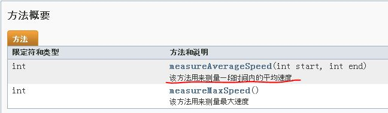                   

(三)第二部分：局部对属性或者方式进行仔细的阐明

​     阐明java语句：

```
1  *该方法用来测量一段时间内的平均速度.
2  *<p>啊啊啊啊啊啊<br>
3  *<p>哈哈哈哈哈哈<br>
```

​    会包含简述中的语句，如下图：

 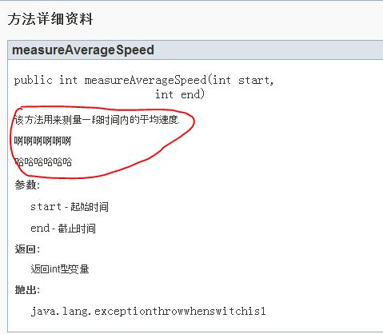

(四)第三部分：特殊说明

​     java语句：

```
1 *@param start 起始时间
2 *@param end 截止时间
3 *@return 返回int型变量
4 *@exception java.lang.exceptionthrowwhenswitchis1
```

​    如下图：

 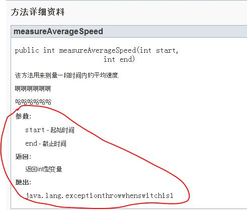

**六、****运用javadoc记号**

(一) @see的运用

​      \1. 提供类名，方法名，变量名，javadoc在文档中插入一个超链接。如下：

​          @see com.cn.corejava.BusTestJavaDoc#measureAverageSpeed(int)

​          建立一个链接到com.cn.corejava.BusTestJavaDoc类的measureAverageSpeed(int)方法的超链接。

​          注意：一定是#来分割类名和方法名或者类名和变量名。

​      \2. @see <a href="www.baidu.com">百度</a>

(二) 运用@author、@version阐明类

1. @author,可以不止一个
2. 最好只有一个

(三) 运用@param、@return和@exception阐明方式

1. 这三个记号全是**只用于方法的**。@param描写方式的参数，@return描写方式的返回值，@exception描写方式也许抛出的异常。
2. 每一个@param只能描写方式的1个参数，因此，要是方式需要不止一个参数，就需要不止一次运用@param来描写。 
3. @return如下代码：1个方式中只能用1个@return，要是文档阐明中列了不止一个@return，则javadoc编译时会发出正告，且只要第一个@return在生成的文档中有效只会生成第一个.如下,生成的只有第一个:

```
1 *@return 返回int型变量
2 *@return 返回double型变量
```

​     \4. 方法也许抛出的异常应该用@exception描写。因为一个方式也许抛出不止一个非常，因此可以有不止一个@exception

**七、****Javadoc****命令**

(一)Javadoc生成命令

1. javadoc命令

​        javadoc -d 文档寄存目录 -author -version java文档存在目录\源文件名.java

​         **-author –version可以省略**

​     \2. 举例子：

​        java -d D:\workspace8\JavaDoc\src D:\workspace8\JavaDoc\src\BusTestJavaDoc.java

​     \3. 如下图：

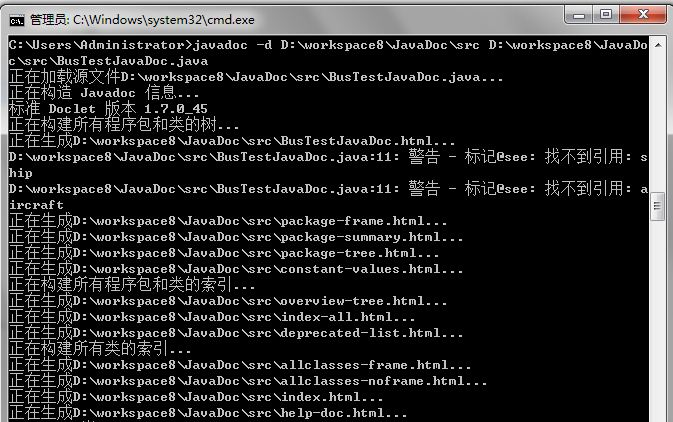

(二)Javadoc帮助命令

​     运行javadoc-help可以看到javadoc的用法，如下：

 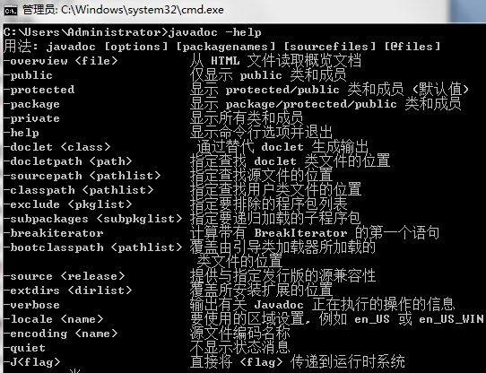

**【建议风格】**

   **一、 格式**

- 一般形式：

   这样：

```
/**
 * Multiple lines of Javadoc text are written here,
 * wrapped normally...
 */
public int method(String p1) { ... }
```

   或这样：

```
/** An especially short bit of Javadoc. */
```

-  段落

​      空行(即，只包含最左侧星号的行)会出现在段落之间和Javadoc标记(@XXX)之前(如果有的话)。除了第一个段落，每个段落第一个单词前都有标签`<p>`，并且它和第一个单词间没有空格。

- Javadoc标记

​      标准的Javadoc标记按以下顺序出现：`@param`, `@return`, `@throws`, `@deprecated`, 前面这4种标记如果出现，描述都不能为空。当描述无法在一行中容纳，连续行需要至少再缩进4个空格。

**二、摘要片段**

-  每个类或成员的Javadoc以一个简短的摘要片段开始。这个片段是非常重要的，在某些情况下，它是唯一出现的文本，比如在类和方法索引中。
-  这只是一个小片段，可以是一个名词短语或动词短语，但不是一个完整的句子。它不会以A  {@code Foo} is a...或This method returns...开头, 它也不会是一个完整的祈使句，如Save the  record...。然而，由于开头大写及被加了标点，它看起来就像是个完整的句子。
- Tip：一个常见的错误是把简单的Javadoc写成`/** @return the customer ID */`，这是不正确的。它应该写成`/** Returns the customer ID. */`。

**三、哪里需要使用Javadoc**

   至少在每个public类及它的每个public和protected成员处使用Javadoc。

**例外：**

- 不言自明的方法

​      对于简单明显的方法如getFoo，Javadoc是可选的(即，是可以不写的)。这种情况下除了    写“Returns the foo”，确实也没有什么值得写了。

​      单元测试类中的测试方法可能是不言自明的最常见例子了，我们通常可以从这些方法的描述性命名中知道它是干什么的，因此不需要额外的文档说明。

- 重载

​      如果一个方法重载了超类中的方法，那么Javadoc并非必需的。

- 可选的Javadoc

​      对于包外不可见的类和方法，如有需要，也是要使用Javadoc的。如果一个注释是用来定义一个类，方法，字段的整体目的或行为，那么这个注释应该写成Javadoc，这样更统一更友好。

**【参考资料】**

1. 这篇文章主要是学习了[《javadoc__用法_很详细》](http://wenku.baidu.com/view/e780453a87c24028915fc303.html)这个文档

**【后面的话】**

​     加油吧。

——T

# Java学习笔记（十六）——Java RMI 		


**【前面的话】**

​      最近过的好舒服，每天过的感觉很充实，一些生活和工作的技巧注意了就会发现，其实生活也是可以过的如此的有滋有味，满足现在的状况，并且感觉很幸福。

​      学习java RMI的原因是最近在使用dubbo框架做一个系统，所以对这java RMI进行学习，做一些笔记，**基础性文章，选择性阅读。**

**【定义】**

​       **Java RMI**[**：**](http://zh.wikipedia.org/wiki/Java_RMI)Java远程方法调用，即Java  RMI（Java Remote Method  Invocation）是Java编程语言里，一种用于实现远程过程调用的应用程序编程接口。它使客户机上运行的程序可以调用远程服务器上的对象。远程方法调用特性使Java编程人员能够在网络环境中分布操作。RMI全部的宗旨就是尽可能简化远程接口对象的使用。

​      我们知道远程过程调用（Remote Procedure  Call, RPC）可以用于一个进程调用另一个进程（很可能在另一个远程主机上）中的过程，从而提供了过程的分布能力。Java 的 RMI 则在  RPC 的基础上向前又迈进了一步，即提供分布式对象间的通讯。

​      RMI（Remote Method Invocation）为远程方法调用，是允许运行在一个Java虚拟机的对象调用运行在另一个Java虚拟机上的对象的方法。

​      这两个虚拟机可以是运行在相同计算机上的不同进程中，也可以是运行在网络上的不同计算机中。

**【****JavaRMI****】**

**一、****工作原理**

​      RMI能让一个Java程序去调用网络中另一台计算机的Java对象的方法，那么调用的效果就像是在本机上调用一样。通俗的讲：A机器上面有一个class，通过远程调用，B机器调用这个class 中的方法。

​      RMI，远程方法调用（Remote Method Invocation）是Enterprise JavaBeans的支柱，是建立分布式Java应用程序的方便途径。RMI是非常容易使用的，但是它非常的强大。

​      RMI的基础是接口，RMI构架基于一个重要的原理：定义接口和定义接口的具体实现是分开的。下面我们通过具体的例子，建立一个简单的远程计算服务和使用它的客户程序

**二、****RMI****包含部分：**

1. 远程服务的接口定义
2. 远程服务接口的具体实现
3. 桩（Stub）和框架（Skeleton）文件
4. 一个运行远程服务的服务器
5. 一个RMI命名服务，它允许客户端去发现这个远程服务
6. 类文件的提供者（一个HTTP或者FTP服务器）
7. 一个需要这个远程服务的客户端程序

**三、****RMI****的用途****?**

​     RMI的用途是为分布式Java应用程序之间的远程通信提供服务，提供分布式服务。

​     目前主要应用时封装在各个J2EE项目框架中，例如Spring，EJB（Spring和EJB均封装了RMI技术）

​     在Spring中实现RMI：

​     ①在服务器端定义服务的接口，定义特定的类实现这些接口；

​     ②在服务器端使用org.springframework.remoting.rmi.RmiServiceExporter类来注册服务；

​     ③在客户端使用org.springframework.remoting.rmi.RmiProxyFactoryBean来实现远程服务的代理功能；

​     ④在客户端定义访问与服务器端服务接口相同的类

**四、****RMI****的局限？**                                                                     

​      RMI目前使用Java远程消息交换协议JRMP（Java  Remote Messaging  Protocol）进行通信。JRMP是专为Java的远程对象制定的协议，由于JRMP是专为Java对象制定的，因此，RMI对于用非Java语言开发的应用系统的支持不足。不能与用非Java语言书写的对象进行通信（意思是只支持客户端和服务器端都是Java程序的代码的远程调用）。

**五、****RMI****的使用局限****?**

​      由于客户机和服务器都是使用Java编写的，二者平台兼容性的要求仅仅是双方都运行在版本兼容的Java虚拟机上。

**六、****RMI****调用远程方法的参数和返回值**

​       当调用远程对象上的方法时，客户机除了可以将原始类型的数据作为参数一外，还可以将对象作为参数来传递，与之相对应的是返回值，可以返回原始类型或对象，这些都是通过Java的对象序列化（serialization）技术来实现的。（换而言之：参数或者返回值如果是对象的话必须实现Serializable接口）

**七、** **RMI****应用程序的基本模型**

                       

**八、****RMI****体系结构**

 

​      桩/框架（Stub/Skeleton）层：客户端的桩和服务器端的框架；

​      远程引用（remote reference）层：处理远程引用行为

​      传送层（transport）：连接的建立和管理，以及远程对象的跟踪

**九、** **RMI****类和接口（完成一个简单****RMI****需要用到的类）。**

 

 

 

(一) **Remote****接口：**是一个不定义方法的标记接口

​      Public interface Remote{}

​      在RMI中，远程接口声明了可以从远程Java虚拟机中调用的方法集。远程接口满足下列要求：

​      1、远程接口必须直接或间接扩展Java.rmi.Remote接口，且必须声明为public，除非客户端于远程接口在同一包中

​      2、在远程接口中的方法在声明时，除了要抛出与应用程序有关的一场之外，还必须包括RemoteException（或它的超类，IOExcepion或Exception）异常

​      3、在远程方法声明中，作为参数或返回值声明的远程对象必须声明为远程接口，而非该接口的实现类。

(二) **RemoteObject****抽象类**实现了Remote接口和序列化Serializable接口，它和它的子类提供RMI服务器函数。

(三) **LocateRegistry final()****类**用于获得特定主机的引导远程对象注册服务器程序的引用（即创建stub），或者创建能在特定端口接收调用的远程对象注册服务程序。

**服务器端**：向其他客户机提供远程对象服务

​      SomeService servcie=……；//远程对象服务

1. Registry registry=LocateRegisty.getRegistry()；//Registry是个接口，他继承了Remote，此方法返回本地主机在默认注册表端口 1099 上对远程对象 `Registry` 的引用。
2. getRegistry(int port) 返回本地主机在指定 port 上对远程对象 Registry 的引用;
3. getRegistry(String host)  返回指定 `host` 在默认注册表端口 1099 上对远程对象 `Registry` 的引用;
4. getRegistry(String host, int port) 返回指定的 `host` 和 `port` 上对远程对象 Registry 的引用
5. registry.bind(“I serve”,service);//  bind(String name,Remote obj) 绑定对此注册表中指定 name 的远程引用。name ： 与该远程引用相关的名称  obj ： 对远程对象（通常是一个 stub）的引用
6. unbind（String name）移除注册表中指定name的绑定。
7. rebind（String name,Remote obj）重新绑定，如果name已存在，但是Remote不一样则替换，如果Remote一样则丢弃现有的绑定
8. lookup(String name) 返回注册表中绑定到指定 name 的远程引用，返回Remote
9. String[] list()   返回在此注册表中绑定的名称的数组。该数组将包含一个此注册表中调用此方法时绑定的名称快照。

**客户机端**：向服务器提供相应的服务请求。

```
Registry registry=LocateRegisty.getRegistry()；
SomeService servcie=(SomeService)registry.lookup(“I serve”);
Servcie.requestService();
```

(四) **Naming****类**和Registry类类似。

**客户端：**

​      Naming.lookup(String url)

​      url 格式如下"rmi://localhost/"+远程对象引用
**服务器端：**
​      Registry registry=LocateRegistry.createRegistry(int port);
​      Naming.rebind(“service”,service);

(五) **RMISecurityManager****类**

​     在RMI引用程序中，如果没有设置安全管理器，则只能从本地类路径加载stub和类，这可以确保应用程序不受由远程方法调用所下载的代码侵害

​     在从远程主机下载代码之前必须执行以下代码来安装RMISecurityManager:

​     System.setSecurityManager（new RMISecurityManager（））；

**十、****demo****开发**

​     为了编写一个demo，我们分为两部分，一部分是server端的代码，一部分是client端的代码，client端的代码主要是为了使用server端的代码。当然这个代码是非常简单的，只是为了说明问题，现实的使用会使比较复杂的。

(一) 我们的目的

​     建立一个server端的java project，包含远程端的代码，定义接口，定义接口实现，然后在建立一个client端的java project，通过RMI使用远端服务中的方法。

(二) 我们的代码结构

 

(三) 远程服务代码

​      \1. 远程服务的接口定义

​       第一步就是建立和编译服务接口的Java代码。这个接口定义了所有的提供远程服务的功能，下面是源程序：

​       UserManagerInterface.java

[](javascript:void(0);)

```
 1 package cn.com.tt.rmiserver.stub;
 2 
 3 import java.rmi.Remote;
 4 import java.rmi.RemoteException;
 5 
 6 import cn.com.tt.rmiserver.bean.Account;
 7 
 8 public interface UserManagerInterface extends Remote{
 9     public String getUserName() throws RemoteException;
10     public Account getAdminAccount() throws RemoteException;
11 }
```

[](javascript:void(0);)

​     接口必须继承Remote类，每一个定义地方法都要抛出RemoteException异常对象。

​    \2. 接口的具体实现

​    第二步就是对于上面的接口进行实现:

​    UserManagerImp.java

[](javascript:void(0);)

```
 1 package cn.com.tt.rmiserver;
 2 
 3 import java.rmi.RemoteException;
 4 
 5 import cn.com.tt.rmiserver.stub.UserManagerInterface;
 6 import cn.com.tt.rmiserver.bean.Account;
 7 
 8 public class UserManagerImp implements UserManagerInterface {
 9     public UserManagerImp() throws RemoteException {
10 
11     }
12     private static final long serialVersionUID = -3111492742628447261L;
13 
14     public String getUserName() throws RemoteException{
15         return "TT";
16     }
17     public Account getAdminAccount() throws RemoteException{
18         Account account=new Account();
19         account.setUsername("TT");
20         account.setPassword("123456");
21         return account;
22     }
23 }
```

[](javascript:void(0);)

​      \3. 定义一个bean，实现implements Serializable序列化接口。也就是可以在client和server端进行传输的可序列化对象。

​      Account.java

[](javascript:void(0);)

```
 1 package cn.com.tt.rmiserver.bean;
 2 
 3 import java.io.Serializable;
 4 
 5 public class Account implements Serializable,Cloneable{
 6     private static final long serialVersionUID = -1858518369668584532L;
 7     private String username;
 8     private String password;
 9     
10     public String getUsername() {
11         return username;
12     }
13     public void setUsername(String username) {
14         this.username = username;
15     }
16     public String getPassword() {
17         return password;
18     }
19     public void setPassword(String password) {
20         this.password = password;
21     }
22 }
```

[](javascript:void(0);)

​      \4. 定义server端的主程序入口。

​          Entry.java

[](javascript:void(0);)

```
 1 package cn.com.tt.rmiserver.entry;
 2 
 3 import java.rmi.AlreadyBoundException;
 4 import java.rmi.RemoteException;
 5 import java.rmi.registry.LocateRegistry;
 6 import java.rmi.registry.Registry;
 7 import java.rmi.server.UnicastRemoteObject;
 8 
 9 import cn.com.tt.rmiserver.UserManagerImp;
10 import cn.com.tt.rmiserver.stub.UserManagerInterface;
11 
12 public class Entry {
13     public static void main(String []args) throws AlreadyBoundException, RemoteException{
14         UserManagerImp userManager=new UserManagerImp();
15         UserManagerInterface userManagerI=(UserManagerInterface)UnicastRemoteObject.exportObject(userManager,0);
16         // Bind the remote object's stub in the registry
17         Registry registry = LocateRegistry.createRegistry(2002);
18        
19         registry.rebind("userManager", userManagerI);
20         System.out.println("server is ready");
21         }
22 }
```

[](javascript:void(0);)

(四) client端代码

1. 把Server端的Account类和接口UserManagerInterface 导出Export成jar包，命名为：RmiServerInterface.jar。导入到client中。
2. 项目——右键——Export——java——jar file——next——选择Account类和接口UserManagerInterface——命名为：RmiServerInterface.jar如下图：


 

​     \3. 新建一个java Project，导入jar包，编写客户端代码。

​    \4. 代码

​         ClientEntry.java

[](javascript:void(0);)

```
 1 package weiblog.rmi;
 2 
 3 import java.rmi.NotBoundException;
 4 import java.rmi.RemoteException;
 5 import java.rmi.registry.LocateRegistry;
 6 import java.rmi.registry.Registry;
 7 
 8 import cn.com.tt.rmiserver.stub.UserManagerInterface;
 9 
10 public class ClientEntry {
11     
12     public static void main(String []args){
13         
14         try {
15             Registry registry = LocateRegistry.getRegistry("localhost",2004);
16             UserManagerInterface userManager = (UserManagerInterface)registry.lookup("userManager");
17             System.out.println("用户名是"+userManager.getAdminAccount().getUsername()
18                     +"密码"+userManager.getAdminAccount().getPassword());
19         } catch (RemoteException e) {
20             // TODO Auto-generated catch block
21             e.printStackTrace();
22         } catch (NotBoundException e) {
23             // TODO Auto-generated catch block
24             e.printStackTrace();
25         }
26         
27     }
28 
29 }
```

[](javascript:void(0);)

​     \5. 先运行服务器端代码， 然后运行客户端代码，就会显示运行结果，客户端可以运行多次，每次都可以取得服务器端的对象。如果要再次运行客户端代码就需要更改端口号，如果不更改就会显示端口号被占用。

**【参考资料】**

​     \1. demo参考的下面文章：

​        [ RMI网络编程开发之二 如何搭建基于JDK1.5的分布式JAVA RMI 程序](http://www.cnblogs.com/%20%20%20http:/6221123.blog.51cto.com/6211123/1112619)

​     \2. 理论知识参考的下面文章：

​       [RMI入门教程](http://www.cnblogs.com/%20http:/wenku.baidu.com/link?url=cmMn9JPVv-eN4ndBz2eEcw7KYr4XErJW0lQyY_r9ZuXB682NqawBPcKtiTlOSa8JAZTvy8t_jXepSKviVWC9uQYTJJEMh-CQM0gguKFZk2_) 

​       [java_RMI技术讲解](http://wenku.baidu.com/view/4bf068a9102de2bd9705880f.html)

**【后面的话】**

​      快要放假了多么值得高兴。

​      时至今日都是我咎由自取，学java那是自找，与任何人无关。大学生活过的平顺，造就了我轻信java，编写众多bug的脾气，导致今日岌岌可危的地步，我今天愿意承担一切后果。其实，我很感激你们让我在测试的时候发现bug，而不是到了生产环境，我必须重新梳理我所造成的bug，坦然面对每个bug。我，在学java的路上编写了大量的bug。我辜负了c和c++，辜负了C#，辜负了程序员和码农的称呼，辜负了所有以为我可以写出漂亮代码的人。对不起，请接收我发自内心的歉意和忏悔。晚上和周末本来有一个温暖和美的生活，可是这一切被我学习java给打破了，我学java的行为不配得到原谅，我造成的无休止的bug现状也难以修改，但我还是想修改，我必须修改，这是我今日之后的生活。至于我自己，已咎由自取，愿日后不在产生bug。java程序员。——**我真是越来越喜欢自黑了。哈哈，让我笑一会。**

——TT

 

#   			[Java学习笔记（十七）——java序列化](https://www.cnblogs.com/xt0810/p/3642904.html) 		


**【前面的话】**

​      做项目总是要用到很多东西，遇到一个新的知识，并不是这个知识出来的时间短，而是对于自己来说是新的，所以就需要自己去学习，希望今后可以提高学习的效率。

​      这篇文章是关于Java 序列化的，**选择性阅读。**

**【知识点】**

**一、****什么叫序列化？**

​      我们都知道对象是暂时保存在内存中的，不能用U盘考走了，有时为了使用介质转移对象，并且把对象的状态保持下来，就需要把对象保存下来，这个过程就叫做序列化，通俗点，就是把人的魂（对象）收伏成一个石子（可传输的介质）。

**二、****什么叫反序列化？**

​      就是再把介质中的东西还原成对象，把石子还原成人的过程。

**三、****可能的使用情况**

​      \1. 当你想把的内存中的对象写入到硬盘的时候；

​       比如说你的内存不够用了，那计算机就要将内存里面的一部分对象暂时的保存到硬盘中，等到要用的时候再读入到内存中，硬盘的那部分存储空间就是所谓的虚拟内存。在比如过你要将某个特定的对象保存到文件中，我隔几天在把它拿出来用，那么这时候就要实现Serializable接口；

​      \2. 当你想用套接字在网络上传送对象的时候；

​      在进行java的Socket编程的时候，你有时候可能要传输某一类的对象，那么也就要实现Serializable接口；最常见的你传输一个字符串，它是JDK里面的类，也实现了Serializable接口，所以可以在网络上传输。

​      \3. 当你想通过RMI传输对象的时候；

​      如果要通过远程的方法调用（RMI）去调用一个远程对象的方法，如在计算机A中调用另一台计算机B的对象的方法，那么你需要通过JNDI服务获取计算机B目标对象的引用，将对象从B传送到A，就需要实现序列化接口。

**四、****Serializable****接口**

1. **Serializable****接口**：一个对象序列化的接口，一个类只有实现了Serializable接口，它的对象才是可序列化的。因此如果要序列化某些类的对象，这些类就必须实现Serializable接口。
2. **Serializable**实现代码：

```
1 public interface Serializable {
2 }
```

​      可以看出Serializable接口是一个空的接口，目的只有一个就是表示一个类的对象可以被序列化。这个标签是类可以被序列化的特性，表示这个类可以被序列化。

**五、****Externalizable****接口**

1. **Externalizable****接口**：他是**Serializable**接口的子类
2. **Externalizable**实现代码：

```
1 public interface Externalizable extends java.io.Serializable {
2     void writeExternal(ObjectOutput out) throws IOException;
3     void readExternal(ObjectInput in) throws IOException, ClassNotFoundException;
4 }
```

**六、****Serializable****接口和****Externalizable****接口区别**

1. **Serializable**：一个对象想要被序列化，那么它的类就要实现此接口，这个对象的所有属性（包括private属性、包括其引用的对象）都可以被序列化和反序列化来保存、传递。
2. **Externalizable**：他是Serializable接口的子类，有时我们不希望序列化那么多，可以使用这个接口，这个接口的writeExternal()和readExternal()方法可以指定序列化哪些属性;

**【学习****demo And** **解释】**

**一、****Java****实现序列化**

​      **1. java.io.ObjectOutputStream**代表对象输出流，它的**writeObject(Object obj)**方法可对参数指定的obj对象进行序列化，把得到的字节序列写到一个目标输出流中。

​      **2. java.io.ObjectInputStream**代表对象输入流，它的**readObject()**方法从一个源输入流中读取字节序列，再把它们反序列化为一个对象，并将其返回。

​      \3. 对象序列化包括如下步骤：

​         1)创建一个对象输出流，它可以包装一个其他类型的目标输出流，如文件输出流；

​         2)通过对象输出流的writeObject()方法写对象。

​      \4. 对象反序列化的步骤如下：

​         1)创建一个对象输入流，它可以包装一个其他类型的源输入流，如文件输入流；

​         2)通过对象输入流的readObject()方法读取对象。

​      \5. 代码实现：

​       SerializableTest.java

[](javascript:void(0);)

```
 1 import java.io.*;
 2 import java.util.Date;
 3 
 4 public class SerializableTest {
 5     
 6     public static void main(String[] args) throws Exception {
 7         ObjectOutputStream out = new ObjectOutputStream(new FileOutputStream("objectFile.obj"));
 8         //序列化对象
 9         Customer customer = new Customer("阿蜜果", 24);
10         out.writeObject("你好!");
11         out.writeObject(new Date());
12         out.writeObject(customer);//写入实现了序列化的对象
13         out.writeInt(123); //写入基本类型数据
14         out.close();
15         //反序列化对象
16         ObjectInputStream in = new ObjectInputStream(new FileInputStream("objectFile.obj"));
17         System.out.println("obj1=" + (String) in.readObject());
18         System.out.println("obj2=" + (Date) in.readObject());
19         Customer obj3 = (Customer) in.readObject();
20         System.out.println("obj3=" + obj3);
21         int obj4 = in.readInt();
22         System.out.println("obj4=" + obj4);
23         in.close();
24         }
25     }
26 class Customer implements Serializable {
27     private String name;
28     private int age;
29     public Customer(String name, int age) {
30         this.name = name;
31         this.age = age;
32         }
33     public String toString() {
34         return "name=" + name + ", age=" + age;
35         }
36     }
```

[](javascript:void(0);)

​      \6. 运行结果：

```
1 obj1=你好!
2 obj2=Thu Apr 03 09:12:09 CST 2014
3 obj3=name=阿蜜果, age=24
4 obj4=123
```

**二、****Java****实现序列化的时候使用关键字**

​      **1. transient**是Java语言的关键字，用来表示一个域不是该对象序列化的一部分。当一个对象被序列化的时候，transient型变量的值不包括在序列化的表示中，然而非transient型的变量是被包括进去的。  

​      \2. demo代码

​     其中Password定义为transient型，在输出的时候，就会不被序列化。输出null。

​     SerializableTest.java

[](javascript:void(0);)

```
  1 import java.io.*; 
  2 
  3 public class SerializableTest { 
  4     public static void main(String args[]) { 
  5         testObjectSeri(); 
  6         testObjectInSeri(); 
  7     } 
  8     /** 
  9      * 对象序列化测试 
 10      */ 
 11     public static void testObjectSeri() { 
 12         Person person = new Person("熔岩", "341022225562156", "lavasoft"); 
 13         FileOutputStream fos = null; 
 14         ObjectOutputStream oos = null; 
 15         try { 
 16             fos = new FileOutputStream("person.dat"); 
 17             oos = new ObjectOutputStream(fos); 
 18             oos.writeObject(person); 
 19         } catch (FileNotFoundException e) { 
 20             System.out.println("找不到指定的文件！"); 
 21             e.printStackTrace(); 
 22         } catch (IOException e) { 
 23             e.printStackTrace(); 
 24         } finally { 
 25             try { 
 26                 oos.flush(); 
 27                 oos.close(); 
 28             } catch (IOException e) { 
 29                 e.printStackTrace(); 
 30             } 
 31         } 
 32     } 
 33     /** 
 34      * 对象反序列化测试 
 35      */ 
 36     public static void testObjectInSeri() { 
 37         FileInputStream fis = null; 
 38         ObjectInputStream ois = null; 
 39         Person person = null; 
 40         try { 
 41             fis = new FileInputStream("person.dat"); 
 42             ois = new ObjectInputStream(fis); 
 43             person = (Person) ois.readObject(); 
 44         } catch (FileNotFoundException e) { 
 45             e.printStackTrace(); 
 46         } catch (IOException e) { 
 47             e.printStackTrace(); 
 48         } catch (ClassNotFoundException e) { 
 49             e.printStackTrace(); 
 50         } finally { 
 51             try { 
 52                 ois.close(); 
 53             } catch (IOException e) { 
 54                 e.printStackTrace(); 
 55             } 
 56         } 
 57         System.out.println(person.toString()); 
 58     } 
 59 } 
 60 /** 
 61 * 测试序列化所用的类 
 62 */ 
 63 class Person implements Serializable { 
 64     private String username; 
 65     private String cardNumber; 
 66     private transient String password; 
 67     public Person(String username, String cardNumber, String password) { 
 68         this.username = username; 
 69         this.cardNumber = cardNumber; 
 70         this.password = password; 
 71     } 
 72     public String getUsername() { 
 73         return username; 
 74     } 
 75     public void setUsername(String username) { 
 76         this.username = username; 
 77     } 
 78     public String getCardNumber() { 
 79         return cardNumber; 
 80     } 
 81     public void setCardNumber(String cardNumber) { 
 82         this.cardNumber = cardNumber; 
 83     } 
 84     public String getPassword() { 
 85         return password; 
 86     } 
 87     public void setPassword(String password) { 
 88         this.password = password; 
 89     } 
 90     public String toString() { 
 91         StringBuffer sb = new StringBuffer(this.getClass().getName()); 
 92         sb.append("["); 
 93         sb.append("\n\t"); 
 94         sb.append("username=" + this.username); 
 95         sb.append("\n\t"); 
 96         sb.append("cardNumber=" + this.cardNumber); 
 97         sb.append("\n\t"); 
 98         sb.append("password=" + this.password); 
 99         sb.append("]"); 
100         return sb.toString(); 
101     } 
102 }
```

[](javascript:void(0);)

  \4. 运行结果：

```
1 Person[
2     username=熔岩
3     cardNumber=341022225562156
4     password=null]
```

**【几个问题】**

**一、****序列化版本****serialVersionUID**

​      \1. serialVersionUID作用： 

​        序列化时为了保持版本的兼容性，即在版本升级时反序列化仍保持对象的唯一性。 

​         类的serialVersionUID的默认值完全依赖于Java编译器的实现，对于同一个类，用不同的Java编译器编译，有可能会导致不同的serialVersionUID，也有可能相同。为了提高serialVersionUID的独立性和确定性，强烈建议在一个可序列化类中显示的定义serialVersionUID，为它赋予明确的值。显式地定义serialVersionUID有两种用途：

​       1)在某些场合，希望类的不同版本对序列化兼容，因此需要确保类的不同版本具有相同的serialVersionUID；

​       2)在某些场合，不希望类的不同版本对序列化兼容，因此需要确保类的不同版本具有不同的serialVersionUID。

​      \2. 有两种生成方式： 

​        一个是默认的1L，比如：private static final long serialVersionUID = 1L;

​        一个是根据类名、接口名、成员方法及属性等来生成一个64位的哈希字段，比如： 

​        private static final long serialVersionUID = xxxxL; 

​        当你一个类实现了Serializable接口，如果没有定义serialVersionUID，Eclipse会提供这个 ，提示功能告诉你去定义 。在Eclipse中点击类中warning的图标一下，Eclipse就会自动给定两种生成的方式。如果不想定义它，在Eclipse的设置中也 可以把它关掉的，设置如下： 

​       Window ==> Preferences ==> Java ==> Compiler ==> Error/Warnings ==> Potential programming problems 

​       将Serializable class without serialVersionUID的warning改成ignore即可。 

**二、****其他说明：**

1. 基本类型的数据可以直接序列化
2. 对象要被序列化，它的类必须要实现Serializable接口;如果一个类中有引用类型的实例变量，这个引用类型也要实现Serializable接口。

​      **如果不想让引用类实现****Serializable****接口，并且让本类成功序列化也可以，使用****transient****关键字。**

**【参考资料】**

1. [Serializable 作用 ](http://blog.csdn.net/tracyly1029/article/details/7072508)
2. [Java对象的序列化和反序列化实践](http://dev.yesky.com/76/7562076.shtml)
3. [java.io 序列化 总结(一)---Serializable 和 Externalizable 的区别与联系](http://dovecat.iteye.com/blog/66044)

**【后面的话】**

​     随波逐流虽易，努力生活不易，且行且珍惜。

——TT


#  			[Java学习笔记（十八）——Java DTO](https://www.cnblogs.com/xt0810/p/3654574.html) 		


**【前面的话】**

​     在和技术人员的交流中，各种专业术语会出现，每次都是默默的记录下出现的术语，然后再去网上查看是什么意思。最近做项目，需要使用到DTO，然后学习一下吧。

​     这篇文章是关于Java DTO的，**选择性阅读。**

**【几个定义】**

​     **分布式系统**（distributed system）：是建立在网络之上的软件系统。正是因为软件的特性，所以分布式系统具有高度的内聚性和透明性。因此，网络和分布式系统之间的区别更多的在于高层软件（特别是操作系统），而不是硬件。

​     **分布式软件系统**(Distributed Software Systems)是支持分布式处理的软件系统,是在由通信网络互联的多处理机体系结构上执行任务的系统。它包括分布式操作系统、分布式程序设计语言及其编译(解释)系统、分布式文件系统和分布式数据库系统等。

​     **PO:**persistant object持久对象,可以看成是与数据库中的表相映射的java对象。最简单的PO就是对应数据库中某个表中的一条记录，多个记录可以用PO的集合。PO中应该不包含任何对数据库的操作.

​     **VO:**value object值对象。通常用于业务层之间的数据传递，和PO一样也是仅仅包含数据而已。但应是抽象出的业务对象,可以和表对应,也可以不,这根据业务的需要.个人觉得同DTO(数据传输对象),在web上传递.

​     **DAO:**data access object数据访问对象，此对象用于访问数据库。通常和PO结合使用，DAO中包含了各种数据库的操作方法。通过它的方法,结合PO对数据库进行相关的操作.

​     **BO:**business object业务对象,封装业务逻辑的java对象,通过调用DAO方法,结合PO,VO进行业务操作;

​     **POJO:**plain ordinary java object 简单无规则java对象,我个人觉得它和其他不是一个层面上的东西,VO和PO应该都属于它.

​     **Java RMI****：**Java远程方法调用，即Java  RMI（Java Remote Method  Invocation）是Java编程语言里，一种用于实现远程过程调用的应用程序编程接口。它使客户机上运行的程序可以调用远程服务器上的对象。远程方法调用特性使Java编程人员能够在网络环境中分布操作。RMI全部的宗旨就是尽可能简化远程接口对象的使用。

​    **DTO**[**：**](http://en.wikipedia.org/wiki/Data_transfer_object)Data  transfer object (DTO) is an object that carries data between processes.  The motivation for its use has to do with the fact that communication  between processes is usually done resorting to remote interfaces (e.g.  web services), where each call is an expensive operation.Because the  majority of the cost of each call is related to the round-trip time  between the client and the server, one way of reducing the number of  calls is to use an object (the DTO) that aggregates the data that would  have been transferred by the several calls, but that is served by one  call only.

​    The difference between data  transfer objects and business objects or data access objects is that a  DTO does not have any behavior except for storage and retrieval of its  own data (accessors and mutators). DTOs are simple objects that should  not contain any business logic that would require testing

**【****DTO****】**

**一、****DTO**

(一) 客户端和服务器端交互情形：

​      在分布式系统中，客户端和服务器端交互有两种情形：

​      第一个是客户端从服务器端读取数据；

​      第二个是客户端将本身的数据传递给服务器端。

(二) 传统的方式：

​      当有客户端要向服务器端传输大量数据的时候，可以通过一个包含要传输的所有数据的方法调用来完成。这在小数据量的时候缺点并不明显，但是如果要传递包含有大量信息的数据的时候，这将变得难以忍受。

​      \1. 例子：

```
1 public void save(String id,String number,String name,int type,int height,int width,BigDecimal weight,BigDecimal price,String description)//我们需要使用这个方法传递很多数据，并且如果数据方式变化，这个方法就要发生变化。
```

​      当客户端要从服务器端取得大量数据的时候，可以使用多个细粒度的对服务器端的调用来获取数据。比如：

[](javascript:void(0);)

```
1 ISomeInterface intf = RemoteService.getSomeInterface();
2 System.out.println("您要查询的商品的资料为:");
3 System.out.println("编号："+intf.getNumber(id));
4 System.out.println("姓名："+intf.getName(id));
5 System.out.println("类型："+intf.getType(id));
6 System.out.println("高度："+intf.getHeight(id));
7 System.out.println("宽度："+intf.getWidth(id));
8 System.out.println("价格："+intf.getPrice(id));
9 System.out.println("描述信息："+intf.getDescription(id));
```

[](javascript:void(0);)

​      \2. 缺点：

​      这种方式中每一个get***方法都是一个对服务器  的远程调用，都需要对参数和返回值进行序列化和反序列化，而且服务器进行这些调用的时候还需要进行事务、权限、日志的处理，这会造成性能的大幅下降。如果没有使用客户端事务的话还会导致这些调用不在一个事务中从而导致数据错误。

(三) DTO方式：

​      系统需要一种在客户端和服务器端之间高效、安全地进  行数据传输的技术。DTO(Data Transfer  Object，数据传送对象)是解决这个问题的比较好的方式。DTO是一个普通的Java类，它封装了要传送的批量的数据。当客户端需要读取服务器端的数据的时候，服务器端将数据封装在DTO中，这样客户端就可以在一个网络调用中获得它需要的所有数据。

​      \1. 例子：

[](javascript:void(0);)

```
 1 ISomeInterface intf = RemoteService.getSomeInterface();
 2 SomeDTOInfo info = intf.getSomeData(id);//我们一次性得到所需要的全部数据，然后在本地去拆分。
 3 System.out.println("您要查询的商品的资料为:");
 4 System.out.println("编号："+info.getNumber());
 5 System.out.println("姓名："+info.getName());
 6 System.out.println("类型："+info.getType());
 7 System.out.println("高度："+info.getHeight());
 8 System.out.println("宽度："+info.getWidth());
 9 System.out.println("价格："+info.getPrice());
10 System.out.println("描述信息："+info.getDescription());
```

[](javascript:void(0);)

(四) 使用DTO的好处

1. 域模型结构可以在一次网络调用中复制到客户端，客户端可以读取、更新这个DTO而不需要额外的网络调用开销，而且客户端还可以通过将更新后的DTO回传到服务器端以更新数据
2. 易于实现快速开发。通过使用域DTO可以直接将域模型在层间传输，减少了工作量，可以快速地构建出一个应用。

(五) 缺点：

1. 将客户端和服务器端域对象耦合在一起。如果域模型变了，那么相应的DTO也会改变，即使对于Hibernate这种PO、DTO一体的系统来说也会同样导致客户端的代码要重新编译或者修改。
2. 不能很好地满足客户端的要求。客户端可能只需要域对象的20个属性中的一两个，采用域DTO则会将20个属性都传递到客户端，浪费了网络资源。
3. 更新域对象很烦琐。客户端对DTO可能做了很多更新或者很深层次的更新，要探查这些更新然后更新域对象是很麻烦的事情。

(六) DTO的例子

​      也就是一个javaBean，只是用来封转数据而已。

[](javascript:void(0);)

```
 1 package cn.com.cmbc.ccc.rolemanage.application;
 2 
 3 import java.io.Serializable;
 4 import java.util.HashMap;
 5 
 6 public class UserDTO implements Serializable{
 7     /**
 8      * Property：序列化版本
 9      */
10     private static final long serialVersionUID = 1314L;
11     /**
12      * Property：用户标识
13      */
14     private String UserId;
15     /**
16      * Property：用户姓名
17      */
18     private String UserName;
19     /**
20      * Property：用户性别
21      */
22     private String UserSex;
23     /**
24      * Property：添加额外属性
25      */
26     private HashMap<String, Object> extProperties;
27     
28     /**
29      * Getter Method
30      * @return 用户标识
31      */
32     public String getUserId() {
33         return UserId;
34     }
35     /**
36      * Setter Method
37      */
38     public void setUserId(String userId) {
39         UserId = userId;
40     }
41     /**
42      * Getter Method
43      * @return 用户姓名
44      */
45     public String getUserName() {
46         return UserName;
47     }
48     /**
49      * Setter Method
50      */
51     public void setUserName(String userName) {
52         UserName = userName;
53     }
54     /**
55      * Setter Method
56      */
57     public void setUserSex(String userSex) {
58         UserSex = userSex;
59     }
60     /**
61      * Getter Method
62      * @return 用户性别
63      */
64     public String getUserSex() {
65         return UserSex;
66     }
67     /**
68      * Setter Method
69      */
70     public void setExtProperties(HashMap<String, Object> extPro){
71         this.extProperties=extPro;
72     }
73     /**
74      * Getter Method
75      * @return 额外的属性信息
76      */
77     public HashMap<String, Object> getExtProperties(){
78         return extProperties;
79     }
80 }
```

[](javascript:void(0);)

**二、****PO****、****BO****、****VO****、****DTO****、****POJO****、****DAO****的区别：**

**(一)** **PO****：**

​       persistant object持久对象

​       最形象的理解就是一个PO就是数据库中的一条记录。

​       好处是可以把一条记录作为一个对象处理，可以方便的转为其它对象。

**(二)** **BO****：**

​       business object业务对象

​       主要作用是把业务逻辑封装为一个对象。这个对象可以包括一个或多个其它的对象。

​       比如一个简历，有教育经历、工作经历、社会 关系等等。

​       我们可以把教育经历对应一个PO，工作经历对应一个PO，社会 关系对应一个PO。

​       建立一个对应简历的BO对象处理简历，每个BO包含这些PO。

​       这样处理业务逻辑时，我们就可以针对BO去处理。

**(三)** **VO** **：**

​       value object值对象

​       ViewObject表现层对象

​       主要对应界面显示的数据对象。对于一个WEB页面，或者SWT、SWING的一个界面，用一个VO对象对应整个界面的值。

**(四)** **DTO** **：**

​       Data Transfer Object数据传输对象

​       主要用于远程调用等需要大量传输对象的地方。

​       比如我们一张表有100个字段，那么对应的PO就有100个属性。

​       但是我们界面上只要显示10个字段，

​       客户端用WEB service来获取数据，没有必要把整个PO对象传递到客户端，

​       这时我们就可以用只有这10个属性的DTO来传递结果到客户端，这样也不会暴露服务端表结构.到达客户端以后，如果用这个对象来对应界面显示，那此时它的身份就转为VO

**(五)** **POJO** **：**

​       plain ordinary java object 简单java对象

​       个人感觉POJO是最常见最多变的对象，是一个中间对象，也是我们最常打交道的对象。

​       一个POJO持久化以后就是PO

​       直接用它传递、传递过程中就是DTO

​       直接用来对应表示层就是VO

**(六)** **DAO****：**

​       data access object数据访问对象

​       这个大家最熟悉，和上面几个O区别最大，基本没有互相转化的可能性和必要。

​       主要用来封装对数据库的访问。通过它可以把POJO持久化为PO，用PO组装出来VO、DTO

**【参考资料】**

​    [ 1. PO&VO&DTO](http://wenku.baidu.com/view/0ff2109680eb6294dc886c20.html)

​     [2. Java DTO](http://wenku.baidu.com/view/f842b364dd36a32d72758147.html)

​    [3. DTO](http://blog.csdn.net/dchjmichael/article/details/7905766)**（讲的很好）**

**【后面的话】**

​    **努力学习。**

**——TT**


#  			[Java学习笔记（十九）——Java 日志记录 AND log4j](https://www.cnblogs.com/xt0810/p/3659045.html) 		


**【前面的话】**

​      学习的进度应该稍微在快一点。

​      Java日志到了必须学习怎么使用的时候了，因为在项目中要进行使用。**基础性文章，选择性阅读。**

**【结构】**

​     java日志对调试，记录运行，问题定位都起到了很重要的作用，一般常用的日志框架有：

1. sf4j
2. commons-logging
3. log4j
4. JDK自带logging
5. 其他日志框架

**【定义】**

​     **记录日志****:**一般在最开始写代码的时候总是会在代码中加入一些System.out.println方法的语句来观察代码运行的情况。这样需要反复加入和修改，日志API就是为了解决这个问题。

​     **java.util.logging**包就是JDK的日志开发包。

​     **Log4j**是Apache的一个开放源代码项目，通过使用Log4j，我们可以控制日志信息输送的目的地是控制台、文件、GUI组件，甚至是套接口服务器、NT的事件记录器、UNIX   Syslog守护进程等；我们也可以控制每一条日志的输出格式；通过定义每一条日志信息的级别，我们能够更加细致地控制日志的生成过程。最令人感兴趣的就是，这些可以通过一个配置文件来灵活地进行配置，而不需要修改应用的代码。

​     **好处**

1. 可以很容易的取消全部日志记录，或者仅仅取消某个级别的日志，而且打开和关闭这个操作也很容易。
2. 可以很简单地禁止日志记录的输出，因此，将这些日志代码留在程序中所付出的代价很小。
3. 日志记录可以被定向到不同的处理器，用于在控制台中显示，用于存储在文件中。
4. 日志记录器和处理器都可以对记录进行过滤。过滤器可以根据过滤实现器制定的标准丢弃那些无用的记录项。
5. 日志记录可以采用不同的方式格式化。如：纯文本或者XML。
6. 应用程序可以使用多个日志记录器，他们使用类似包名的这种具有层次结构的名称，如：com.mycompany.myapp。
7. 在默认情况下，日志系统的配置由配置文件控制，如果需要的话，应用程序可以替换这个配置。

**【****JDK****自带****logging****】**

**一、 日志级别** 

| **级别** | **意义**                                                     | **等级** |
| -------- | ------------------------------------------------------------ | -------- |
| OFF      | 这个日志级别比较特殊，用来关闭日志                           |          |
| SEVERE   | 系统比较严重的错误级别，一般是无法恢复的bug                  | 最高     |
| WARNING  | 警告提示                                                     |          |
| INFO     | 普通信息输出                                                 |          |
| CONFIG   | 静态配置信息输出，如cpu,mem                                  |          |
| FINE     | FINE，FINER，FINEST三个日志级别都是用来跟踪日志信息，输出信息的详细程度依次递增 |          |
| FINER    |                                                              |          |
| FINEST   |                                                              | 最低     |
| ALL      | 所有的日志信息都输出                                         |          |

在默认情况下，只记录前面三个级别。也可以设置级别如下：

```
1 logger.setLevel(Level.ALL);
```

**二、例子**

​     \1. 代码

[](javascript:void(0);)

```
 1 import java.util.logging.ConsoleHandler;
 2 import java.util.logging.Level;
 3 import java.util.logging.Logger;
 4 
 5 public class LoggerTest {
 6     public static void main(String []args){    
 7         Logger logger =Logger.getLogger("cn.cc.ccc");
 8     /*    ConsoleHandler handler=new ConsoleHandler();
 9         handler.setLevel(Level.ALL);
10         logger.addHandler(handler);*/
11         logger.setLevel(Level.ALL);
12         logger.severe("严重错误");
13         logger.warning("警告信息");
14         logger.info("普通输出");
15         logger.config("配置信息");
16         logger.fine("日志信息");
17         logger.finer("日志信息");
18         logger.finest("日志信息");
19     }
20 }
```

[](javascript:void(0);)

​    \2. 结果：

[](javascript:void(0);)

```
1 四月 10, 2014 4:48:55 下午 LoggerTest main
2 严重: 严重错误
3 四月 10, 2014 4:48:55 下午 LoggerTest main
4 警告: 警告信息
5 四月 10, 2014 4:48:55 下午 LoggerTest main
6 信息: 普通输出
```

[](javascript:void(0);)

   \3. 问题：

​       **进行了等级设置以后为什么不能输出下面的几个级别的信息？也就是为什么没有输出：**

[](javascript:void(0);)

```
1 四月 10, 2014 4:44:43 下午 LoggerTest main
2 配置: 配置信息
3 四月 10, 2014 4:44:43 下午 LoggerTest main
4 详细: 日志信息
5 四月 10, 2014 4:44:43 下午 LoggerTest main
6 较详细: 日志信息
7 四月 10, 2014 4:44:43 下午 LoggerTest main
8 非常详细: 日志信息
```

[](javascript:void(0);)

​    \4. 原因：

​        默认规定只能输出到INFO级别，我们没有修改配置文件，也就是使用了默认的配置。有两种修改方式，

​        一种是修改.properties文件（本文没有实现），默认情况下配置文件存在于：jre/lib/logging.properties

​        第二种是安装一个新的ConsoleHandler，如下代码：

[](javascript:void(0);)

```
 1 import java.util.logging.ConsoleHandler;
 2 import java.util.logging.Level;
 3 import java.util.logging.Logger;
 4 
 5 public class LoggerTest {
 6     public static void main(String []args){    
 7         Logger logger =Logger.getLogger("cn.cc.ccc");
 8         ConsoleHandler handler=new ConsoleHandler();
 9         handler.setLevel(Level.ALL);
10         logger.addHandler(handler);
11         logger.setLevel(Level.ALL);
12         logger.severe("严重错误");
13         logger.warning("警告信息");
14         logger.info("普通输出");
15         logger.config("配置信息");
16         logger.fine("日志信息");
17         logger.finer("日志信息");
18         logger.finest("日志信息");
19     }
20 }
```

[](javascript:void(0);)

​    结果

[](javascript:void(0);)

```
 1 四月 10, 2014 4:44:43 下午 LoggerTest main
 2 严重: 严重错误
 3 四月 10, 2014 4:44:43 下午 LoggerTest main
 4 严重: 严重错误
 5 四月 10, 2014 4:44:43 下午 LoggerTest main
 6 警告: 警告信息
 7 四月 10, 2014 4:44:43 下午 LoggerTest main
 8 警告: 警告信息
 9 四月 10, 2014 4:44:43 下午 LoggerTest main
10 信息: 普通输出
11 四月 10, 2014 4:44:43 下午 LoggerTest main
12 信息: 普通输出
13 四月 10, 2014 4:44:43 下午 LoggerTest main
14 配置: 配置信息
15 四月 10, 2014 4:44:43 下午 LoggerTest main
16 详细: 日志信息
17 四月 10, 2014 4:44:43 下午 LoggerTest main
18 较详细: 日志信息
19 四月 10, 2014 4:44:43 下午 LoggerTest main
20 非常详细: 日志信息
```

[](javascript:void(0);)

**【****log4j****】**

​     再学习一个常见的日志框架，log4j。先看个例子。

**一、例子**

​     \1. LoggerTest.java

[](javascript:void(0);)

```
 1 import java.util.logging.Level;
 2 
 3 import org.apache.log4j.Logger;
 4 
 5 public class LoggerTest {
 6     public static void main(String []args){
 7         //获取Logger实例，参数为本类
 8         Logger logger=Logger.getLogger(LoggerTest.class);
 9         logger.debug("debuging");//输出一段DEBUG信息
10         logger.info("info..."); //输出一段INFO信息
11         logger.error("error..."); //输出一段ERROR错误信息
12         logger.fatal("fatal");
13         logger.warn("warn");
14         }
15     }
```

[](javascript:void(0);)

​    \2. log4j.properties

[](javascript:void(0);)

```
1 #此属性指定日志等级等于或低于INFO的日志信息输出到名为stdout的目的地
2 log4j.rootCategory=INFO, stdout
3 #此属性执行stdout这个输出目的地类型为控制台
4 log4j.appender.stdout=org.apache.log4j.ConsoleAppender
5 #此属性指定输出日志的布局类，这里采用LOG4J默认的布局类
6 log4j.appender.stdout.layout=org.apache.log4j.PatternLayout
```

[](javascript:void(0);)

​    \3. 结果

```
1 info...
2 error...
3 fatal
4 warn
```

​    \4. 注意事项

​    需要把log4j-1.2.16.jar导入

**二、log4j的结构**

(一) log4j的构成

1. 根目录（级别和目的地）；
2. 目的地（控制台、文件等等）；
3. 输出样式。

(二) log4j包含类的意义

1. Logger - 日志写出器，供程序员输出日志信息
2. Appender - 日志目的地，把格式化好的日志信息输出到指定的地方去
3. ConsoleAppender - 目的地为控制台的Appender
4. FileAppender - 目的地为文件的Appender
5. RollingFileAppender - 目的地为大小受限的文件的Appender
6. Layout - 日志格式化器，用来把程序员的logging request格式化成字符串
7. PatternLayout - 用指定的pattern格式化logging request的Layout

**三、.properties配置信息**

​       Log4j由三个重要的组件构成：日志信息的优先级，日志信息的输出目的地，日志信息的输出格式。日志信息的优先级从高到低有ERROR、WARN、  INFO、DEBUG，分别用来指定这条日志信息的重要程度；日志信息的输出目的地指定了日志将打印到控制台还是文件中；而输出格式则控制了日志信息的显示内容。

​      在.properties进行配置的时候，也是针对日志信息的优先级，日志信息的输出目的地，日志信息的输出格式进行配置。

​      \1. 配置根**Logger**

​      例子中，properties文件中的第一句就是配置这个。

```
1 log4j.rootLogger = level,appenderName1,appenderName2, ···
```

​     其中，level 是日志记录的优先级，分为**OFF**、**FATAL**、**ERROR**、**WARN**、**INFO**、**DEBUG**、**ALL**或者您定义的级别。Log4j建议只使用四个级别，优先级从高到低分别是ERROR、WARN、INFO、DEBUG。通过在这里定义的级别，您可以控制到应用程序中相应级别的日志信息的开关。比如在这里定义了INFO级别，则应用程序中所有DEBUG级别的日志信息将不被打印出来。  appenderName就是指B日志信息输出到哪个地方。您可以同时指定多个输出目的地。优先级：**ALL < DEBUG < INFO <WARN < ERROR < FATAL < OFF**

​     \2. 配置日志信息输出目的地**Appender**

```
1 log4j.appender.appenderName = Log4j提供的appender类
2 log4j.appender.appenderName.属性名 = 属性值
3 ···
4 log4j.appender.appenderName.属性名 = 属性值
```

​     其中，Log4j提供的appender有以下几种：

```
1 org.apache.log4j.ConsoleAppender（控制台），
2 org.apache.log4j.FileAppender（文件），
3 org.apache.log4j.DailyRollingFileAppender（每天产生一个日志文件），
4 org.apache.log4j.RollingFileAppender（文件大小到达指定尺寸的时候产生一个新的文件），
5 org.apache.log4j.WriterAppender（将日志信息以流格式发送到任意指定的地方）
```

​     **1) ConsoleAppender**选项

​         Threshold=WARN:指定日志消息的输出最低层次。

​         ImmediateFlush=true:默认值是true,意谓着所有的消息都会被立即输出。

​         Target=System.err：默认情况下是：System.out,指定输出控制台

​    **2) FileAppender** 选项

​        Threshold=WARN:指定日志消息的输出最低层次。

​        ImmediateFlush=true:默认值是true,意谓着所有的消息都会被立即输出。

​        File=mylog.txt:指定消息输出到mylog.txt文件。

​        Append=false:默认值是true,即将消息增加到指定文件中，false指将消息覆盖指定的文件内容。

​    **3) DailyRollingFileAppender** 选项

​       Threshold=WARN:指定日志消息的输出最低层次。

​       ImmediateFlush=true:默认值是true,意谓着所有的消息都会被立即输出。

​       File=mylog.txt:指定消息输出到mylog.txt文件。

​       Append=false:默认值是true,即将消息增加到指定文件中，false指将消息覆盖指定的文件内容。

​       DatePattern=''.''yyyy-ww:每周滚动一次文件，即每周产生一个新的文件。

​       当然也可以指定按月、周、天、时和分。即对应的格式如下：

- ''.''yyyy-MM: 每月
- ''.''yyyy-ww: 每周
- ''.''yyyy-MM-dd: 每天
- ''.''yyyy-MM-dd-a: 每天两次
- ''.''yyyy-MM-dd-HH: 每小时
- ''.''yyyy-MM-dd-HH-mm: 每分钟

​    **4) RollingFileAppender** 选项

​       Threshold=WARN:指定日志消息的输出最低层次。

​       ImmediateFlush=true:默认值是true,意谓着所有的消息都会被立即输出。

​       File=mylog.txt:指定消息输出到mylog.txt文件。

​       Append=false:默认值是true,即将消息增加到指定文件中，false指将消息覆盖指定的文件内容。

​       MaxFileSize=100KB: 后缀可以是KB, MB 或者是 GB. 在日志文件到达该大小时，将会自动滚动，即将原来的内容移到mylog.log.1文件。

​       MaxBackupIndex=2:指定可以产生的滚动文件的最大数。

​    \3. 配置日志信息的格式（布局）

```
1 log4j.appender.appenderName.layout = Log4j提供的layout类 
2 log4j.appender.appenderName.layout.属性 = 值 
3 •••
4 log4j.appender.appenderName.layout.属性 = 值 Log4j 
```

​       其中，Log4j提供的layout有以下几种：

```
1 org.apache.log4j.HTMLLayout（以HTML表格形式布局）， 
2 org.apache.log4j.PatternLayout（可以灵活地指定布局模式）， 
3 org.apache.log4j.SimpleLayout（包含日志信息的级别和信息字符串）， 
4 org.apache.log4j.TTCCLayout（包含日志产生的时间、线程、类别等等信息）
```

​    **1) HTMLLayout**选项

​        LocationInfo=true:默认值是false,输出java文件名称和行号

​        Title=my app file: 默认值是 Log4J Log Messages.

​    **2) PatternLayout**选项

​        ConversionPattern=%m%n :指定怎样格式化指定的消息。

​    **3) XMLLayout**选项

​        LocationInfo=true:默认值是false,输出java文件和行号

​        Log4J采用类似C语言中的printf函数的打印格式格式化日志信息，打印参数如下：

```
1 og4j.appender.A1.layout.ConversionPattern=%-4r %-5p %d{yyyy-MM-dd HH:mm:ssS} %c %m%n 
```

​       这里需要说明的就是日志信息格式中几个符号所代表的含义：

​       **-X**号: X信息输出时左对齐；

​      **%p:** 输出日志信息优先级，即DEBUG，INFO，WARN，ERROR，FATAL,

​      **%d:** 输出日志时间点的日期或时间，默认格式为ISO8601，也可以在其后指定格式，

​       比如：%d{yyy MMM dd HH:mm:ss,SSS}，输出类似：2002年10月18日 22：10：28，921

​      **%r:** 输出自应用启动到输出该log信息耗费的毫秒数

​      **%c:** 输出日志信息所属的类目，通常就是所在类的全名

​     **%t:** 输出产生该日志事件的线程名

​     **%l:** 输出日志事件的发生位置，相当于%C.%M(%F:%L)的组合,包括类目名、发生的线程，以及行数。

​     举例：Testlog4.main(TestLog4.java:10)

​     **%x:** 输出和当前线程相关联的NDC(嵌套诊断环境)，尤其用到像java servlets这样的多客户多线程的应用中。

​     **%%:** 输出一个"%"字符

​     **%F:** 输出日志消息产生时所在的文件名称

​     **%L:** 输出代码中的行号

​     **%m:** 输出代码中指定的消息,产生的日志具体信息

​     **%n:** 输出一个回车换行符，Windows平台为"\r\n"，Unix平台为"\n"输出日志信息换行

​     可以在**%**与模式字符之间加上修饰符来控制其最小宽度、最大宽度、和文本的对齐方式。如：

- %20c：指定输出category的名称，最小的宽度是20，如果category的名称小于20的话，默认的情况下右对齐。
- %-20c:指定输出category的名称，最小的宽度是20，如果category的名称小于20的话，"-"号指定左对齐。
- %.30c:指定输出category的名称，最大的宽度是30，如果category的名称大于30的话，就会将左边多出的字符截掉，但小于30的话也不会有空格。
- %20.30c:如果category的名称小于20就补空格，并且右对齐，如果其名称长于30字符，就从左边交远销出的字符截掉

**四、xml配置信息**

​      详细内容见例子：

​      \1. LoggerTest.java

[](javascript:void(0);)

```
 1 import org.apache.log4j.Logger;
 2 
 3 public class LoggerTest {
 4     private static final Logger log = Logger.getLogger(LoggerTest.class);
 5     public static void main(String[] args) {
 6         log.info("Enter the main()....");
 7         log.debug("Enter the main()....");
 8         log.warn("Enter the main()....");
 9         log.info("Enter the main()....");
10         System.out.println("this is a log4j test.");
11         log.info("log end.");
12     }
13 }
```

[](javascript:void(0);)

​     \2. log4j.xml

[](javascript:void(0);)

```
 1 <?xml version="1.0" encoding="UTF-8" ?>
 2 <!DOCTYPE log4j:configuration SYSTEM "log4j.dtd">
 3 <log4j:configuration xmlns:log4j='http://jakarta.apache.org/log4j/'>
 4 
 5     <!-- ========================== 自定义输出格式说明================================ -->
 6       <!-- %p 输出优先级，即DEBUG，INFO，WARN，ERROR，FATAL -->
 7       <!-- %r 输出自应用启动到输出该log信息耗费的毫秒数  -->
 8       <!-- %c 输出所属的类目，通常就是所在类的全名 -->
 9       <!-- %t 输出产生该日志事件的线程名 -->
10       <!-- %n 输出一个回车换行符，Windows平台为“/r/n”，Unix平台为“/n” -->
11       <!-- %d 输出日志时间点的日期或时间，默认格式为ISO8601，也可以在其后指定格式，比如：%d{yyy MMM dd HH:mm:ss,SSS}，输出类似：2002年10月18日 22：10：28，921  -->
12       <!-- %l 输出日志事件的发生位置，包括类目名、发生的线程，以及在代码中的行数。举例：Testlog4.main(TestLog4.java:10)  -->
13       <!-- ========================================================================== -->
14 
15       <!-- ========================== 输出方式说明================================ -->
16       <!-- Log4j提供的appender有以下几种:  -->
17       <!-- org.apache.log4j.ConsoleAppender(控制台),  -->
18       <!-- org.apache.log4j.FileAppender(文件),  -->
19       <!-- org.apache.log4j.DailyRollingFileAppender(每天产生一个日志文件), -->
20       <!-- org.apache.log4j.RollingFileAppender(文件大小到达指定尺寸的时候产生一个新的文件),  -->
21       <!-- org.apache.log4j.WriterAppender(将日志信息以流格式发送到任意指定的地方)   -->
22   <!-- ========================================================================== -->
23   <!-- 输出到日志文件  -->
24   <!-- 设置通道file和输出方式：org.apache.log4j.RollingFileAppender -->  
25   <appender name="FILE" class="org.apache.log4j.RollingFileAppender">
26      <!-- 设置File参数：日志输出文件名 -->  
27      <param name="File" value="D:/logxml/test_log4j_debug.log"/>
28      <!-- 设置是否在重新启动服务时，在原有日志的基础添加新日志 -->  
29      <param name="Append" value="true"/>
30      <param name="MaxFileSize" value="5KB"/>
31      <param name="MaxBackupIndex" value="2"/>
32      <layout class="org.apache.log4j.PatternLayout">
33         <!-- 设置输出文件项目和格式 -->  
34         <param name="ConversionPattern" value="%c %d{ISO8601}-- %p -- %m%n"/>
35      </layout>
36      <filter class="org.apache.log4j.varia.LevelRangeFilter">
37         <param name="LevelMin" value="DEBUG"/>
38         <param name="LevelMax" value="DEBUG"/>
39      </filter>
40   </appender>
41   <appender name="STDOUT" class="org.apache.log4j.ConsoleAppender">
42      <layout class="org.apache.log4j.PatternLayout"> 
43         <param name="ConversionPattern" value="%c %d{ISO8601}-- %p -- %m%n"/>
44      </layout>
45      <filter class="org.apache.log4j.varia.LevelRangeFilter">
46         <param name="LevelMin" value="INFO"/>
47         <param name="LevelMax" value="INFO"/>
48      </filter>
49   </appender>
50   <root>
51      <priority value="debug"/>  
52      <appender-ref ref="FILE" /><!-- 与前面的通道id相对应 -->  
53      <appender-ref ref="STDOUT" />  
54   </root>
55 </log4j:configuration>
```

[](javascript:void(0);)

​     \3. 运行结果：

​        在控制台中输出结果：

```
1 LoggerTest 2014-04-11 16:20:17,683-- INFO -- Enter the main()....
2 LoggerTest 2014-04-11 16:20:17,684-- INFO -- Enter the main()....
3 this is a log4j test.
4 LoggerTest 2014-04-11 16:20:17,684-- INFO -- log end.
```

​       在*D:/logxml/test_log4j_debug.log**输出结果：*

```
1 LoggerTest 2014-04-11 16:20:17,684-- DEBUG -- Enter the main()....
```

**【参考资料】**

   \1. [java日志详解](http://wenku.baidu.com/link?url=L21VaYxJ3f85ta193dRNd3THGb2VRPS39VTjvSfgTq0_l7wmsgpnOCSQhh6MmPQQHyj1YRqJUSknI3_71_xANC_V7U0CPJcHrLRbLa0C9D7)

   \2. [JAVA应用开发日志解决方案](http://wenku.baidu.com/view/dc75167743323968011c92cf.html)

   \3. [log4j入门、详解](http://wenku.baidu.com/view/69027a04336c1eb91a375db2.html)

**【后面的话】**

​    好好学习。

——TT

#  			[Java学习笔记（二十）——Java 散列表_算法内容](https://www.cnblogs.com/xt0810/p/3662007.html) 		


**【前面的话】**

​       周末，本来打算找人去玩，结果没找到，所以我只好有学习了。

​       为什么会学习散列表，因为要使用HashMap？因为在做项目的时候，在服务器和客户端需要传输DTO，而传输的属性是动态增加的，所以需要HashMap动态的添加一些属性到DTO类中去，所以学习一下。

**【定义】**

​      **Hash****表：**是根据关键字而直接进行访问的数据结构，也就是说，散列表建立了关键字和存储地址之间的一种直接映射关系。

​     **散列函数：**一个把查找表中的关键字映射成该关键字对应的地址的函数，记为Hash（key）=Addr。

​     **冲突：**散列函数可能会把两个或两个以上的不同关键字映射到同一地址，称这种情况为“冲突”。

​     **同义词：**这些发生碰撞的不同关键字成为同义词。

**【基础知识】**

**一****.** **常用的散列函数：**

1. 直接定址法——H（key）=a*key+b
2. 除留余数法——H（key）=key%p
3. 数字分析法
4. 平方去中法

**二.** **处理冲突的方法**

​     (一) 拉链法

​            拉链法是指把所有的同义词存储在一个线性链表中，这个链表由散列地址唯一标识。

​            关键字码为：{06,12,15,26,36,38,41,44,51,68}，散列函数为H(key)=key%13。用拉链法处理冲突建立的表如下：

 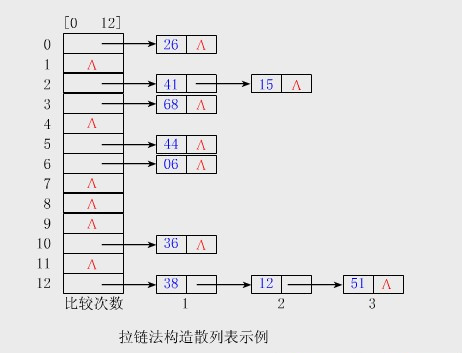

​      (二) 开放定址法

​            开放定址法是指可存放新表项的空闲地址即向它的同义词表项开发，又向它的非同义词表项开发。其数学递推公式为(Hi表示冲突发生后第i次探测的散列地址)：

Hi=(H(key)+di)%m

​            其中，i=1，2，···，k(k<=m-1)；m为散列表表长；di为增量序列。当取定某一增量序列后，则对应的处理方法是确定的。通常有：

​        \1. 线性探测

​            di=1，2，···，m-1

​            特点：冲突发生时，顺序查看表中下一个单元，直到找到空单元为止。

​        \2. 平方探测

​            di=12，-12，22，-22···，k2，-k2。K<=m/2

​        \3. 再散列

**【题】**

1. 设有一组关键字{9,1,23,14,55,20,84,27}，采用散列函数H(key)=key mod 7,表长为10，用开放定址的二次探测再散列法Hi=(H(key)+di)%10(di=12，22，32，···)解决冲突。要求：对该关键字序列构造散列表，并计算查找成功的平均查找长度。
2. 答案：

​          {9,1,23,14,55,20,84,27} mod 7={2,1,2,0,6,6,0,6}

 

| 关键字 | 计算                                                         | 比较次数 |
| ------ | ------------------------------------------------------------ | -------- |
| 9      | H(9)=9%7=**2**(不冲突)                                       | 1        |
| 1      | H(1)=1%7=**1**(不冲突)                                       | 1        |
| 23     | H(23)=23%7=2(冲突)，H1=(2+1)%10=**3**(不冲突)                | 2        |
| 14     | H(14)=14%7=**0**(不冲突)                                     | 1        |
| 55     | H(55)=55%7=**6**(不冲突)                                     | 1        |
| 20     | H(20)=20%7=6(冲突)，H1=(6+1)%10=**7**(不冲突)                | 2        |
| 84     | H(84)=84%7=0(冲突)，H1=(0+1)%10=1(冲突)，H2=(0+22)%10=**4**(不冲突) | 3        |
| 27     | H(27)=27%7=6(冲突)，H1=(6+1)%10=7(冲突)，H2=(6+22)%10=0(冲突)，H3=(6+32)%10=**5**(不冲突) | 4        |

 

 

| 散列地址 | 0    | 1    | 2    | 3    | 4    | 5    | 6    | 7    | 8    | 9    |
| -------- | ---- | ---- | ---- | ---- | ---- | ---- | ---- | ---- | ---- | ---- |
| 关键字   | 14   | 1    | 9    | 23   | 84   | 27   | 55   | 20   |      |      |
| 探测长度 | 1    | 1    | 1    | 2    | 3    | 5    | 1    | 2    |      |      |

​        平均查找长度=(1+1+2+1+1+2+3+4)/8=15/8

**【参考资料】**

1. 王道考研书籍

**【后面的话】**

​      加油。

**——****TT**


#  			[Java学习笔记（二一）——Java 泛型](https://www.cnblogs.com/xt0810/p/3664280.html) 		


**【前面的话】**

​     最近脸好干，掉皮，需要买点化妆品了。

​     **Java泛型**好好学习一下。

**【定义】**

**一、****泛型的定义主要有以下两种：**

1. 在程序编码中一些包含类型参数的类型，也就是说泛型的参数只可以代表类，不能代表个别对象。（这是当今较常见的定义）
2. 在程序编码中一些包含参数的[类](http://zh.wikipedia.org/wiki/%E7%B1%BB_(%E8%AE%A1%E7%AE%97%E6%9C%BA%E7%A7%91%E5%AD%A6))。其参数可以代表类或对象等等。（现在人们大多把这称作模板）

​        不论使用那个定义，泛型的参数在真正使用泛型时都必须作出指明。

**二、****使用泛型的目的：**

1. 一些强类型程序语言支持泛型，其主要目的是加强类型安全及减少类转换的次数，但一些支持泛型的程序语言只能达到部份目的。
2. 泛型程序设计（Generic programming）意味着编写的代码可以被很多不同类型的对象所重用。
3. 是对java语言的类型系统的一种扩展，以支持创建可以按类型进行参数化的类。可以把类型参数看作是使用参数化类型时指定的类型的一个占位符，就像方法的形式参数是运行时传递的值得占位符一样。

**【****Java****泛型的几种类型代码】**

**一、****不使用泛型的代码**

​      我们定义一个Person类，包含三个属性x，y，z。在我们开始定义地时候，我们也不知道这三个属性是用来干什么的，所以我们定义为Object类型。但是在使用的时候，我们分别对x，y，z赋予了int，double，String类型，所以在取出的时候，我们需要把这三个类型值进行强制转换。如下代码：

​    \1. Person.java

[](javascript:void(0);)

```
 1 public class Person {
 2     private Object x;
 3     private Object y;
 4     private Object z;
 5     //使用Object类型。可以转化为任何类型
 6     public Object getX() {
 7         return x;
 8     }
 9     public void setX(Object x) {
10         this.x = x;
11     }
12     public Object getY() {
13         return y;
14     }
15     public void setY(Object y) {
16         this.y = y;
17     }
18     public Object getZ() {
19         return z;
20     }
21     public void setZ(Object z) {
22         this.z = z;
23     }
24 }
```

[](javascript:void(0);)

​    \2. NoGenericTest.java

[](javascript:void(0);)

```
 1 public class NoGenericTest {
 2     public static void main(String[]args){
 3         Person boy=new Person();
 4         boy.setX(20);
 5         boy.setY(22.2);
 6         boy.setZ("帅哥TT");
 7         //这里根据设置的不同类型的值，我们需要进行强制类型转化。
 8         int x=(Integer)boy.getX();
 9         double y=(double)boy.getY();
10         String z=(String)boy.getZ();
11         
12         System.out.println(x);
13         System.out.println(y);
14         System.out.println(z);
15     }
16 }
```

[](javascript:void(0);)

​    \3. 运行结果

```
1 20
2 22.2
3 帅哥TT
```

**二、****使用一个类型变量泛型的代码**

​      我们定义一个泛型类Person，定义三个属性x，y，z，在测试类中，我们设置属性的值，并打印。

​    \1. Person.java

[](javascript:void(0);)

```
 1 public class Person<T> {
 2     private T x;
 3     private T y;
 4     private T z;
 5     public T getX() {
 6         return x;
 7     }
 8     public void setX(T x) {
 9         this.x = x;
10     }
11     public T getY() {
12         return y;
13     }
14     public void setY(T y) {
15         this.y = y;
16     }
17     public T getZ() {
18         return z;
19     }
20     public void setZ(T z) {
21         this.z = z;
22     }
23 }
```

[](javascript:void(0);)

​    \2. GenericTest.java

[](javascript:void(0);)

```
 1 public class GenericTest {
 2     public static void main(String[]args){
 3         Person boy=new Person();
 4         boy.setX(20);
 5         boy.setY(22.2);
 6         boy.setZ("帅哥TT");
 7         //不用进行类型转化
 8         System.out.println(boy.getX());
 9         System.out.println(boy.getY());
10         System.out.println(boy.getZ());
11     }
12 }
```

[](javascript:void(0);)

​    \3. 运行结果

```
1 20
2 22.2
3 帅哥TT
```

**三、****使用两个类型变量泛型的代码**

​     我们定义一个泛型类Person，定义两个属性x，y，使用了两种不同的类型变量，在测试类中，我们设置属性的值，并打印。

​    \1. Person.java

[](javascript:void(0);)

```
 1 public class Person<T1,T2> {
 2     private T1 x;
 3     private T2 y;
 4     public T1 getX() {
 5         return x;
 6     }
 7     public void setX(T1 x) {
 8         this.x = x;
 9     }
10     public T2 getY() {
11         return y;
12     }
13     public void setY(T2 y) {
14         this.y = y;
15     }
16 }
```

[](javascript:void(0);)

​    \2. GenericTest.java

[](javascript:void(0);)

```
 1 public class GenerricTest {
 2     public static void main(String[] args){
 3         Person<String,Integer> boy=new Person<String,Integer>();
 4         boy.setX("帅哥TT");
 5         boy.setY(20);
 6         System.out.println(boy.getX());
 7         System.out.println(boy.getY());
 8     }
 9 
10 }
```

[](javascript:void(0);)

​    \3. 运行结果

```
1 帅哥TT
2 20
```

**四、****使用泛型的继承**

​     我们定义一个泛型类Person，定义两个属性x，y，然后定义另一个泛型类Boy，定义属性z，Boy继承Person类，在测试类中，我们设置属性的值，并打印。

​    \1. Person.java

[](javascript:void(0);)

```
 1 public class Person<T1,T2> {
 2     private T1 x;
 3     private T2 y;
 4     public T1 getX() {
 5         return x;
 6     }
 7     public void setX(T1 x) {
 8         this.x = x;
 9     }
10     public T2 getY() {
11         return y;
12     }
13     public void setY(T2 y) {
14         this.y = y;
15     }
16 }
```

[](javascript:void(0);)

​    \2. Boy

[](javascript:void(0);)

```
1 public class Boy<T1,T2,T3>extends Person<T1,T2> {
2     private T3 z;
3     public T3 getZ() {
4         return z;
5     }
6     public void setZ(T3 z) {
7         this.z = z;
8     }
9 }
```

[](javascript:void(0);)

​    \3. GenericTest.java

[](javascript:void(0);)

```
 1 public class GenericTest {
 2     public static void main(String[] args){
 3         Boy<String,Integer,Double> boy=new Boy<String,Integer,Double>();
 4         boy.setX("帅哥TT");
 5         boy.setY(20);
 6         boy.setZ(200000.22);
 7         
 8         System.out.println(boy.getX());
 9         System.out.println(boy.getY());
10         System.out.println(boy.getZ());
11     }
12 }
```

[](javascript:void(0);)

   \4. 运行结果

```
1 帅哥TT
2 20
3 200000.22
```

**五、****使用泛型的接口**

​     我们定义一个泛型接口Person，定义两个方法，然后定义另一个泛型类Boy，实现泛型接口Person，定义属性x,y,z，在测试类中，我们设置属性的值，并打印。

​    \1. Person.java

```
1 public interface Person<T1,T2> {
2     public T1 getX();
3     public T2 getY();
4 }
```

​    \2. Boy

[](javascript:void(0);)

```
 1 public class Boy<T1,T2,T3>implements Person<T1,T2> {
 2     private T1 x;
 3     private T2 y;
 4     private T3 z;
 5     public T1 getX() {
 6         return x;
 7     }
 8     public void setX(T1 x) {
 9         this.x = x;
10     }
11     public T2 getY() {
12         return y;
13     }
14     public void setY(T2 y) {
15         this.y = y;
16     }
17     public T3 getZ() {
18         return z;
19     }
20     public void setZ(T3 z) {
21         this.z = z;
22     }
23 
24 }
```

[](javascript:void(0);)

​    \3. GenericTest.java

[](javascript:void(0);)

```
 1 public class GenericTest {
 2     public static void main(String[] args){
 3         Boy<String,Integer,Double> boy=new Boy<String,Integer,Double>();
 4         boy.setX("帅哥TT");
 5         boy.setY(20);
 6         boy.setZ(200000.22);
 7         System.out.println(boy.getX());
 8         System.out.println(boy.getY());
 9         System.out.println(boy.getZ());
10     }
11 }
```

[](javascript:void(0);)

​    \4. 运行结果

```
1 帅哥TT
2 20
3 200000.22
```

**六、****使用泛型方法**

​     说明一下，定义泛型方法时，必须在返回值前边加一个<T>，来声明这是一个泛型方法，持有一个泛型T，然后才可以用泛型T作为方法的返回值。

​      定义一个普通类Person，定义一个泛型方法，如下代码：

​     **1.** Person.java

[](javascript:void(0);)

```
 1 public class Person{
 2     public static<T>T getMiddle(T[]a){
 3         return a[a.length/2];
 4     }
 5     public static void main(String [] args){
 6         String[]name={"帅哥TT","帅哥TT1","帅哥TT2"};
 7         String middle=Person.<String>getMiddle(name);
 8         System.out.println(middle);
 9         
10         Integer[]num={20,22,25};
11         Integer middle1=Person.<Integer>getMiddle(num);
12         System.out.println(middle1);
13         
14         Double[]num1={20.0,22.2,25.5};
15         Double middle2=Person.<Double>getMiddle(num1);
16         System.out.println(middle2);
17     }
18 }
```

[](javascript:void(0);)

​    \2. 运行结果

```
1 帅哥TT1
2 22
3 22.2
```

**七、****类型变量的限定**

​     如下代码，我们在方法min中定义了一个变量smallest类型为T，这说明了smallest可以是任何一个类的对象，我们在下面的代码中需要使用compareTo方法，  但是我们没有办法确定我们的T中含有CompareTo方法，所以我们需要对T进行限定，在代码中我们让T继承Comparable类。如下：

```
1 public static<T extends Comparable>T min(T[]a)
```

​    **1. Person.java**

[](javascript:void(0);)

```
 1 public class Person{
 2     public static<T extends Comparable>T min(T[]a){
 3         if(a==null||a.length==0){
 4             return null;
 5         }
 6         T smallest=a[0];
 7         for(int i=1;i<a.length;i++){
 8             if(smallest.compareTo(a[i])>0){
 9                 smallest=a[i];
10             }
11         }
12         return smallest;
13     }
14     public static void main(String [] args){
15         Integer[]num={20,25,30,10};
16         Integer middle=Person.<Integer>min(num);
17         System.out.println(middle);
18     }
19 }
```

[](javascript:void(0);)

​    \2. 运行结果

```
1 10
```

**【****Java****泛型理解】**

**一、****类型擦除**

​      正确理解泛型概念的首要前提是理解类型擦除（type erasure）。  Java中的泛型基本上都是在编译器这个层次来实现的。在生成的Java字节代码中是不包含泛型中的类型信息的。使用泛型的时候加上的类型参数，会被编译器在编译的时候去掉。这个过程就称为类型擦除。如在代码中定义的List<Object>和List<String>等类型，在编译之后都会变成List。JVM看到的只是List，而由泛型附加的类型信息对JVM来说是不可见的。Java编译器会在编译时尽可能的发现可能出错的地方，但是仍然无法避免在运行时刻出现类型转换异常的情况。

​     很多泛型的奇怪特性都与这个类型擦除的存在有关，包括：

1. 泛型类并没有自己独有的Class类对象。比如并不存在List<String>.class或是List<Integer>.class，而只有List.class。
2. 静态变量是被泛型类的所有实例所共享的。对于声明为MyClass<T>的类，访问其中的静态变量的方法仍然是  MyClass.myStaticVar。不管是通过new MyClass<String>还是new  MyClass<Integer>创建的对象，都是共享一个静态变量。
3. 泛型的类型参数不能用在Java异常处理的catch语句中。因为异常处理是由JVM在运行时刻来进行的。由于类型信息被擦除，JVM是无法区分两个异常类型MyException<String>和MyException<Integer>的。对于JVM来说，它们都是  MyException类型的。也就无法执行与异常对应的catch语句。

**二、****最佳实践**

在使用泛型的时候可以遵循一些基本的原则，从而避免一些常见的问题。

1. 在代码中避免泛型类和原始类型的混用。比如List<String>和List不应该共同使用。这样会产生一些编译器警告和潜在的运行时异常。当需要利用JDK 5之前开发的遗留代码，而不得不这么做时，也尽可能的隔离相关的代码。
2. 在使用带通配符的泛型类的时候，需要明确通配符所代表的一组类型的概念。由于具体的类型是未知的，很多操作是不允许的。
3. 泛型类最好不要同数组一块使用。你只能创建new  List<?>[10]这样的数组，无法创建new  List<String>[10]这样的。这限制了数组的使用能力，而且会带来很多费解的问题。因此，当需要类似数组的功能时候，使用集合类即可。
4. 不要忽视编译器给出的警告信息。

**【参考资料】**

1. [Java深度历险（五）——Java泛型](http://www.infoq.com/cn/articles/cf-java-generics/)
2. java核心技术

**【后面的话】**

​     好好学习。

——TT


#  			[Java学习笔记（二二）——Java HashMap](https://www.cnblogs.com/xt0810/p/3666101.html) 		


**【前面的话】**

​     早上起来好瞌睡哈，最近要注意一样作息状态。

​      **HashMap**好好学习一下。

**【定义】**

1. **Hashmap****：**是一个散列表，它存储的内容是键值对（key——value）映射。允许null值和null键。
2. **java.lang.Cloneable** 接口是一个空接口,该接口用来指明一个对象是否可以进行克隆.实现了该接口的对象可以调用clone()方法来进行对象的浅克隆.  java默认的克隆是浅克隆,浅克隆仅仅克隆所考虑的对象,而不克隆它所引用的对象.
3. **Serializable****，**序列化接口，表明这个类可以进行序列化。
4. **Java HashMap****的代码：**

​         HashMap继承了AbstracMap类,实现了Map接口和Cloneable接口,以及Serializable接口。

​     1)  HashMap：

```
1 public class HashMap<K,V>
2     extends AbstractMap<K,V>
3 implements Map<K,V>, Cloneable, Serializable
```

​     2)  AbstractMap

```
1 public abstract class AbstractMap<K,V> implements Map<K,V> 
```

​     3)  Map

```
1 public interface Map<K,V>
```

​     4)  Cloneable

```
1 public interface Cloneable { //空接口
2 }
```

​     5)  Serializable

```
1 public interface Serializable {//空接口
2 }
```

**【知识点】**

一、**HashMap****的数据结构**

​      java中，最基本的结构就是两种，一个是数组，另外一个是模拟指针（引用），所有的数据结构都可以用这两个基本的结构来构造的，hashMap也不例外。Hashmap实际上是一个“链接散列”的数据结构，也就是数组和链表的结合体。

​      从下图可以看出，HashMap底层是一个数组结构，数组中的每一项又是一个链表，当新建一个HashMap的时候，就会初始化一个数组。

​       如下：


​      源代码如下：

[](javascript:void(0);)

```
1 static class Entry<K,V> implements Map.Entry<K,V> {
2         final K key;
3         V value;
4         Entry<K,V> next;
5         int hash;
6 •••
7 }
```

[](javascript:void(0);)

​      可以看出，这就是java泛型的一个使用。就是一个key-value对，并且拥有指向下一个Entry的next，这就构成了一个链表。并且是一个单项链表。

二、**HashMap****的构造函数**

```
1 public HashMap(int initialCapacity, float loadFactor) 
```

​         指定容器大小和加载因子的构造函数

```
1 public HashMap(int initialCapacity)
```

​         指定容器大小的构造函数，加载因子默认为0.75

```
1 public HashMap() 
```

​          默认构造函数，构造一个默认初始容量为16，默认加载因子为0.75的空HashMap

```
1 public HashMap(Map<? extends K, ? extends V> m) 
```

​          构造一个映射关系与指定Map相同的新的HashMap

三、**HashMap****的****API**

| 类型                | 函数和功能                                                   |
| ------------------- | ------------------------------------------------------------ |
| `void`              | `**clear**``()` 从此映射中移除所有映射关系。                 |
| `Object`            | `**clone**``()` 返回此 `HashMap` 实例的浅表副本：并不复制键和值本身。 |
| `boolean`           | `**containsKey**``(Object key)` 如果此映射包含对于指定键的映射关系，则返回 `true`。 |
| `boolean`           | `**containsValue**``(Object value)` 如果此映射将一个或多个键映射到指定值，则返回 `true`。 |
| Set<Map.Entry<K,V>> | `**entrySet**``()` 返回此映射所包含的映射关系的 `Set` 视图。 |
| `V`                 | `**get**``(Object key)` 返回指定键所映射的值；如果对于该键来说，此映射不包含任何映射关系，则返回 `null`。 |
| `boolean`           | `**isEmpty**``()` 如果此映射不包含键-值映射关系，则返回   `true`。 |
| `Set<K>`            | `**keySet**``()` 返回此映射中所包含的键的 `Set` 视图。       |
| `V`                 | `**put**`(K key, V value) 在此映射中关联指定值与指定键。     |
| `void`              | `**putAll**`(Map<? extends K,? extends V> m) 将指定映射的所有映射关系复制到此映射中，这些映射关系将替换此映射目前针对指定映射中所有键的所有映射关系。 |
| `V`                 | `**remove**`(Object key) 从此映射中移除指定键的映射关系（如果存在）。 |
| `int`               | `**size**`() 返回此映射中的键-值映射关系数。                 |
| `Collection<V>`     | `**values**`() 返回此映射所包含的值的 `Collection` 视图。    |

四、**HashMap** **的实例有两个参数影响其性能：****“****初始容量****”** **和** **“****加载因子****”****。**

​     \1. 容量是哈希表中数组的长度。初始容量只是哈希表在创建时的长度默认为16

```
1 static final int DEFAULT_INITIAL_CAPACITY = 1 << 4; // aka 16
```

​    \2. 加载因子是哈希表在其容量自动增加之前可以达到多满的一种尺度。当哈希表中的条目数超出了加载因子与当前容量的乘积时，则要对该哈希表进行 rehash 操作（即重建内部数据结构），从而哈希表将具有大约两倍的桶数。默认加载因子是 0.75，

```
1  static final float DEFAULT_LOAD_FACTOR = 0.75f;
```

五、**HashMap****的****resize****（****rehash****）**

1. 为什么会有初始容量和加载因子的设置，原因就是：当HashMap中的元素越来越多的时候，Hash冲突的几率也就会越来越高，也为数组的长度是默认固定的，为16。为了提高查询效率就需要对Hashmap的数组进行扩容，对hashmap进行扩容以后，最消耗性能的地方也就出现了，原数组中的数据必须进行重新计算放到新数组中去。这就是resize。
2. **默认加载因子是** **0.75**,  这是在时间和空间成本上寻求一种折衷。加载因子过高虽然减少了空间开销，但同时也增加了查询成本（在大多数 HashMap 类的操作中，包括 get  和 put 操作，都反映了这一点）。在设置初始容量时应该考虑到映射中所需的条目数及其加载因子，以便最大限度地减少 rehash  操作次数。如果初始容量大于最大条目数除以加载因子，则不会发生 rehash 操作。

六、**Hashmap****的实现不是同步的，这意味着它不是线程安全的。它的****key,value****都可以为****null****。此外，****HashMap****中的映射不是有序的。**

1. HashMap不是线程安全的意思是多个线程操作的时候，结果可能不可预料，在操作系统中我们学习过，线程的安全状态是绝对安全的，不安全状态是可能会出现不安全的现象，如死锁，但有可能不会出现。
2. HashMao的映射不是有序的，如下拉链法的例子：

​         在有拉链法建立散列表的时候，最终建立的散列表和最初的关键字码中的顺序是不一样的。

​         关键字码为：{06,12,15,26,36,38,41,44,51,68}，散列函数为H(key)=key%13。用拉链法处理冲突建立的表如下：


**【参考资料】**

​      \1. [深入Java集合学习系列：HashMap的实现原理](http://www.cnblogs.com/%20http:/www.360doc.com/content/10/1214/22/573136_78200435.shtml)

​      \2. [Java 集合系列10之 HashMap详细介绍(源码解析)和使用示例](http://www.cnblogs.com/skywang12345/p/3310835.html) **（推荐这篇文章）**

​          <http://www.cnblogs.com/skywang12345/p/3310835.html>

​      \3. HashMap的工作原理               

​          <http://www.importnew.com/7099.html>

**【后面的话】**

​      好好学习。

——TT


# end