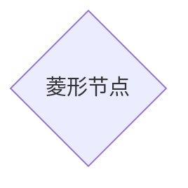

# Markdown画图表

## 使用mermaid

## 流程图


#### Graph


###### 语法解释

1. 第一行的`graph LR`中`graph`指定是一个图，第二个`LR`指定图的方向，所有的方向关键词为:
   - TB - top bottom
   - BT - bottom top
   - RL - right left
   - LR - left right
   - TD - same as TB
2. 之后的A,B,C等都是节点的标识（标识中不能使用空格）
3. 节点默认只显示标识,但也可以通过如下方法控制其显示
   - `A[aa bb]` 显示字符串`aa bb`的方框
   - `B(wo)` 显示字符串`wo`的圆角框
   - `C((我是C))` 显示`我是C`字符串的圆圈
   - `D>我是D]` 显示`我是D`的半方框
   - `E{我是E}` 显示`我是E`的正方形框
4. 连线可以选择如下形式:
   - `A-->B` 箭头
   - `A--B` 无箭头线
   - `A--hh dd--B`或者`A--|hh dd|B` 线之间可以添加注释
   - `A-.->B` 虚线箭头
   - `A-. hh .->B` 添加了注释的虚线箭头
   - `A==>B` 加粗的箭头
   - `A== hh ==>B` 加注释加粗的箭头

###### 子图subgraph

```
subgraph 子图表名称
    子图表中的描述语句...
end
```


#### 方向

流程图方向有下面几个值

| 用词 | 含义     |
| ---- | -------- |
| TB   | 从上到下 |
| BT   | 从下到上 |
| RL   | 从右到左 |
| LR   | 从左到右 |
| TD   | 同TB     |


#### 节点

即流程图中每个文本块，包括开始、结束、处理、判断等。Mermaid 中每个节点都有一个 id，以及节点的文字。
| 表述 | 说明 |
| ---- | ---- |
|id[文字]	|矩形节点|
|id(文字)	|圆角矩形节点|
|id((文字))|	圆形节点|
|id>文字]	|右向旗帜状节点|
|id{文字}	|菱形节点|
注意: 如果节点的文字中包含标点符号，需要时用双引号包裹起来。 

例子:


###### 默认节点


注意：’id1’显示在节点内部。

###### 文本节点


###### 圆角节点


###### 圆节点(The form of a circle)


###### 非对称节点(asymetric shape)


###### 菱形节点(rhombus)



#### 连接线

节点间的连接线有多种形状，而且可以在连接线中加入标签：

节点间的连线

|表述|说明|
| :--- | :--- |
| \>|	添加尾部箭头|
|	-	|不添加尾部箭头|
|	  --	|单线|
|	  --text--	|单线上加文字|
|	  ==	|粗线|
|	  ==text==|	粗线加文字|
|	  -.-	|虚线|
|	  -.text.-	|虚线加文字|


###### 箭头形连接


###### 开放行连接


###### 标签连接


###### 箭头标签连接


###### 虚线(dotted link,点连线)


###### 标签虚线


###### 粗实线


###### 标签粗线


##### 特殊的语法

###### 引号

使用引号可以抑制一些特殊的字符的使用，可以避免一些不必要的麻烦。


###### html字符的转义字符

转义字符的使用语法： 
流程图定义如下：

```mermaid
graph LR
        A["A double quote:#quot;"]-->B["A dec char:#9829;"]

​```mermaid

子图(Subgraphs)
subgraph title\ 
graph definition\ 
end

示例：

​```mermaid
graph TB
        subgraph one
        a1 --> a2
        en
        subgraph two
        b2 --> b2
        end
        subgraph three
        c1 --> c2
        end
        c1 --> a2
```


###### 基础fontawesome支持

如果想加入来自frontawesome的图表字体,需要像frontawesome网站上那样引用的那样。\ 
详情请点击：fontawdsome

引用的语法为：++fa:#icon class name#++

```
使用 fa: #图表名称# 的语法添加 fontawesome。
```


```mermaid
graph TD
      B["fa:fa-twitter for peace"]
      B-->C[fa:fa-ban forbidden]
      B-->D(fa:fa-spinner);
      B-->E(A fa:fa-camera-retro perhaps?);
```


```mermaid
graph TB
    id1(圆角矩形)--普通线-->id2[矩形]
    subgraph 子图表
        id2==粗线==>id3{菱形}
        id3-.虚线.->id4>右向旗帜]
        id3--无箭头---id5((圆形))
    end
```


##### 节点样式


###### 定义连接线的样式


```mermaid
graph LR
     id1(Start)-->id2(Stop)
     style id1 fill:#f9f,stroke:#333,stroke-width:4px;
     style id2 fill:#ccf,stroke:#f66,stroke-width:2px,stroke-dasharray:5,5;
```
备注：这些样式参考CSS样式。

###### 样式类

为了方便样式的使用，可以定义类来使用样式 
类的定义示例：

classDef className fill:#f9f,stroke:#333,stroke-width:4px;
1
对节点使用样式类：

class nodeId className;
1
同时对多个节点使用相同的样式类：

class nodeId1,nodeId2 className;
1
可以在CSS中提前定义样式类，应用在图表的定义中。

```mermaid
graph LR
      A-->B[AAABBB];
      B-->D;
      class A cssClass;
```
###### 默认样式类

当没有指定样式的时候，默认采用。

```mermaid
graph LR
classDef default fill:#f90,stroke:#555,stroke-width:4px;
id1(Start)-->id2(Stop)
```

### 时序图(sequence diagram)

使用以下语法开始序列图

```
sequenceDiagram
    [参与者1][消息线][参与者2]:消息体
    ...123
```

例如

```
sequenceDiagram
    张三->>李四: 吃了吗？
    李四->>张三: 吃了
```

###### 参与者

上例中的张三、李四都是参与者，上例中的语法是最简单的，也可以明显表明参与者有哪些

sequenceDiagram
    participant 参与者 1
    participant 参与者 2
    ...

​    participant 简称 as 参与者 3 #该语法可以在接下来的描述中使用简称来代替参与者 3

消息线
|类型|描述|
| ---- | ---- |
|->|无箭头的实线|
|-->|无箭头的虚线|
|->>|有箭头的实线|
|-->>|有箭头的虚线|
|-x|末端为叉的实线（表示异步）|
|--x|末端为叉的虚线（表示异步）|

处理中
在消息线末尾增加 + ，则消息接收者进入当前消息的“处理中”状态； 
在消息线末尾增加 - ，则消息接收者离开当前消息的“处理中”状态。

或者使用以下语法直接说明某个参与者进入“处理中”状态

activate 参与者

标注
语法如下

```
Note 位置表述 参与者: 标注文字
```

其中位置表述可以为

| 表述 | 含义 |
| ---- | ---- |
|right of|	右侧|
|left of|	左侧|
|over|	在当中，可以横跨多个参与者|

###### 循环

语法如下

```
loop 循环的条件
    循环体描述语句
end
```


###### 判断

```
alt 条件 1 描述
    分支 1 描述语句
else 条件 2 描述 # else 分支可选
    分支 2 描述语句
else ...
    ...
end
```


如果遇到可选的情况，即没有 else 分支的情况，使用如下语法：

```
opt 条件描述
    分支描述语句
end
```


举个例子
--------------------- 

```mermaid
sequenceDiagram
    participant z as 张三
    participant l as 李四
    loop 日复一日
        z->>l: 吃了吗您呐？
        l-->>z: 吃了，您呢？
        activate z
        Note left of z: 想了一下
        alt 还没吃
            z-xl: 还没呢，正准备回去吃
        else 已经吃了
            z-xl: 我也吃过了，哈哈
        end
        opt 大过年的
            l-->z: 祝您新年好啊
        end
    end
```


```mermaid
sequenceDiagram
    participant Alice
    participant Bob
    Alice->John: Hello John, how are you?
    loop Healthcheck
        John->John: Fight against hypochondria
    end
    Note right of John: Rational thoughts <br/>prevail...
    John-->Alice: Great!
    John->Bob: How about you?
    Bob-->>John: Jolly good!
```

#### 解释

1. 时序图使用`sequenceDiagram`关键词声明
2. 参与者使用`participant`声明
3. 消息声明是使用`[参与者][发送方式][参与者]:消息内容`形式声明
   发送方式有如下几种:
   - `->` 无箭头的线
   - `-->` 无箭头的虚线
   - `->>` 有箭头的实线
   - `-->>` 有箭头虚线
   - `-x` 有十字叉的实线
   - `--x` 有十字叉的虚线
4. 可以通过`ote right of [参与者]: 信息`的方式添加备注(多行信息请使用`<br/>`)


```mermaid
sequenceDiagram
　　Alice->>John: Hello John, how are you ?
　　John-->>Alice: Great!
　　Alice->>John: Hung,you are better .
　　John-->>Alice: yeah, Just not bad.
```
观察上面的图，如果想让John出现在前面，如何控制，mermaid通过设定参与者(participants)的顺序控制二者的顺序。上面的图可以做如下修改：

```mermaid
sequenceDiagram
　　participant John
　　participant Alice
　　Alice-xJohn:Hello John,how are you?
　　John-->>Alice:Great!
```
###### 消息的语法

　　实线或者虚线的使用： 
示例：

```mermaid
sequenceDiagram
    Alice->John: Hello John, how are you ?
    John-->Alice:Great!
    Alice->>John: dont borther me !
    John-->>Alice:Great!
    Alice-xJohn: wait!
    John--xAlice: Ok!
```

###### 便签

给序列图增加便签：\ 
具体规则：\ 
[right of | left of | over][Actor]:Text\ 
示例：

```mermaid
sequenceDiagram
　　participant John
　　Note left of John: Text in note
```
###### 跨越两个Actor的便签：

```mermaid
sequenceDiagram
　　Alice->John:Hello John, how are you?
　　Note over Alice,John:A typical interaction
```

```mermaid
sequenceDiagram
Alice->>John:Hello John, how are you?
Note over Alice,John:A typical interaction
```

###### 循环Loops

在序列图中，也可以使用循环，具体规则如下：

```
loop Loop text
... statements...
end
```

示例：

```mermaid
sequenceDiagram
　　Alice->>John: Hello!
　　loop Reply every minute
　　　　John->>Alice:Great!
　　end
```

###### 选择ALT

在序列图中选择的表达。规则如下：

```
alt Describing text
...statements...
else
...statements...
end
```
或者使用opt(推荐在没有else的情况下使用)

```
opt Describing text
...statements...
end
```
示例：

```mermaid
sequenceDiagram
　　Alice->>Bob: Hello Bob, how are you?
　　alt is sick
　　　　Bob->>Alice:not so good :(
　　else is well
　　　　Bob->>Alice:Feeling fresh like a daisy:)
　　end
　　opt Extra response
　　　　Bob->>Alice:Thanks for asking
　　end
```

### 甘特图(gantt)

甘特图是一类条形图，由Karol Adamiechi在1896年提出, 而在1910年Henry Gantt也独立的提出了此种图形表示。通常用在对项目终端元素和总结元素的开始及完成时间进行的描述。

示例：
```mermaid
gantt
        dateFormat  YYYY-MM-DD
        title 项目名
        section 现有任务
        已完成               :done,    des1, 2014-01-06,2014-01-08
        进行中               :active,  des2, 2014-01-09, 3d
        计划中               :            des3, after des2, 5d
```

```mermaid
gantt
title 项目开发流程
    section 项目确定
        需求分析       :a1, 2016-06-22, 3d
        可行性报告     :after a1, 5d
        概念验证       : 5d
    section 项目实施
        概要设计      :2016-07-05  , 5d
        详细设计      :2016-07-08, 10d
        编码          :2016-07-15, 10d
        测试          :2016-07-22, 5d
    section 发布验收
        发布: 2d
        验收: 3d
```


```mermaid
gantt
dateFormat YYYY-MM-DD
section S1
T1: 2014-01-01, 9d
section S2
T2: 2014-01-11, 9d
section S3
T3: 2014-01-02, 9d
```

先来看一个大的例子：

```mermaid
    gantt
    dateFormat  YYYY-MM-DD
    title Adding GANTT diagram functionality to mermaid
    
    section A section
    Completed task            :done,    des1, 2014-01-06,2014-01-08
    Active task               :active,  des2, 2014-01-09, 3d
    Future task               :         des3, after des2, 5d
    Future task2               :         des4, after des3, 5d
    
    section Critical tasks
    Completed task in the critical line :crit, done, 2014-01-06,24h
    Implement parser and jison          :crit, done, after des1, 2d
    Create tests for parser             :crit, active, 3d
    Future task in critical line        :crit, 5d
    Create tests for renderer           :2d
    Add to mermaid                      :1d
    
    section Documentation
    Describe gantt syntax               :active, a1, after des1, 3d
    Add gantt diagram to demo page      :after a1  , 20h
    Add another diagram to demo page    :doc1, after a1  , 48h
    
    section Last section
    Describe gantt syntax               :after doc1, 3d
    Add gantt diagram to demo page      : 20h
    Add another diagram to demo page    : 48h
```
1. 使用关键词`gantt`声明甘特图

2. 使用关键词`title`声明标题

3. 使用关键词`section`声明板块

4. 板块后是任务的名称，任务类型，开始时间，持续时间等

   asdf

   

   

#### 时间参数

| 参数     | 示例           | 含义                                                   |
| :------- | :------------- | :----------------------------------------------------- |
| YYYY     | 2014           | 4 digit year                                           |
| YY       | 14             | 2 digit year                                           |
| Q        | 1..4           | Quarter of year. Sets month to first month in quarter. |
| M MM     | 1..12          | Month number                                           |
| MMM MMMM | January..Dec   | Month name in locale set by moment.locale()            |
| D DD     | 1..31          | Day of month                                           |
| Do       | 1st..31st      | Day of month with ordinal                              |
| DDD DDDD | 1..365         | Day of year                                            |
| X        | 1410715640.579 | Unix timestamp                                         |
| x        | 1410715640579  | Unix ms timestamp                                      |
| H HH     | 0..23          | 24 hour time                                           |
| h hh     | 1..12          | 12 hour time used with a A.                            |
| a A      | am pm          | Post or ante meridiem                                  |
| m mm     | 0..59          | Minutes                                                |
| s ss     | 0..59          | Seconds                                                |
| S        | 0..9           | Tenths of a second                                     |
| SS       | 0..99          | Hundreds of a second                                   |
| SSS      | 0..999         | Thousandths of a second                                |
| Z ZZ     | +12:00         | Offset from UTC as +-HH:mm, +-HHmm, or Z               |

   [mermaidsdfasdfafds 语法本文大撒反对dsf](http://www.bubuko.com/infodetail-794433.html)

获得的图渲染后如下： 

|header 1|	header 2|
|:----|:----|
|title|	标题|
|dateFormat	|日期格式|
|section|	模块|
|Completed|	已经完成|
|Active|	当前正在进行|
|Future|	后续待处理|
|crit|	关键阶段|
|日期缺失|	默认从上一项完成后|
关于日期的格式可以参考： 
- string-format 
- Time-Formatting

#### Demo

```mermaid
graph TB
    sq[Square shape] --> ci((Circle shape))

    subgraph A subgraph
        di{Diamond with  line break} -.-> ro(Rounded)
        di==>ro2(Rounded square shape)
    end
    
    e --> od3>Really long text with linebreak<br>in an Odd shape]
    
    cyr[Cyrillic]-->cyr2((Circle shape Начало));
    
    classDef green fill:#9f6,stroke:#333,stroke-width:2px;
    classDef orange fill:#f96,stroke:#333,stroke-width:4px;
    class sq,e green
    class di orange
```

- reference
  [mermaid docs](https://knsv.github.io/mermaid/)


