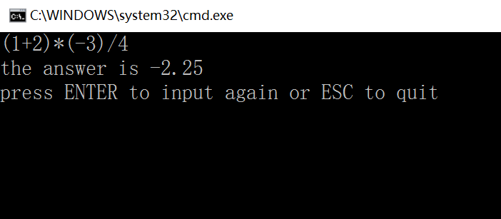

# 中缀输入逆波兰计算器程序


　　在看K&R的时候，里面提到了逆波兰表示法，老实说看得我迷迷糊糊的，主要是这种反人类的后缀表示法做出的计算器，一般人根本就不知道怎么输入好吧。今天看书的时候，看到了将中缀表达式转为后缀表达式的方法才恍然大悟，原来是少了这一步。这下我就知道该如何做一个可用的逆波兰计算器了。

　　先简单介绍一下如何完成这步转换吧。中缀表达式就是我们习惯的表达式，比如：1+2*3　考虑运算符优先级的话后缀表达式则应该写成123*+

　　写成后缀表达式的形式后我们可以利用栈轻松地解决计算问题，思路是当见到一个数时就把它推入栈；在遇到一个运算符时就从栈中弹出相应的操作数，并把运算的结果推入栈中，最后栈顶的值就是表达式的值。

　　虽然后缀表达式计算起来很方便，输入的时候却十分麻烦。要写出一个人性化的计算器程序，我们首先要完成中缀表达式到后缀表达式的转换。我们用两个数组存放中缀和后缀表达式的字符。从用户获取中缀表达式的输入到相应数组中。然后遍历中缀表达式。当读到一个操作数时我们立即把它写到后缀表达式的数组中去；当读到操作符或者左括号时我们把它推入栈中（从一个空栈开始）。如果读到右括号我们将栈元素弹出并写到数组直到遇到左括号为止，注意左括号只弹出而不写到数组中去；如果再次读到操作符（+-*/），我们从栈中弹出操作符直到遇到优先级更低的元素或遇到左括号为止（注意一定是要更低，相同也不行）然后把操作符推入栈中；如果我们读完了，我们就将栈元素弹出直到该栈变为空栈为止。

　　有了算法，把它转变为代码就是比较简单的事了，我们把这个转换写成一个函数，tran()。

[](javascript:void(0);)

```
#include <stdio.h>
#include <ctype.h>

#define MAXSIZE 100　　　　//可输入的最大字符数以及栈的容量

char infix[MAXSIZE];　　　　//中缀表达式数组
char postfix[MAXSIZE];　　　　//后缀表达式数组

char stack[MAXSIZE];　　　　//创立栈
int top = -1;

int size = 0;　　//数组大小

void push(char c)　　//由于本程序入栈的元素不可能溢出，这里就没有做错误检测
{
    stack[++top] = c;
}

char pop(void)
{
    if (top >= 0)
        return stack[top--];
    else
        printf("stack empty!");
}

void tran(char a[], char b[])
{
    int i,j,tmp;
    for (i = 0, j = 0; i < size; i++) {
        if (isdigit(a[i]) || a[i] == '.')
            b[j++] = a[i];
        else if (a[i] == '(') {　　//考虑是单纯的括号，还是负数（-x)
            tmp = i+1;
            if (a[tmp] == '-') {　　//如果是负数-x,把（-x)复制到后缀数组去
                while (a[i] != ')')
                    b[j++] = a[i++];
                b[j++] = ')';
            }
            else
                push(a[i]);
        }
        else if (a[i] == '+' || a[i] == '-') {　　　　//如果是+或-的话
            while (top >= 0 && stack[top] != '(')　　//弹出直到遇上括号或者空栈
                b[j++] = pop();
            push(a[i]);
        }
        else if (a[i] == '*' || a[i] == '/') {　　//如果是*或/的话，考虑要不要弹出
            while (stack[top] == '*' || stack[top] == '/')
                b[j++] = pop();
            push(a[i]);
        }
        else if (a[i] == ')') {
            while (stack[top] != '(')
                b[j++] = pop();
            pop();
        }
    }
    while (top >= 0)　　//将栈中元素全部弹出
        b[j++] = pop();
}
```

[](javascript:void(0);)

如此我们就完成了将用户输入的中缀表达式转变为计算机易于计算的后缀表达式，接下来就是对后缀表达式的处理了。在这方面K&R上有详细的讲解。读者若有疑惑可以作为参照。当然如果手边没有K&R，也可以阅读我的下一篇博客。

UPDATE:在完成后缀处理的过程中发现这样的转换处理有致命缺陷，例如将12*3转为后缀表达式后将是123*，这样的话无法分辨究竟是12*3还是1*23根本无法处理。K&R书上透过在不同数间加入空格来解决这一问题，但这样在输入时就麻烦许多。所以我们在转换这一步上再处理一下。将12*3转换为（12）3*形式的后缀表达式，这样之后处理起来就轻松多了。下面是修改后的代码：

[](javascript:void(0);)

```
void tran(char a[], char b[])
{
    int i,j,tmp;
    for (i = 0, j = 0; i < size; i++) {
        if (isdigit(a[i]) || a[i] == '.') {　　//修改部分
            b[j++] = '(';
            while (isdigit(a[i]) || a[i] == '.')
                b[j++] = a[i++];
            b[j++] = ')';
            i--;　　　　　　　　//前面i多自增了一次
        }
        else if (a[i] == '(') {
            tmp = i+1;
            if (a[tmp] == '-') {
                while (a[i] != ')')
                    b[j++] = a[i++];
                b[j++] = ')';
            }
            else
                push(a[i]);
        }
        else if (a[i] == '+' || a[i] == '-') {
            while (top >= 0 && stack[top] != '(')
                b[j++] = pop();
            push(a[i]);
        }
        else if (a[i] == '*' || a[i] == '/') {
            while (stack[top] == '*' || stack[top] == '/')
                b[j++] = pop();
            push(a[i]);
        }
        else if (a[i] == ')') {
            while (stack[top] != '(')
                b[j++] = pop();
            pop();
        }
    }
    while (top >= 0)
        b[j++] = pop();
    size = j;　　　　　　//后缀表达式数组的大小
}
```

[](javascript:void(0);)

经处理后后缀表达式数组大小要显著大于前缀表达式数组，可以适当改变其大小。

 


有了上一篇博客作为支撑，编写一个逆波兰计算器相对来说就比较简单了，本篇博客还将参考K&R上的写法。那就直接上代码吧。

[](javascript:void(0);)

```
#include <stdlib.h>
#include <conio.h>

#define NUMBER 0
#define OVER 1

double stack_d[MAXSIZE];
int top_d = -1;

int error = 0;
double answer;

void push_d(double c)
{
    stack_d[++top_d] = c;
}

double pop_d(void)
{
    if (top_d >= 0)
        return stack_d[top_d--];
    else {
        printf("stack empty! revise your input!\n");
        error = 1;
    }
}

int getop(char post[],char temp[],int *i)
{
    int j;
    for (j = 0; *i < size; (*i)++) {
        if (post[*i] == '+' || post[*i] == '-' || post[*i] == '*' || post[*i] == '/') {
            (*i)++;
            return(post[(*i) - 1]);
        }
        else if (post[*i] == '(') {
            (*i)++;
            while (post[*i] != ')')
                temp[j++] = post[(*i)++];
            (*i)++;
            temp[j] = '\0';
            return NUMBER;
            }
    }
    return OVER;
}

int main()
{
    int type,key;
    double op2;
    char s[100];
    int i, c, index = 0;
    while (1) {
        for (i = 0; (c = getc(stdin)) != '\n'; i++)
            infix[i] = c;
        size = i;
        tran(infix, postfix);
        while ((type = getop(postfix, s, &index)) != OVER) {
            switch (type) {
            case NUMBER:
                push_d(atof(s));
                break;
            case'+':
                push_d(pop_d() + pop_d());
                break;
            case'-':
                op2 = pop_d();
                push_d(pop_d() - op2);
                break;
            case'*':
                push_d(pop_d()*pop_d());
                break;
            case'/':
                op2 = pop_d();
                if (op2 != 0.0)
                    push_d(pop_d() / op2);
                else
                    printf("error:zero divisor\n");
                break;
            }
        }
        index = 0;
        answer = pop_d();
        if (error == 0)
            printf("the answer is %.2lf\n", answer);
        printf("press ENTER to input again or ESC to quit\n");
        while ((key = _getch()) != 27 && key != 13)　　//等待ESC或ENTER
            ;
        if (key == 27)
            break;
    }
    return 0;
}
```

[](javascript:void(0);)

这里又创建了一个新栈，注意和之前的栈的区分。getop函数扫描postfix数组并返回一个操作数或操作符。这里用一个变量index记录扫描的位置。在每次扫描结束（计算结束）后记得把index归零。本来还可以在输入处做更多的错误检查督促用户正确输入，这里我稍微偷了下懒，读者可自行完善。总之这就是最基础的逆波兰计算器程序了，当然我们还可以继续在这基础上不断完善。贴张效果图吧：



可以看到操作起来应该比自带的计算器快捷不少。